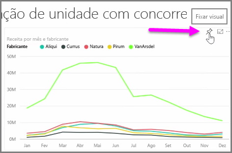
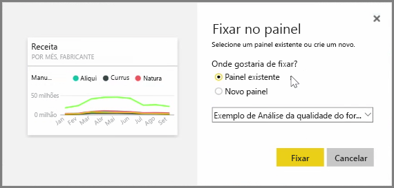
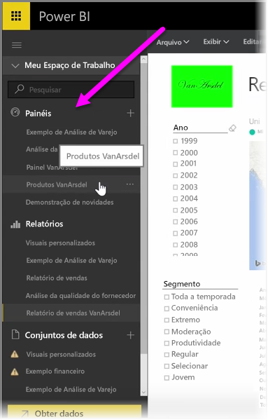
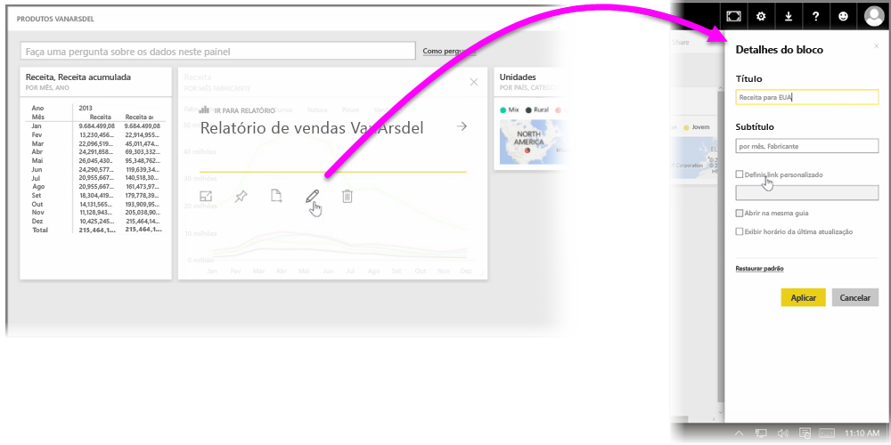

Os **dashboards** no Power BI são coleções de uma página de visualizações criadas com o serviço do Power BI. Você cria dashboards **fixando** as visualizações dos relatórios criados e publicados usando o Power BI Desktop, ou as visualizações criadas no próprio serviço do Power BI. A **anexação** de um visual em um dashboard é muito parecida com a fixação de uma imagem em uma placa de cortiça em uma parede – ela prende o visual lá, em um local específico, para que outras pessoas vejam. Para fixar um visual, abra o relatório no serviço do Power BI. Focalize o visual que você deseja fixar e selecione o ícone de **marcador**.

Uma caixa de diálogo será exibida, em que você seleciona um dashboard de destino para o visual no menu suspenso; se preferir, é possível criar um novo dashboard. Você também obtém uma visualização da futura aparência do visual fixado no dashboard. É possível fixar visualizações de vários relatórios e várias páginas em um único dashboard, permitindo que você combine diferentes conjuntos de dados e fontes em uma única página de informações.

Em **Dashboards**, você pode adicionar qualquer tipo de visualização, incluindo gráficos, mapas, imagens e formas, “fixando-as”. Assim que um visual for fixado em um dashboard, ele será chamado de **bloco**.

Seus dashboards, incluindo todos os novos, serão exibidos na seção Dashboards no lado esquerdo do serviço do Power BI. Selecione um dashboard na lista para exibi-lo.

Você pode alterar o layout de visuais em um dashboard conforme desejar. Para redimensionar um bloco, arraste suas alças para dentro ou para fora. Para mover um bloco, basta clicar e arrastá-lo para um local diferente no dashboard. Focalize um bloco e clique no ícone de **lápis** para abrir os **Detalhes do Bloco**, em que é possível alterar o **Título** ou **Subtítulo**.

Clique em um bloco do dashboard para exibir o relatório do qual ele foi originado. Isso permite exibir rapidamente os dados subjacentes abaixo de um visual. Você também pode alterar esse link usando o campo **Definir link personalizado** em **Detalhes do Bloco**.

Você poderá fixar blocos de um dashboard em outro, por exemplo, se tiver uma coleção de dashboards e desejar criar um quadro de resumo. O processo é o mesmo: focalize o bloco e selecione o **ícone para fixar**. Dashboards são fáceis de serem criados e alterados. Além disso, você pode personalizá-los para fazer com que seu dashboard de uma página mostre exatamente o que deveria.

