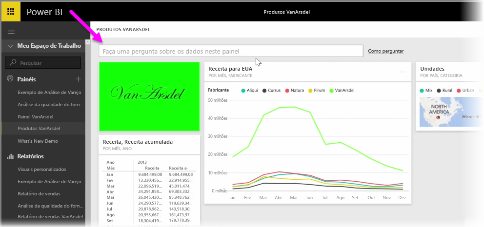
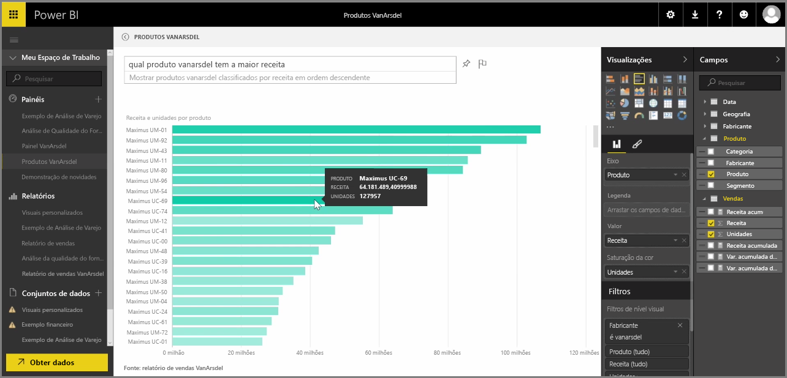

O Power BI é fornecido com um mecanismo avançado de reconhecimento de linguagem que permite fazer perguntas sobre os dados usando perguntas e expressões de conversação. Portanto, junto com a criação de relatórios e visualizações do Power BI, você pode criar gráficos apenas fazendo perguntas simples.

Para fazer uma pergunta sobre os dados, abra um dashboard no Power BI e, na parte superior da tela, você verá uma caixa de entrada, em que poderá fazer perguntas sobre os dados exibidos. Às vezes, esse recurso é chamado de *Perguntas e Respostas*, ou mais frequentemente, chamado apenas de **P e R**.

Quando você clica na caixa, o Power BI exibe avisos com alguns termos sugeridos conforme seus dados, como “Receita acumulada no ano”. Você pode clicar em um termo sugerido para ver o resultado, muitas vezes, exibido como uma tabela simples ou um cartão. Quando você seleciona uma das frases sugeridas, o Power BI cria automaticamente um visual baseado em sua seleção, em tempo real.

Também é possível fazer perguntas usando a linguagem natural, como “Qual foi nossa receita no ano passado?” ou “Qual produto teve as maiores vendas em março de 2014?”. O Power BI exibe sua interpretação da pergunta e escolhe o melhor tipo de visual para representar a resposta. E assim como ocorre com qualquer outro visual no Power BI, você pode **fixá-lo** no dashboard de sua escolha, selecionando o ícone para **fixar**.

Em qualquer momento, é possível editar o visual criado por sua pergunta ou frase em linguagem natural. Basta usar os painéis **Visualizações** e **Campos** no lado direito da tela. Assim como ocorre com qualquer outro visual no Power BI, você pode alterar o layout, ajustar os filtros e alterar as entradas de campo.

Para salvar a visualização em um dashboard depois de criar o visual perfeito, basta selecionar o ícone para **fixar** ao lado da caixa de entrada da pergunta.

