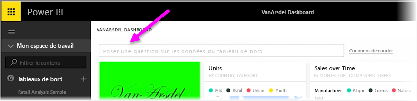
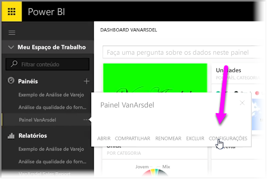
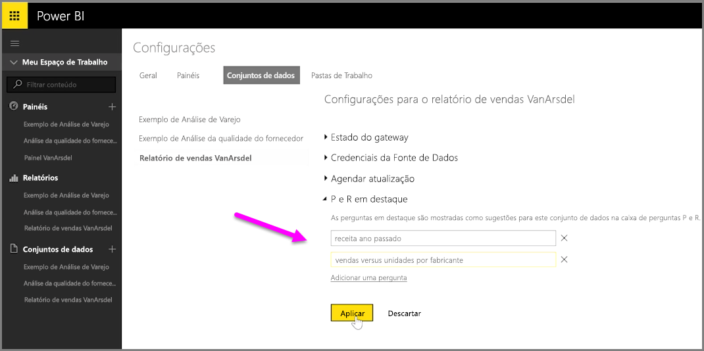

Com o Power BI, você pode adicionar suas próprias sugestões de perguntas para outros usuários que usam a caixa de consulta em linguagem natural de um dashboard, frequentemente chamada de caixa de **P e R**. Essas sugestões de perguntas são o que os usuários verão quando clicarem na caixa de entrada na parte superior de um dashboard.

Para adicionar suas próprias perguntas, selecione as reticências (os três pontos: ...) ao lado do nome do dashboard que você deseja usar e selecione **Configurações** no menu.

 Isso abrirá a página **Configurações** do dashboard e os conjuntos de dados ou as pastas de trabalho subjacentes. É possível desabilitar a caixa de entrada de pesquisa de P e R por completo na seção **Dashboards** da página **Configurações**, mas como queremos adicionar perguntas, selecionamos a seção **Conjuntos de dados**.

Na seção **Conjuntos de dados**, todos os conjuntos de dados associados ao dashboard são exibidos. Selecione o conjunto de dados associado ao seu dashboard na lista, selecione **Perguntas da P e R em destaque** e selecione o link **Adicionar uma pergunta**. Insira a pergunta ou o aviso na caixa de entrada e selecione **Aplicar**.

Agora, sempre que alguém clicar na caixa de entrada de pesquisa no dashboard selecionado, ele verá as sugestões de entradas na parte superior da lista de avisos, e a seleção dessa pergunta os levará diretamente à resposta da P e R. Essa é uma maneira importante para fazer com que os usuários do dashboard pensem sobre o tipo de dados disponíveis e como eles podem tirar o melhor proveito dele.

