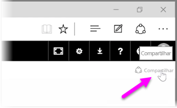
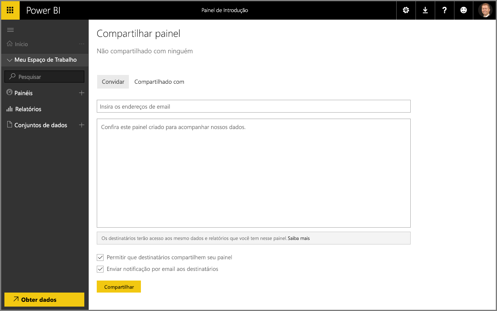

Já vimos como o Power BI ajuda a encontrar dados, coletá-los em um modelo de dados e criar relatórios e visualizações usando esses dados. Também vimos como você pode publicar esses relatórios no serviço do Power BI e criar dashboards que vão ajudá-lo a monitorar suas informações ao longo do tempo. Todos esses recursos são ainda mais eficientes quando você compartilha suas análises com outras pessoas em sua organização. Felizmente, é fácil compartilhar seus dashboards.

Para compartilhar um dashboard, abra-o no serviço do Power BI e selecione o link **Compartilhar** no canto superior direito.

A página **Compartilhar dashboard** será exibida, em que você poderá selecionar a seção **Convidar**. Em seguida, preencha a caixa de entrada **Endereço de email** com as pessoas às quais você deseja conceder acesso ao dashboard. O Power BI verifica os endereços de email à medida você os digita com as contas no domínio e no domínio do Office 365 e faz o preenchimento automático quando possível. Você também pode copiar e colar os endereços de email nesta caixa ou usar uma lista de distribuição, um grupo de segurança ou um grupo do Office 365 para acessar várias pessoas ao mesmo tempo.

Se você selecionou a caixa de seleção (próximo à parte inferior) para *enviar uma notificação por email aos destinatários*, seus destinatários receberão um email informando-os que você compartilhou um dashboard com eles, incluindo um link com o dashboard. É possível adicionar uma observação ao email que eles receberão ou enviar a observação criada pelo Power BI para você (localizada na caixa diretamente abaixo do local em que você insere seus endereços de email).

>[!NOTE]
>Destinatários sem uma conta existente do Power BI serão direcionados para o processo de inscrição antes da exibição do dashboard.
> 
> 

Todas as pessoas com quem você compartilha um dashboard podem ver e interagir com ele, exatamente como você faz. No entanto, elas têm acesso *somente leitura* aos relatórios subjacentes e *não têm acesso* aos conjuntos de dados subjacentes.

Você também pode selecionar a guia **Compartilhado Com** na página Compartilhar dashboard para ver as pessoas com quem você compartilhou este dashboard anteriormente.

