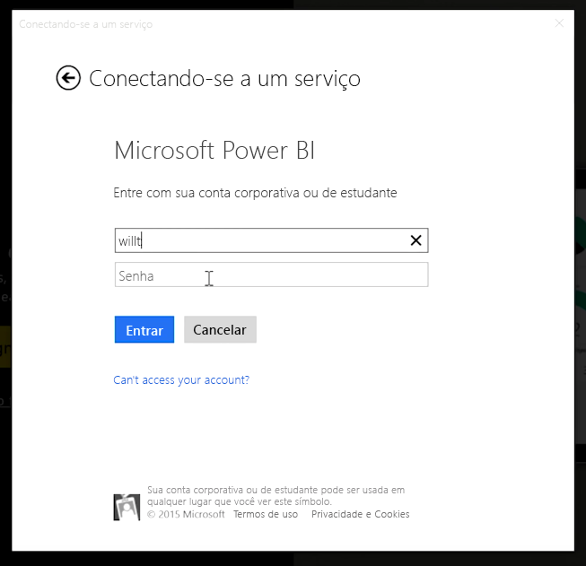
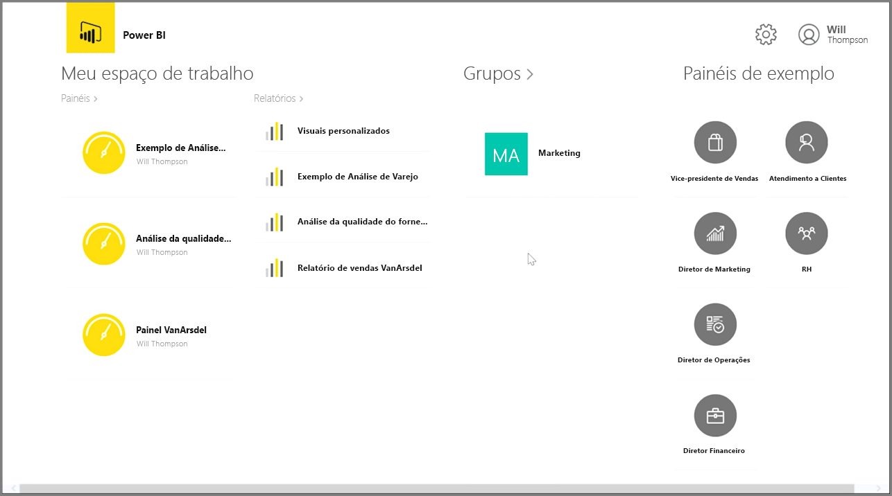
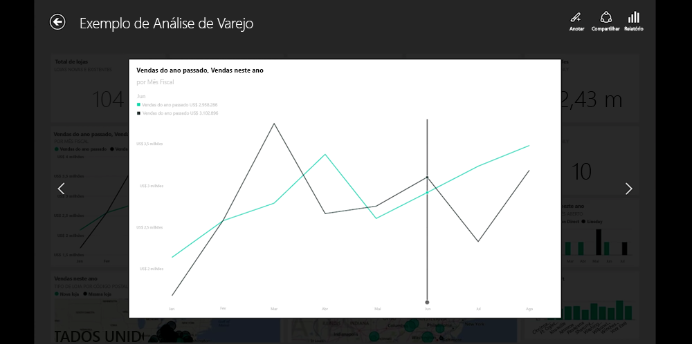
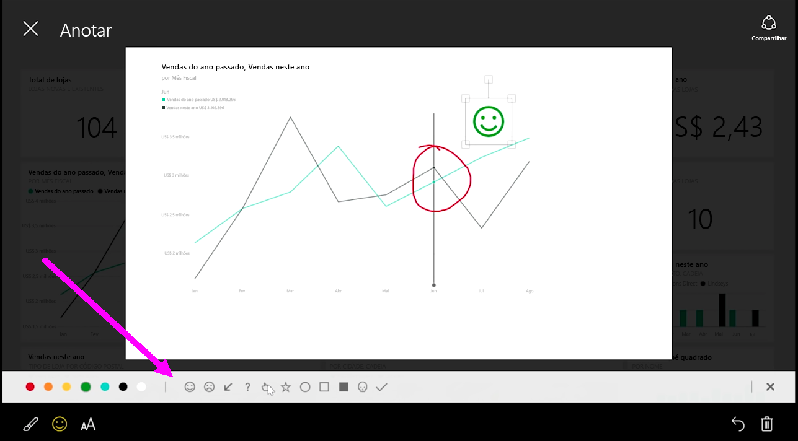

Se você quiser acompanhar seus dados enquanto estiver viajando, será possível usar um dos aplicativos móveis do Power BI para dispositivos iOS, Android e Windows.

Ao usar o aplicativo Power BI, primeiro faça logon em sua conta usando suas informações de conta de serviço do Power BI. Em um dispositivo móvel Windows (neste caso, em um tablet), a entrada é parecida com a mostrada a seguir.

A primeira tela que você verá exibe todo o conteúdo ao qual você tem acesso, incluindo relatórios, dashboards e grupos. Também há dashboards de exemplo que você pode usar para se inspirar ou apenas para ver as funcionalidades do Power BI. O aplicativo foi projetado para ser amigável ao toque: toque em um dashboard ou relatório para exibi-lo em tela inteira e percorrê-lo com o dedo.

É possível abrir qualquer um dos dashboards tocando neles. Em um dashboard, você pode tocar em um bloco do dashboard para focalizá-lo em um modo de exibição maior.

Você também pode anotar as informações que descobrir tocando no botão **Anotar** no canto superior direito. Isso permite aproximar-se de um bloco focalizado para realçar áreas específicas de interesse. As ferramentas de anotação são encontradas na parte inferior da tela.

Compartilhe seu bloco anotado tocando no link **Compartilhar** no canto superior direito.

Toque no link **Relatório** no canto superior direito para exibir o relatório subjacente de um bloco. Isso exibirá as mesmas visualizações que você veria em um navegador da Web ou no Power BI Desktop e também inclui a capacidade de interagir com o relatório tocando em barras, fazendo drill down ou usando segmentações.

