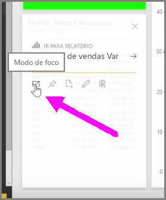
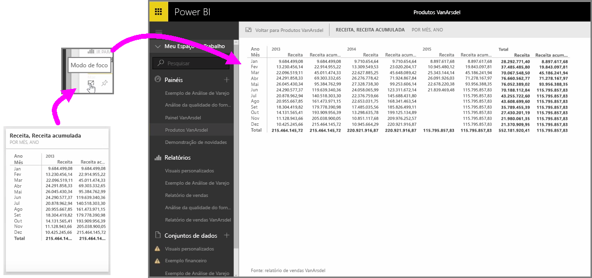

Ao observar dashboards ou relatórios do Power BI no serviço, às vezes, pode ser útil se concentrar em um gráfico ou uma visualização individual. Você pode fazer isso de duas maneiras diferentes.

Quando estiver em um dashboard, focalize um bloco para ver algumas opções de ícone diferentes no canto superior direito. Ao selecionar as reticências (três pontos), você verá uma coleção de ícones que representam as ações que podem ser executadas no bloco.

O ícone mais à esquerda é rotulado **modo Foco**. Selecione esse ícone para expandir o bloco e abranger todo o espaço do dashboard.

O **modo Foco** permite que você veja muito mais detalhes nos visuais e nas legendas. Por exemplo, quando você redimensiona um bloco no Power BI, algumas das colunas podem não ser mostradas devido ao espaço disponível no bloco.

No **modo Foco**, é possível ver todos os dados. Você também pode fixar o visual diretamente por meio do modo Foco em um dashboard diferente selecionando o ícone **Marcador**. Para sair do **modo Foco**, selecione o ícone **Voltar para...** no canto superior esquerdo do **modo Foco**.

O processo é semelhante à exibição de um relatório. Focalize um visual para ver os três ícones no canto superior direito e selecione o ícone **modo Foco**. Essa seleção expandirá a visualização para abranger toda a tela do relatório. O visual ainda será interativo nesse modo, embora todos os efeitos de filtro cruzado entre as visualizações sejam perdidos temporariamente.

Focalize um bloco ou relatório expandido e selecione o ícone de circunflexo esquerdo **Voltar para...** no canto superior esquerdo para retornar ao modo de exibição anterior.

