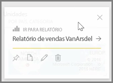
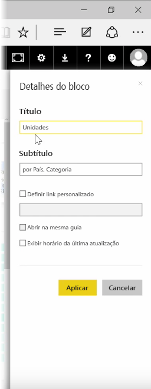
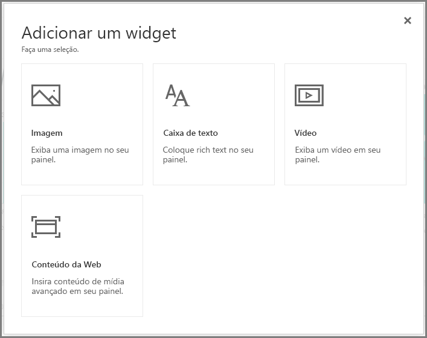
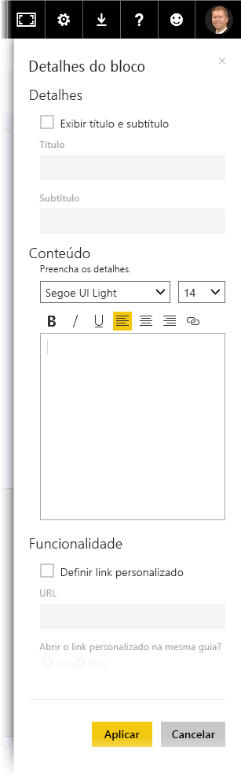

Depois de criar um dashboard, você pode editar seus **Blocos* no serviço do Power BI para fazer algumas alterações de formatação.

Para fazer alterações a um bloco, focalize o bloco e selecione as reticências (três pontos) para mostrar uma coleção de ícones que permitem fazer alterações ao bloco.

Selecione o ícone de **caneta** para abrir o painel **Detalhes do Bloco**. Nele, é possível alterar o **Título** e **Subtítulo** do bloco, incluir sua última hora e data de atualização e outros detalhes como a criação de um link personalizado.

Por padrão, quando você clica em um bloco do dashboard, você é direcionado para o relatório do qual ele foi originado. Para alterar esse comportamento, use o campo **Definir link personalizado** no painel **Detalhes do Bloco**. Um uso popular desse recurso é direcionar os usuários para a home page da organização ao clicar em uma imagem de logotipo.

## Adicionar widgets ao seu dashboard
Também é possível adicionar widgets ao seu dashboard. Um **widget** é um bloco do dashboard especial que, em vez de conter uma visualização, contém outros itens, tais como uma imagem, um vídeo online, uma caixa de texto ou conteúdo da Web sofisticado.

Ao selecionar o link Adicionar Widget no canto superior direito de um dashboard, a caixa de diálogo **Adicionar um widget** será exibida.

Ao adicionar uma caixa de texto, por exemplo, um painel **Detalhes do bloco** será exibido no lado direito, em que é possível editar os detalhes de modo semelhante ao que está disponível quando você edita os detalhes de qualquer bloco. Mas com os widgets, também há uma seção para definir ou modificar o conteúdo do widget, como um editor de rich text para uma caixa de texto.

Com os widgets e a capacidade de editar os detalhes do bloco, você pode personalizar seu dashboard e torná-lo exatamente como deseja.

