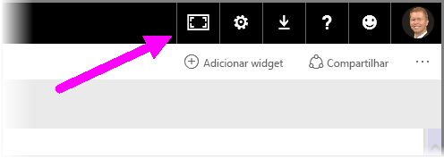
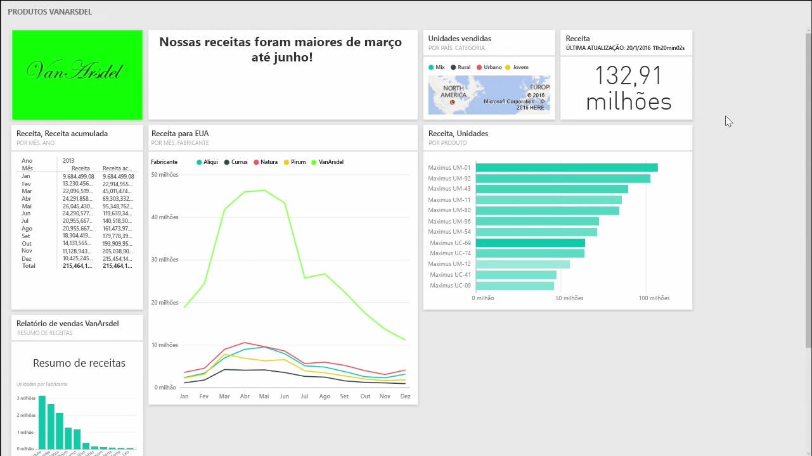
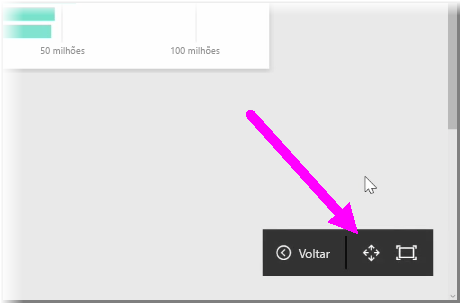
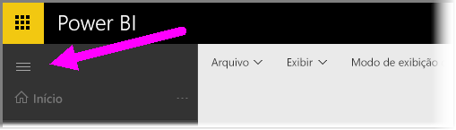

Você pode achar que, em certas ocasiões, ao criar seus dashboards, há mais conteúdo do que o que é possível ajustar na tela. Existem algumas soluções que o ajudam a gerenciar como o espaço de seu dashboard é exibido, para que você possa obter um modo de exibição completo do conteúdo do dashboard.

O método mais fácil para exibir todo o dashboard em uma tela é selecionar o botão **Modo de Tela Inteira** no canto superior direito do dashboard.

A seleção do botão **Modo de Tela Inteira** coloca o navegador no modo de tela inteira, removendo todos os elementos de cromo em torno do dashboard e aumentando a quantidade de espaço visível.

No **Modo de Tela Inteira**, você pode selecionar a opção **Ajustar à Tela** para reduzir todos os seus blocos para que se ajustem em uma única tela, sem a necessidade de barras de rolagem. Normalmente, isso é chamado de *modo TV* e é útil para fazer apresentações com dashboards ou para exibir um dashboard em monitores de corredor.

Outra maneira de gerenciar o espaço do dashboard é recolher o painel de navegação no lado esquerdo da página, selecionando o ícone de hambúrguer. Para expandir o painel de navegação, clique no ícone novamente.

É possível garantir que um dashboard sempre terá uma barra de navegação colapsada acrescentando o seguinte ao final da URL:

> ?collapseNavigation=true
> 
> 

Os usuários que seguem esse link abrirão o dashboard com uma barra de navegação colapsada.

