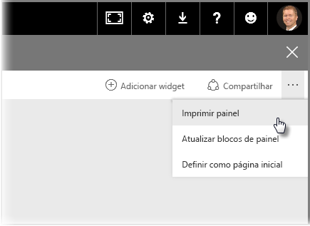
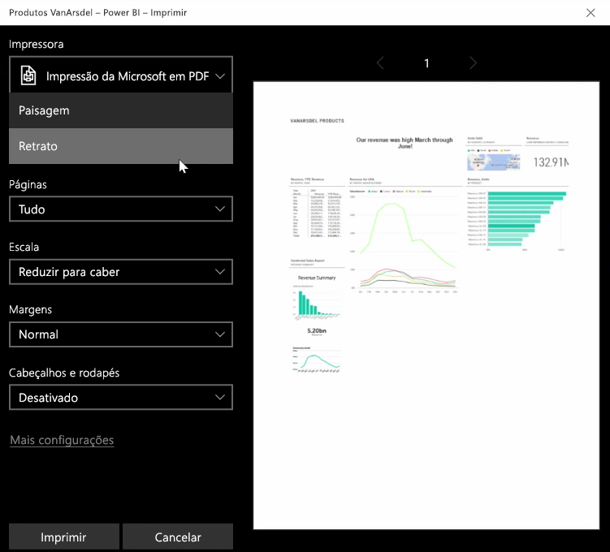
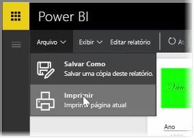

Às vezes, convém levar um relatório ou dashboard impresso para uma reunião ou para que você possa compartilhá-lo com outras pessoas. Com o Power BI, há algumas maneiras pelas quais você pode fazer cópias impressas de seus visuais.

No serviço do Power BI, selecione as reticências (três pontos) no canto superior direito do serviço e selecione **Imprimir dashboard**.

Uma caixa de diálogo **Imprimir** é exibida, em que é possível selecionar a impressora à qual você deseja enviar o dashboard, além de opções de impressão padrão, como orientação *retrato* ou *paisagem*.

## Exportar dados de um visual
Também é possível exportar os dados de qualquer visual no serviço do Power BI. Basta selecionar as reticências em qualquer visual e selecionar o botão **Exportar dados** (o botão do meio). Ao fazer isso, um arquivo .CSV será criado e baixado em seu computador local, e uma mensagem será exibida no navegador (assim como ocorre com qualquer outro download iniciado pelo navegador) informando sobre a conclusão do download.

Você também pode imprimir ou exportar diretamente por meio de um relatório. Ao exibir um relatório no serviço do Power BI, selecione **Arquivo > Imprimir** para abrir a caixa de diálogo de impressão.

E, assim como ocorre com um dashboard, é possível exportar dados de um visual em um relatório também, selecionando o botão de exportação em um visual.

