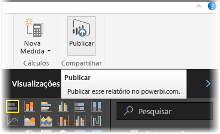
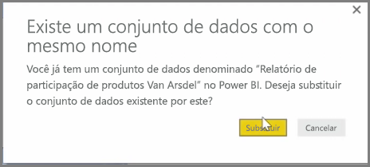
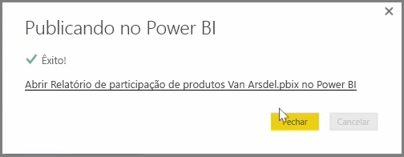

Você pode atualizar relatórios e conjuntos de dados já publicados por meio do Power BI Desktop no serviço do Power BI. Para fazer isso, selecione **Publicar** na guia **Página Inicial** da faixa de opções.

Quando você publica um relatório já existente no serviço do Power BI, será solicitado que você confirme se deseja substituir o conjunto de dados e os relatórios anteriores pela versão editada que você escolheu para atualizar.

Ao selecionar **Substituir**, os conjuntos de dados e relatórios no serviço do Power BI são substituídos pelos conjuntos de dados e relatórios na versão mais recente do Power BI Desktop do arquivo.

E assim como qualquer outro evento de **Publicação** do Power BI Desktop, você verá uma caixa de diálogo que informa se o evento de publicação foi bem-sucedido, além de obter um link para o relatório no serviço do Power BI.

Essa é uma maneira de atualizar manualmente os dados. É possível atualizar automaticamente conjuntos de dados e relatórios; esse processo é abordado em outro tópico de aprendizagem.

