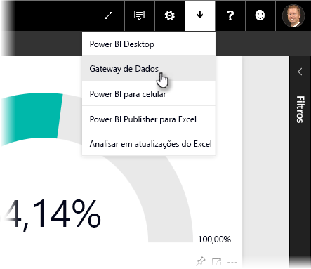
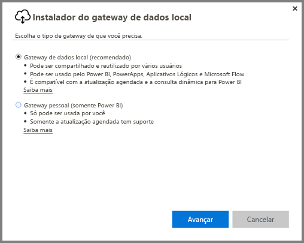
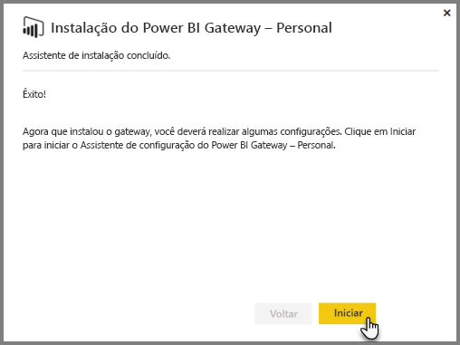
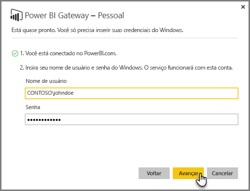
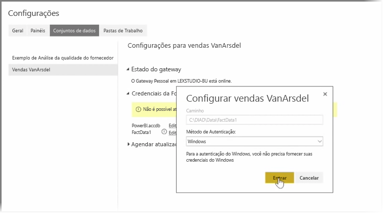
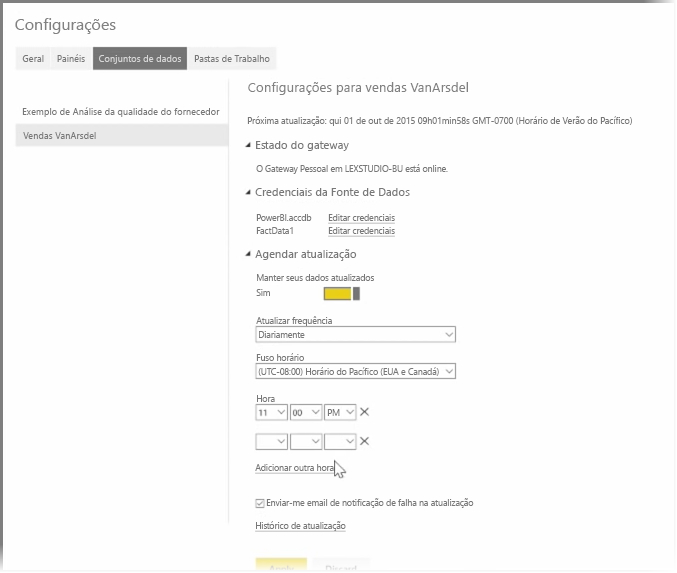

Nos tópicos anteriores, examinamos como é possível usar o Power BI para se conectar a fontes de dados e como atualizar manualmente os conjuntos de dados no serviço do Power BI. No entanto, você não vai querer atualizar tudo manualmente sempre que os dados forem alterados; assim, é possível usar o Power BI para configurar uma atualização agendada que se conectará às suas fontes de dados e as publicará no serviço do Power BI automaticamente. Isso também fornece uma maneira de se conectar ao serviço com quaisquer fonte de dados locais, incluindo arquivos do Excel, bancos de dados do Access, bancos de dados SQL e muito mais.

O sistema que permite a conexão das fontes de dados locais ao serviço do Power BI é chamado de **Gateway de Dados**. É um pequeno aplicativo executado no computador que usa um agendamento predefinido para se conectar aos dados, coletar todas as atualizações e enviá-las por push ao serviço do Power BI. O **Gateway Pessoal** é uma versão do **Gateway de Dados** que pode ser usada sem qualquer configuração do administrador.

>[!NOTE]
>O computador que está executando o Power BI Personal Gateway *deve* estar ligado e conectado à Internet para que o **Personal Gateway** funcione corretamente.
> 

Para configurar o **Gateway Pessoal**, primeiro faça logon no serviço do Power BI. Selecione o ícone **Baixar** no canto superior direito da tela e, em seguida, selecione **Gateways de Dados** no menu.

Nele, você será direcionado para uma página da Web em que é possível selecionar o **Power BI Gateway – Personal**, conforme mostrado abaixo.

Execute o aplicativo após a conclusão do download e conclua o assistente de instalação.

Em seguida, você será solicitado a iniciar o assistente de configuração para configurar seu gateway.

Primeiro, você será solicitado a fazer logon na conta de serviço do Power BI e, em seguida, fazer logon na conta do Windows do computador, pois o serviço do Gateway é executado na sua conta.

Retorne ao serviço do Power BI. Selecione o menu de reticências (três pontos) ao lado do conjunto de dados que você deseja atualizar e, em seguida, selecione **Agendar Atualização**. Isso abrirá a página **Configurações de Atualização**. O Power BI detecta que você instalou um **Personal Gateway** e permite que você saiba seu status.

Selecione **Editar credenciais** ao lado de cada fonte de dados aplicável e configure a autenticação.

Por fim, defina as opções em **Agendar Atualização** para ativar as atualizações automáticas e definir quando e com que frequência elas ocorrerão.

E isso é tudo. Nos horários agendados, o Power BI acessará essas fontes de dados, usando as credenciais fornecidas e a conexão com o computador que tem o **Personal Gateway** em execução, e atualizará os relatórios e conjuntos de dados de acordo com o agendamento. Na próxima vez que você acessar o Power BI, esses dashboards, relatórios e conjuntos de dados refletirão os dados da atualização agendada mais recente.

## Próximas etapas
**Parabéns!** Você concluiu esta seção **Explorando dados** do curso **Aprendizagem interativa** sobre o Power BI. O serviço do Power BI está repleto de maneiras interessantes de explorar dados, compartilhar informações e interagir com visuais. Além disso, é acessível de um navegador, de um serviço ao qual você pode se conectar em qualquer lugar onde estiver.

Um parceiro eficiente e conhecido do Power BI é o **Excel**. O Power BI e o Excel foram projetados para funcionar bem juntos; suas pastas de trabalho se sentirão como se estivessem em casa no Power BI, e é fácil inseri-las nele.

Como é fácil? Na próxima seção, **Power BI e Excel**, você aprenderá exatamente isso.

Vejo vocês na próxima seção!

