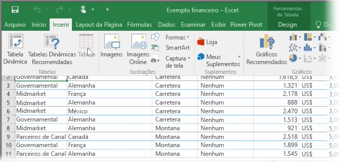
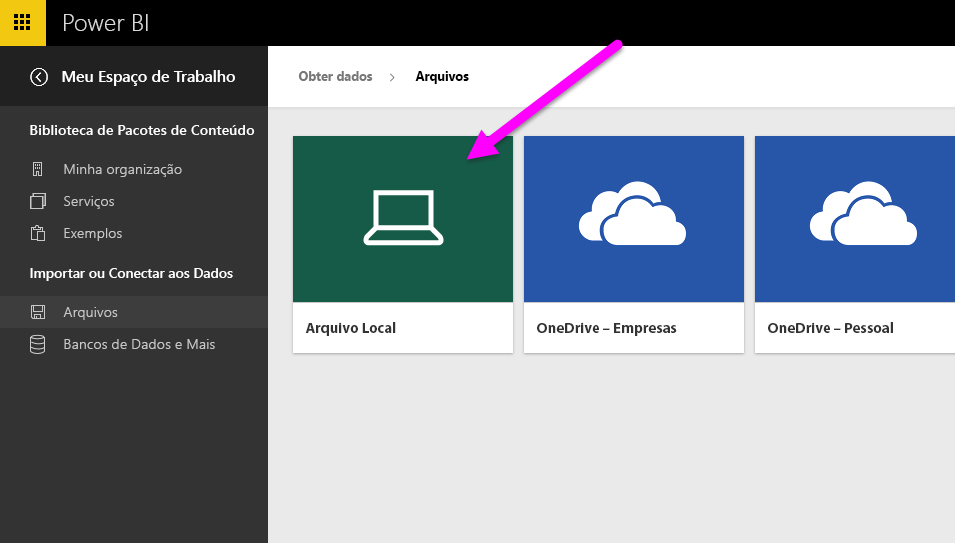
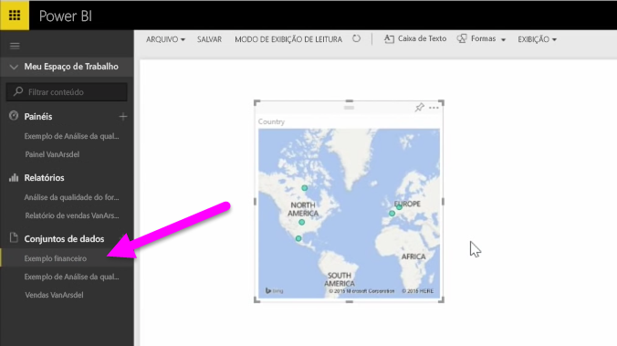

Neste tópico, primeiro vamos dar uma olhada em como você pode importar um arquivo de pasta de trabalho do Excel contendo uma **tabela** simples de uma unidade local para o Power BI. Em seguida, você aprenderá como é possível começar a explorar os dados dessa tabela no Power BI criando um relatório.

## Verifique se seus dados estão formatados como uma tabela
Para que o Power BI importe os dados de sua pasta de trabalho, esses dados precisam estar **formatados como uma tabela**. É fácil. No Excel, é possível realçar um intervalo de células e, na guia **Inserir** da faixa de opções do Excel, clicar em **Tabela**.

Convém certificar-se de que cada coluna tem um nome válido. Isso facilitará a localização dos dados desejados ao criar seus relatórios no Power BI.

## Importar de uma unidade local
Onde quer que você mantenha seus arquivos, o Power BI facilita sua importação. No Power BI, é possível usar **Obter Dados** > **Arquivos** > **Arquivo Local**, para encontrar e selecionar o arquivo do Excel desejado.

Depois de importá-lo para o Power BI, você poderá começar a criar relatórios.

Evidentemente, os arquivos não precisam estar em uma unidade local. Se você salvar os arquivos no OneDrive ou no Site de Equipe do SharePoint, isso será ainda melhor. Vamos explicar mais detalhadamente sobre isso em um tópico adiante.

## Começar a criar relatórios
Depois que os dados de sua pasta de trabalho forem importados, um conjunto de dados será criado no Power BI. Ele aparecerá em **Conjuntos de dados**. Agora você pode começar a explorar seus dados criando relatórios e dashboards. Basta clicar no ícone **Abrir menu** ao lado do conjunto de dados e clicar em **Explorar**. Uma nova tela de relatório em branco será exibida. À direita, em **Campos**, você verá as tabelas e colunas. Basta selecionar os campos nos quais você deseja criar uma nova visualização na tela.

É possível alterar o tipo de visualização e aplicar **filtros** e outras propriedades sob **Visualizações**.

