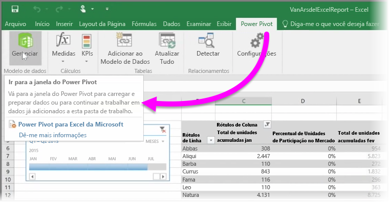

Se você usar qualquer um dos recursos avançados para o BI do Excel, como o **Power Query** (chamado **Obter e Transformar** no Excel 2016) para consultar e carregar dados, o **Power Pivot** para criar modelos de dados avançados e o **Power View** para criar relatórios dinâmicos, você poderá importá-los no Power BI também.

Se você usar o **Power Pivot** para criar modelos de dados avançados, como aqueles com várias tabelas, medidas, colunas calculadas e hierarquias relacionadas, o Power BI importará tudo isso também.

Caso sua pasta de trabalho tenha **planilhas do Power View**, isso não representará nenhum problema. O Power BI vai criá-las novamente como novos **Relatórios** no Power BI. É possível iniciar a anexação de visualizações em dashboards imediatamente.

E aqui está um dos excelentes recursos do Power BI: se você usar o Power Query ou o Power Pivot para se conectar, consultar e carregar dados de uma fonte de dados externa, depois de importar sua pasta de trabalho no Power BI, você poderá configurar uma **atualização agendada**. Com a atualização agendada, o Power BI usará as informações de conexão da pasta de trabalho para se conectar diretamente à fonte de dados e consultar e carregar todos os dados alterados. Todas as visualizações nos relatórios serão atualizadas automaticamente também.

