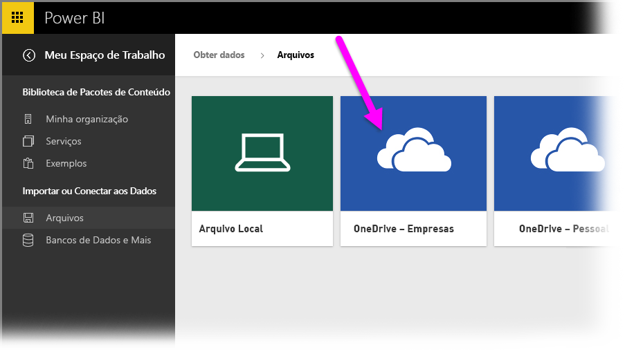
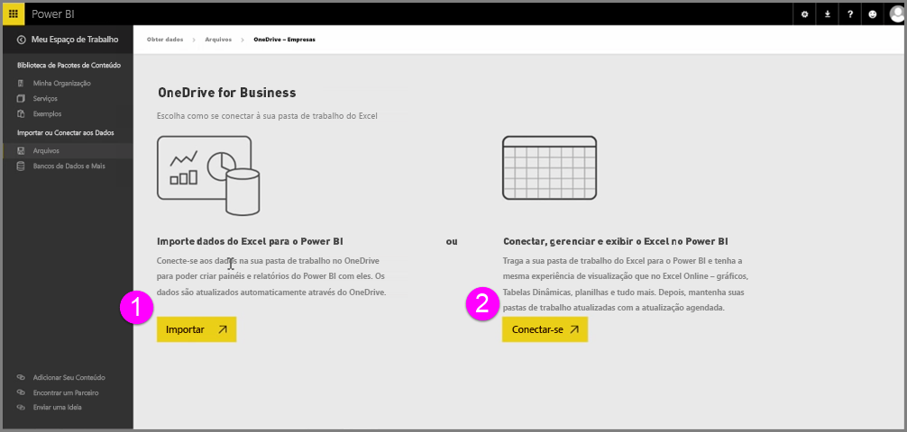
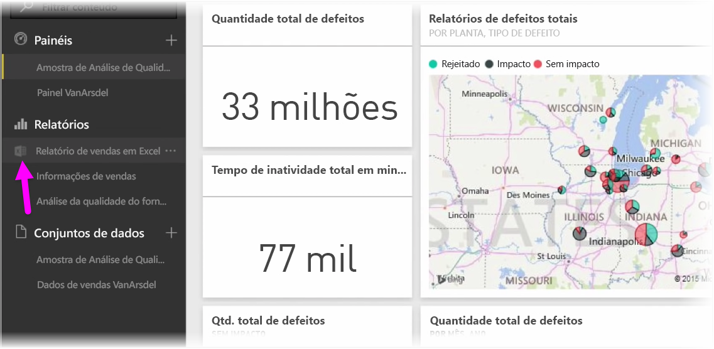
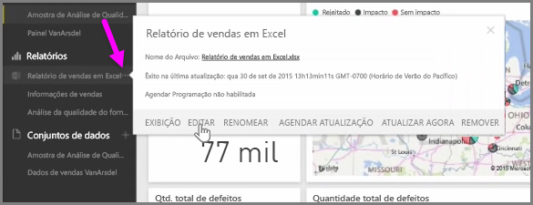

Obtenha uma integração perfeita entre o Power BI e o Excel ao salvar suas pastas de trabalho do Excel no OneDrive.

Já que o OneDrive está na nuvem, assim como o Power BI, uma conexão dinâmica é estabelecida entre o Power BI e o OneDrive. Caso você faça alterações à pasta de trabalho no OneDrive, essas alterações serão *sincronizadas automaticamente* com o Power BI. Suas visualizações em relatórios e dashboards são mantidas atualizadas. Se sua pasta de trabalho se conectar a fontes de dados externas, como um banco de dados ou feed OData, será possível usar os recursos de **Atualização agendada** do Power BI para verificar se há atualizações. Precisa fazer perguntas sobre os dados contidos em sua pasta de trabalho? Sem problemas. Você pode usar os recursos de **P e R** do Power BI para fazer exatamente isso.

Há duas maneiras de se conectar aos arquivos do Excel no OneDrive for Business:

1. Importar dados do Excel para o Power BI
2. Ligar, gerir e ver o Excel no Power BI

### Importar dados do Excel para o Power BI
Quando você opta por importa dados do Excel no Power BI, os dados de tabela da pasta de trabalho são carregados em um novo conjunto de dados no Power BI. Se você tiver planilhas do **Power View** na pasta de trabalho, elas serão importadas e novos relatórios serão criados automaticamente no Power BI também.

O Power BI manterá a conexão entre ela e o arquivo de pasta de trabalho no OneDrive for Business. Caso você faça alterações à pasta de trabalho, ao salvar, essas alterações serão *sincronizadas automaticamente** com o Power BI, geralmente, em menos de uma hora. Se sua pasta de trabalho se conectar a fontes de dados externas, você poderá configurar a atualização agendada para que o conjunto de dados no Power BI seja mantido atualizado. Como as visualizações nos relatórios e no dashboard do Power BI usarão os dados do conjunto de dados, à medida que você explorar, as consultas serão muito mais rápidas.

### Conectar, gerenciar e exibir o Excel no Power BI
Ao optar por se conectar à pasta de trabalho do Excel, você terá uma experiência perfeita de trabalho com sua pasta de trabalho no Excel e no Power BI. Quando você se conectar dessa maneira, o relatório da pasta de trabalho terá um pequeno ícone do Excel ao lado dele.

No relatório, você vê sua pasta de trabalho do Excel no Power BI exatamente como veria no **Excel Online**. É possível explorar e editar suas planilhas no Excel Online selecionando Editar no menu de reticências. Quando fizer alterações, todas as visualizações que você fixou em dashboards serão atualizadas automaticamente.

Nenhum conjunto de dados é criado no Power BI. Todos os dados permanecem na pasta de trabalho no OneDrive. Uma das muitas vantagens dessa abordagem é que você pode configurar a **atualização agendada** caso sua pasta de trabalho se conecte a fontes de dados externas. É possível selecionar elementos, tais como Tabelas Dinâmicas e gráficos, e **fixá**-los diretamente nos dashboards no Power BI. Se você fizer alterações, elas serão refletidas automaticamente no Power BI. Você pode usar os incríveis recursos de **P e R** do Power BI para fazer perguntas sobre os dados em sua pasta de trabalho.  

