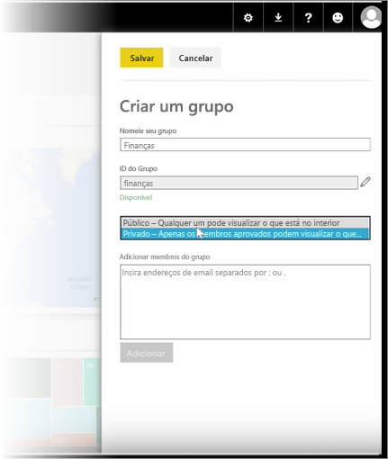
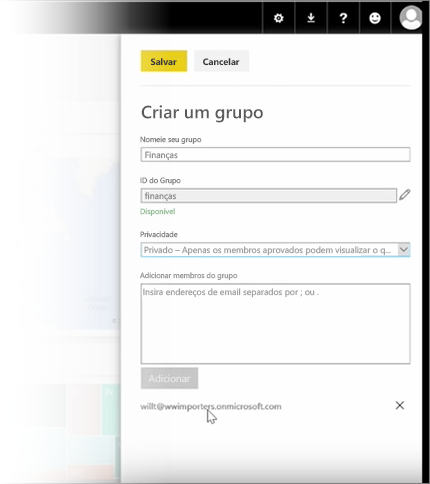

Nesta lição, vamos começar criando um *grupo*. Um **grupo** define um conjunto de usuários que têm acesso a dashboards, relatórios e dados específicos.

Os grupos do Power BI são baseados nos grupos do Office 365 e, portanto, se você usar grupos do Office 365 para gerenciar os emails, o calendário e os documentos de seu grupo, verá que o Power BI oferece os mesmos recursos e muito mais. Quando você cria um grupo no Power BI, na verdade, você está criando um grupo do Office 365.

Este módulo usa o cenário de configuração de um novo grupo de finanças. Vamos mostrar como configurar o grupo, compartilhar dashboards, relatórios e conjuntos de dados no grupo, bem como adicionar membros que terão acesso aos itens no grupo.

Começo aqui em Meu Espaço de Trabalho. Esses são os dashboards, relatórios e conjuntos de dados que criei ou que alguém compartilhou comigo.

Se eu expandir Meu Espaço de Trabalho, poderei selecionar **Criar um grupo**.

Aqui posso dar um nome a ele. Estamos usando o cenário ou um grupo de finanças e, portanto, vou chamá-lo de Finanças. O Power BI verifica se o nome não existe no domínio.

Posso definir o nível de privacidade decidindo se alguém em minha organização pode ver o conteúdo do grupo ou somente seus membros.

Digito endereços de email, grupos de segurança e listas de distribuição aqui. Seleciono **Adicionar** para torná-los membros do grupo e salvo o grupo.

Vá para a próxima lição!

