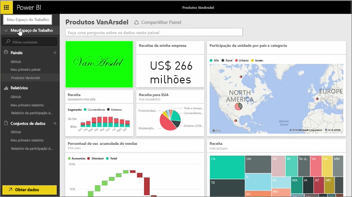
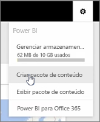
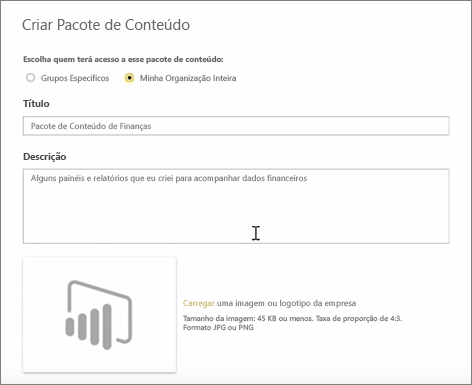
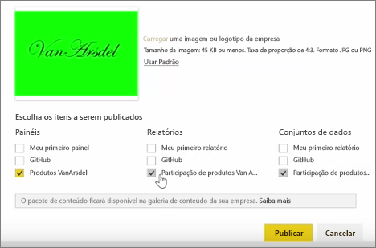
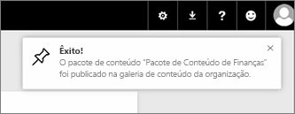

Nesta lição, criamos um *pacote de conteúdo* com artefatos existentes que já tínhamos no Power BI e, em seguida, nós os compartilhamos com colegas. 

Em **Meu Espaço de Trabalho**, tenho um dashboard, o relatório abaixo e o conjunto de dados. Desejo compartilhá-los como um pacote com as pessoas em minha organização, para que elas possam reutilizá-los.

Quando seleciono o ícone **Configurações** (a engrenagem no canto superior direito do serviço), consigo ver a quantidade de armazenamento já usada e criar um pacote de conteúdo.

Na caixa de diálogo exibida, posso optar por distribuí-lo para pessoas ou grupos específicos e também fornecer um título a ele. Também é uma boa ideia fornecer uma descrição detalhada na caixa **Descrição**, para que as pessoas que procuram um pacote de conteúdo saibam o que ele contém ou oferece.

Na parte inferior da caixa de diálogo, tenho a oportunidade de carregar uma imagem para o pacote de conteúdo e, em seguida, a etapa mais importante: seleciono o dashboard que desejo incluir no pacote de conteúdo e, ao fazer isso, o Power BI seleciona automaticamente o relatório e o conjunto de dados que são usados no dashboard. Não posso desmarcar o relatório nem o conjunto de dados, pois o dashboard que desejo incluir no pacote de conteúdo precisa deles.

Eu também poderia selecionar outros dashboards, relatórios e conjuntos de dados, mas não farei isso agora.

Ao publicá-lo, o pacote de conteúdo é adicionado à galeria de conteúdo da organização.

Vá para a próxima lição!

