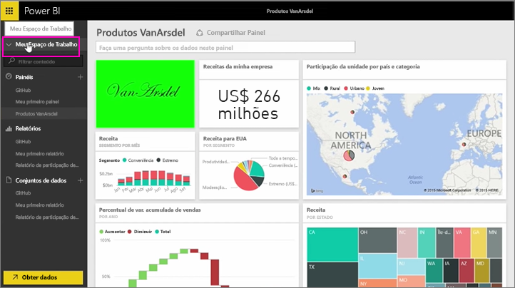
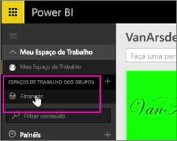
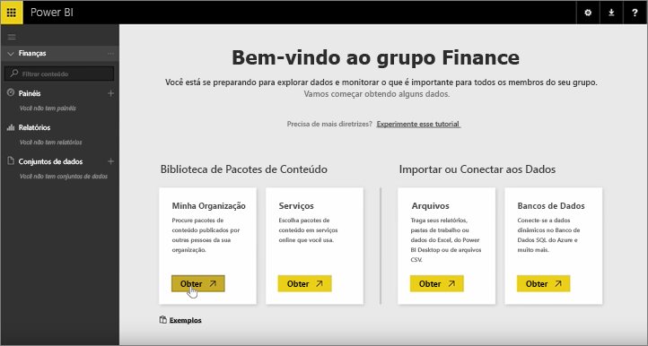
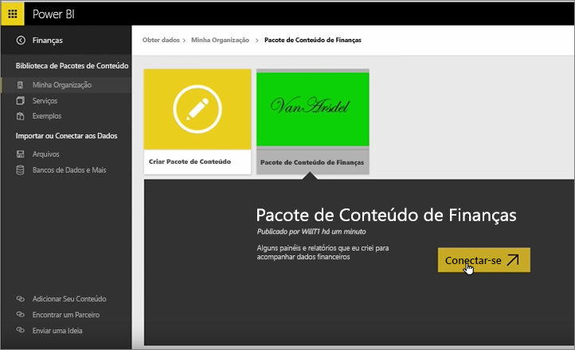
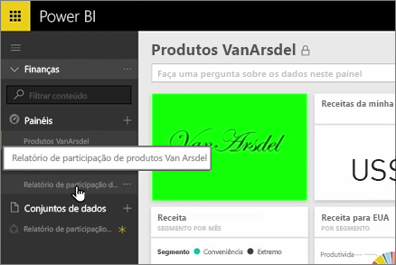
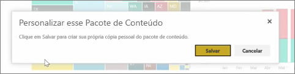
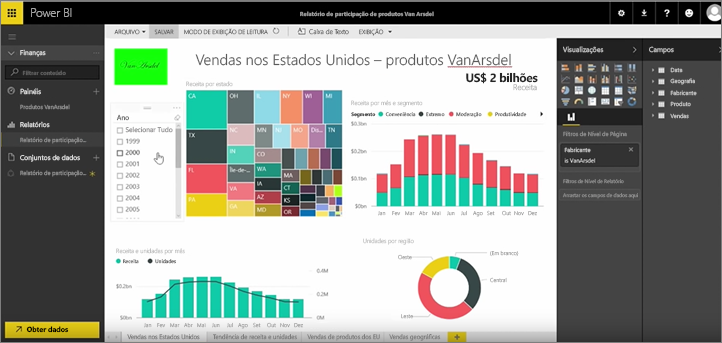

Nas lições anteriores, já criamos um pacote de conteúdo e um grupo. Nesta lição, vamos criar uma instância do pacote de conteúdo para todos no grupo.

Vou começar em Meu Espaço de Trabalho...

… e voltar para o grupo de Finanças que criei na lição anterior.

O grupo ainda não tem nenhum dashboard, relatório ou conjunto de dados. Vou usar o pacote de conteúdo que criei. Procuro entre os pacotes de conteúdo de minha organização em vez daqueles de serviços de terceiros.

Encontro o pacote de conteúdo que criei um minuto atrás. Entendo por que é importante dar a ele um bom título, descrição e imagem: para que as pessoas possam encontrá-lo. Eu me conecto a ele.

O Power BI importa os dashboards, relatórios e conjuntos de dados que estão no pacote de conteúdo.

Quando seleciono o conjunto de dados, o Power BI pergunta se desejo personalizar o pacote de conteúdo.

Estou criando uma cópia do pacote de conteúdo para que eu possa fazer alterações a ele e desconectá-lo da versão publicada do pacote de conteúdo. Se o criador do pacote de conteúdo fizer alterações à versão publicada, não obterei essas atualizações automaticamente.

Mas poderei editar o dashboard, o relatório e até mesmo o conjunto de dados se quiser.

Portanto, os pacotes de conteúdo são uma maneira simples de reutilizar o conteúdo criado por outras pessoas em sua organização.

Vá para a próxima lição: [Criar um pacote de conteúdo no Power BI](6-4-update-content-pack.md).

