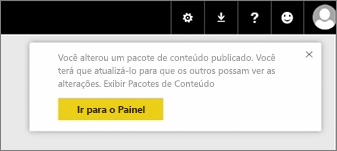
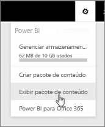
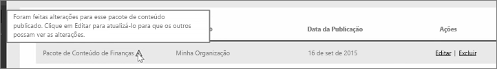

Nesta lição, vamos editar o pacote de conteúdo original que criamos anteriormente e ver como ele mantém atualizadas as outras pessoas que se conectaram a ele.

Estou de volta ao Meu Espaço de Trabalho, editando meu dashboard original.

Sempre que eu fizer qualquer alteração ao dashboard, obtenho o lembrete de que alterei algo que compartilhei com outras pessoas em um pacote de conteúdo e que solicitará a atualização da versão compartilhada.

Volto para o ícone de configurações e seleciono **Exibir pacote de conteúdo** para ver os pacotes de conteúdo que já foram publicados.

Vejo o pacote de conteúdo que criei. Esse pequeno ícone informa que alterei algo no pacote de conteúdo, e preciso editar o pacote de conteúdo para que as outras pessoas possam ver as alterações.

Quando seleciono **Editar**, volto à tela em que é possível editar o título e a descrição, mas, desta vez, ela traz um botão **Atualizar** e, portanto, eu o seleciono.

O Power BI utiliza essas alterações e publica o pacote de conteúdo atualizado na galeria de pacotes de conteúdo.

Qualquer pessoa que se conectou ao meu pacote de conteúdo obtém uma mensagem informando de que o pacote de conteúdo foi alterado e que perguntará se deseja aceitar as alterações ou manter a versão mais antiga.

Assim, como o proprietário do pacote de conteúdo, você pode gerenciar as versões usadas por seus colegas.

