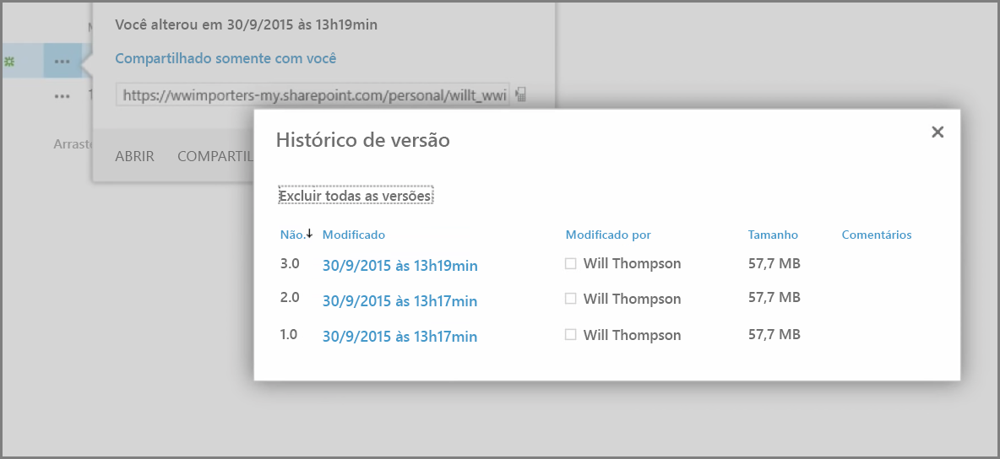
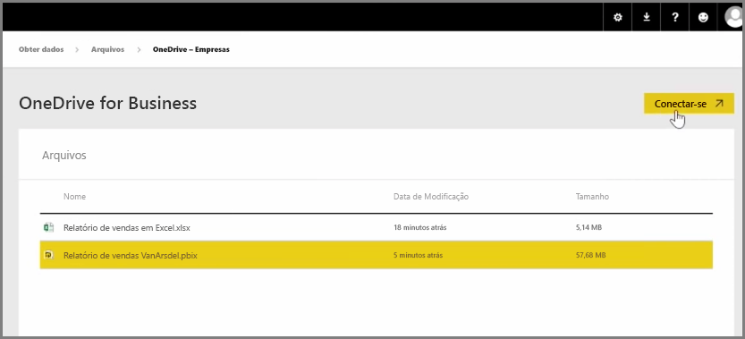
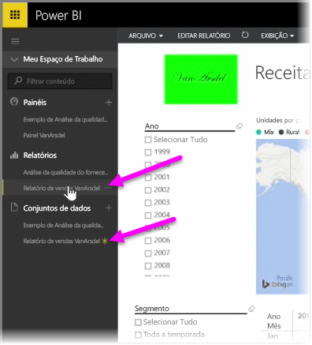

Em um artigo anterior, examinamos a criação de grupos para ajudar sua organização a gerenciar e colaborar usando o conteúdo do Power BI. Você também pode usar os grupos do Power BI/Office 365 para colaborar e compartilhar usando o **OneDrive for Business**.

O uso do OneDrive for Business como uma fonte para o conteúdo do Power BI fornece acesso a diversas ferramentas úteis, como o histórico de versão. Você também pode compartilhar seus arquivos com um grupo do Office 365 no OneDrive for Business para fornecer acesso e permitir que várias pessoas trabalhem nos mesmos arquivos do Power BI ou Excel.

Para se conectar a um arquivo PBIX (Power BI Desktop) no OneDrive for Business, faça logon no serviço do Power BI e selecione **Obter Dados**. Escolha **Arquivos** em Importar ou Conectar-se a Dados e selecione **OneDrive – Business**. Realce o arquivo desejado e selecione **Conectar**.

O conteúdo será exibido na barra de navegação do lado esquerdo.

Agora, todas as alterações feitas ao arquivo no **OneDrive for Business** serão refletidas automaticamente no ambiente do Power BI também e gravadas no histórico de versão.

