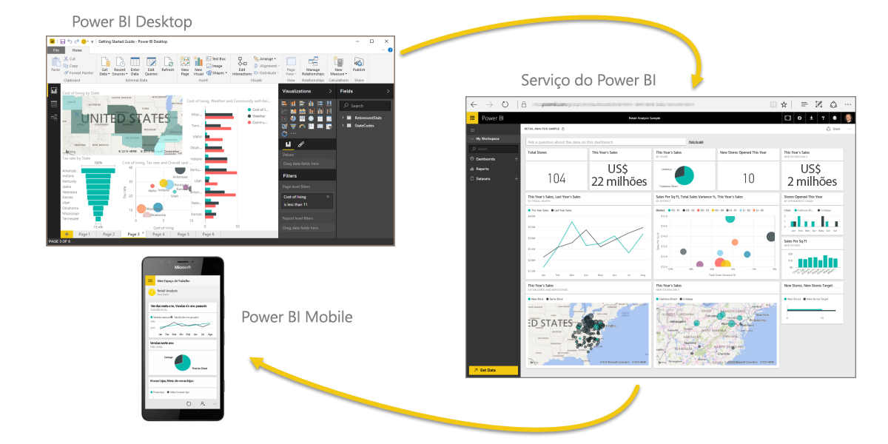
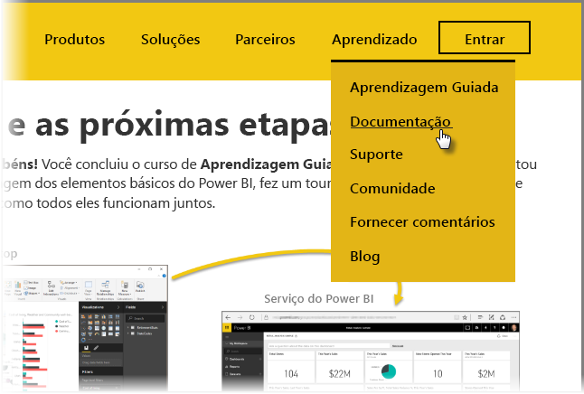

Você conseguiu! **Parabéns!** Você concluiu o curso **Aprendizagem interativa** sobre o Power BI. Você completou um ciclo de aprendizagem dos elementos básicos do Power BI, fez um tour pelos recursos e elementos de software e aprendeu como todos eles funcionam juntos.

Esta é a última seção (e o tópico final, a mesmo que você queira saber mais sobre o DAX) do curso. Portanto, se você acompanhou todas essas seções na ordem, dedique alguns momentos para se parabenizar. Bom trabalho! Agora você está bem familiarizado com todos esses **conceitos importantes**:

* O que é o [Power BI](../gettingstarted.yml?tutorial-step=1)
* Os [blocos de construção](../gettingstarted.yml?tutorial-step=3) do Power BI
* [Obtendo](../gettingdata.yml?tutorial-step=3) e [modelando](../modeling.yml?tutorial-step=1) dados
* [Visualizações](../visualizations.yml?tutorial-step=1)
* [Explorando dados](../exploringdata.yml?tutorial-step=1) no serviço do Power BI
* Usando o [Excel e Power BI](../powerbiandexcel.yml?tutorial-step=1) juntos
* E [publicando e compartilhando](../publishingandsharing.yml?tutorial-step=1) seu trabalho

Isso é muito conhecimento, e agora que você assimilou tudo, você está pronto para começar a colocar isso na prática! Aqui estão alguns **links para downloads** ou para conectar seu navegador **ao serviço do Power BI**:

* Sempre é possível [obter o último Power BI Desktop](https://powerbi.microsoft.com/desktop)
* Começar a usar o [serviço do Power BI](https://powerbi.microsoft.com/) é fácil
* Obter [aplicativos móveis para o Power BI](https://powerbi.microsoft.com/mobile/) com apenas um toque

Há mais conteúdo de **ajuda e referência** disponível também. Basta ir para o início desta página e selecionar **Aprendizagem > Documentação** ver nosso amplo conjunto de conteúdo de referência do Power BI.

Esperamos que você tenha gostado de sua jornada com essa experiência de **Aprendizagem interativa do Power BI**. Desejamos o melhor para você e que seus visuais do Power BI sejam sempre envolventes e interessantes.

## Mais uma seção para os usuários do DAX
Ainda quer mais? Interessado em usar o **DAX (Data Analysis Expressions)** para criar, filtrar ou usar tabelas e colunas personalizadas no Power BI? Há mais uma seção destinada a pessoas inclinadas a executar trabalho de código no Power BI, chamada **Introdução ao DAX**. Dê uma olhada se estiver interessado – ele usa a mesma abordagem amigável que o restante do Aprendizado Interativo.

