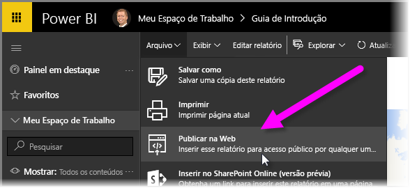
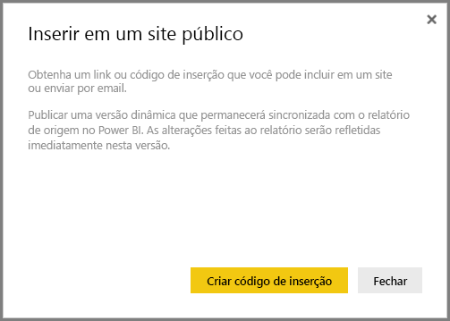
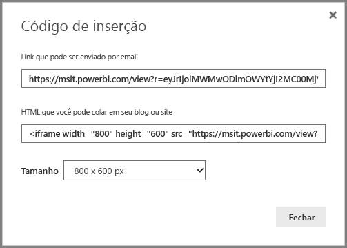
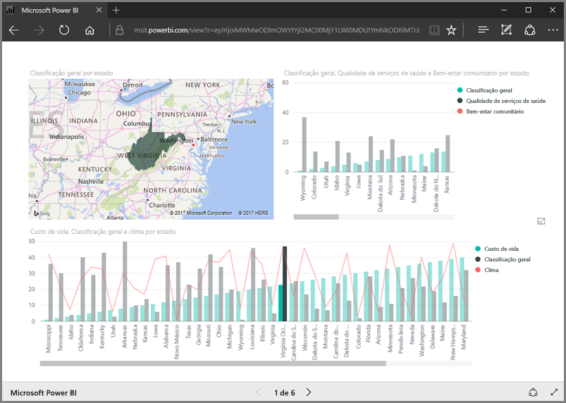
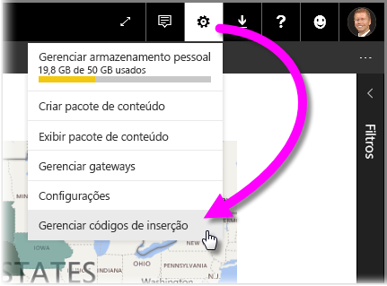
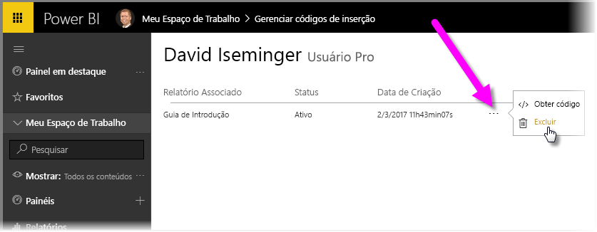

Nesta lição, aprendemos como compartilhar um relatório do Power BI em uma página da Web ou compartilhá-lo por email, em apenas algumas etapas simples. Esse recurso do Power BI é conhecido como **Publicar na Web** e é fácil de usar e gerenciar.

No Power BI, selecione o relatório que deseja compartilhar para que ele seja exibido na tela. Em seguida, no menu, selecione **Arquivo > Publicar na Web**.

A partir daí, aparecerá um diálogo explicando que você receberá um *código de inserção* que permitirá incluir o relatório em um site ou email.

Quando você selecionar **Criar código de inserção**, o Power BI apresentará outro diálogo, informando novamente que você está prestes a compartilhar seus dados com qualquer pessoa na Internet. Tenha certeza de que não há nenhum problema.

O Power BI apresenta um diálogo com dois links:

* Um link para compartilhar por email, que mostra o relatório como uma página da Web
* Código HTML (um link em um iframe) que permite inserir o relatório diretamente em uma página da Web

Para o link HTML, você pode escolher entre tamanhos predefinidos para o relatório inserido ou modificar o código iframe por conta própria e personalizar seu tamanho.

Você pode simplesmente colar o link de email em um navegador e ver o relatório como uma página da Web. Você pode interagir com essa página da Web, exatamente como você faria ao exibir o relatório no Power BI. As imagens a seguir mostram uma página **Publicar na Web**, quando o link foi copiado diretamente do diálogo em um navegador:

Você também pode inserir esse link de iframe em uma postagem no blog, em um site ou no Sway.

Deseja excluir um código de inserção que você criou? Sem problemas. No Power BI, selecione o ícone **engrenagem** no canto superior direito e escolha **Gerenciar códigos de inserção**.

O espaço de trabalho do Power BI mostra os códigos de inserção que você criou (na imagem abaixo, há apenas um). Ao clicar nas reticências, você poderá selecionar que deseja obter o código de inserção ou excluí-lo inteiramente.

E isso é tudo para publicar o relatório do Power BI na Web e compartilhá-los com o mundo. É fácil!

