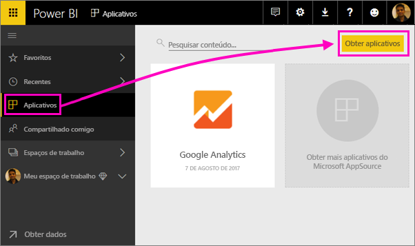
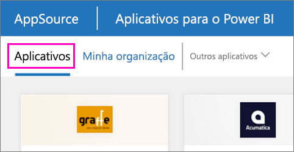

1. Selecione **Aplicativos** no painel de navegação à esquerda > selecione **Obter aplicativos** no canto superior direito.
   
     
2. No AppSource, selecione a guia **Aplicativos** e pesquise o serviço desejado.
   
    

