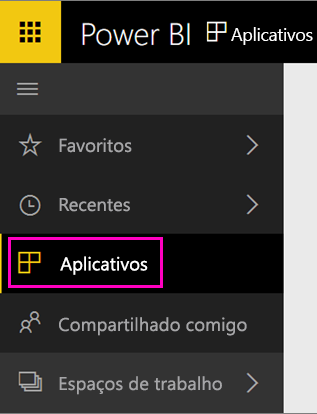

Quando a importação for concluída, o novo aplicativo será exibido na página Aplicativos.

1. Selecione **Aplicativos** no painel de navegação à esquerda > selecione o aplicativo.
   
     
2. Faça uma pergunta digitando na caixa de P e R ou clique em um bloco para abrir o relatório subjacente. 

