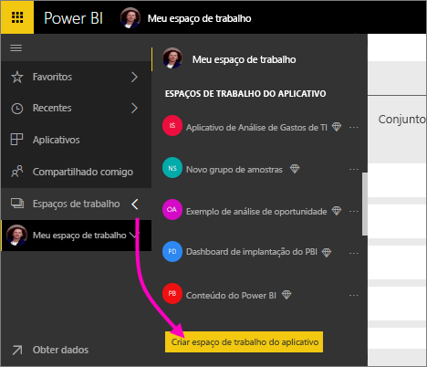
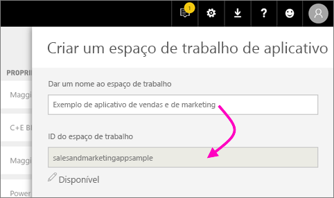
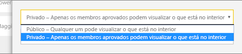
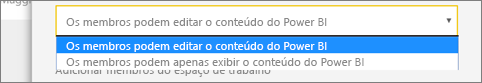
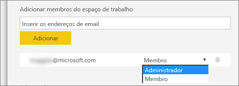

1. Comece criando o espaço de trabalho. Selecione **Espaços de trabalho** > **Criar espaço de trabalho do aplicativo**.
   
     
   
    Esse será o local para colocar o conteúdo no qual você e seus colegas colaboram.

2. Nomeie o espaço de trabalho. Se a **ID do Espaço de Trabalho** correspondente não estiver disponível, edite-a para criar uma ID exclusiva.
   
     Esse também será o nome do aplicativo.
   
     

3. Você tem algumas opções para definir. Se você escolher **Público**, qualquer pessoa na sua organização poderá ver o que está no espaço de trabalho. **Particular**, por outro lado, significará que somente os membros do espaço de trabalho poderão ver o conteúdo.
   
     
   
    Não é possível alterar a configuração Público/Particular depois de criar o grupo.

4. Também é possível escolher se os membros podem **editar** ou se terão acesso **somente exibição**.
   
     
   
     Somente adicione pessoas ao espaço de trabalho do aplicativo para que elas possam editar o conteúdo. Caso a pessoa só precise exibir o conteúdo, não adicione-a ao espaço de trabalho. Você pode incluí-la quando publicar o aplicativo.

5. Adicione os endereços de email das pessoas que você deseja que tenham acesso ao espaço de trabalho e selecione **Adicionar**. Você não pode adicionar aliases de grupos, apenas indivíduos.

6. Decida se cada pessoa será um membro ou um administrador.
   
     
   
    Os administradores podem editar o espaço de trabalho, incluindo a adição de outros membros. Os membros podem editar o conteúdo no espaço de trabalho, a menos que tenham acesso somente exibição. Os membros e os administradores podem publicar o aplicativo.

7. Selecione **Salvar**.

O Power BI cria o espaço de trabalho e o abre. Ele aparece na lista de espaços de trabalho dos quais você é um membro. Como você é um administrador, você pode selecionar as reticências (...) para voltar e fazer alterações, adicionar novos membros ou alterar as permissões deles.

