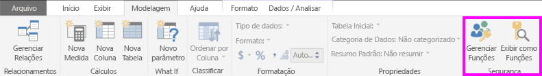

## Definir funções e regras no Power BI Desktop
É possível definir funções e regras no Power BI Desktop. Quando você publica no Power BI, ele também publica as definições de função.

Se você quiser tirar proveito da segurança dinâmica, precisará habilitar a opção de visualização Habilitar filtragem cruzada em ambas as direções para o DirectQuery. Isso permitirá a capacidade de filtrar de modo cruzado e aplique o filtro de segurança em ambas as direções.

Para definir funções de segurança, faça o seguinte:

1. Importe os dados para o relatório do Power BI Desktop ou configure uma conexão do DirectQuery.
   
   > [!NOTE]
   > Você não pode definir funções no Power BI Desktop BI para as conexões dinâmicas do Analysis Services. Você precisará fazer isso no modelo do Analysis Services.
   > 
   > 
2. Selecione a guia **Modelagem**.
3. Selecione **Gerenciar Funções**.
   
   
4. Selecione **Criar**.
   
   
5. Forneça um nome para a função. 
6. Selecione a tabela à qual você deseja aplicar uma regra DAX.
7. Insira as expressões DAX. Essa expressão deve retornar true ou false. Por exemplo: [ID da Entidade] = “Valor”.
   
   > [!NOTE]
   > Você pode usar o *username()* nesta expressão. Lembre-se de que *username()* terá o formato *DOMÍNIO\nomeusuário* no Power BI Desktop. No serviço do Power BI, ele estará no formato do UPN do usuário. Como alternativa, é possível usar *userprincipalname()*, que sempre retornará o usuário no formato de seu nome UPN.
   > 
   > 
   
   
8. Depois de criar a expressão DAX, você pode selecionar a seleção acima da caixa de expressão para validar a expressão.
   
   
9. Selecione **Salvar**.

Não é possível atribuir usuários a uma função no Power BI Desktop. Isso é feito no serviço do Power BI. É possível habilitar a segurança dinâmica no Power BI Desktop fazendo uso das funções DAX *username()* ou *userprincipalname()* e configurando as relações corretas.

