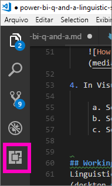
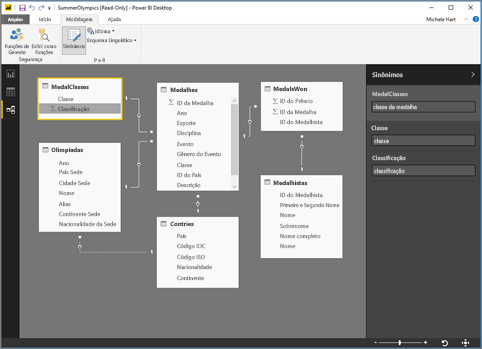
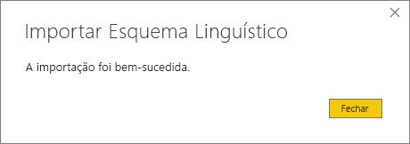

# <a name="language-modeling-and-the-linguistic-schema"></a>Modelagem de linguagem e o esquema linguístico 
Usar linguagem natural e expressões comuns para fazer perguntas sobre seus dados é eficiente. É ainda mais eficiente quando seus dados respondem, que é o que P e R no Power BI Desktop permite que você faça. Quando você faz uma pergunta para P e R do Power BI, ele se esforça para responder corretamente. 

Mas para melhorar ainda mais as interações de P e R, há maneiras de melhorar as respostas e uma delas é editar o esquema linguístico. 

Tudo começa com os dados empresariais.  Quanto melhor for o modelo de dados, mais fácil será para que os usuários recebam respostas de qualidade. Uma maneira de melhorar o modelo é adicionar um esquema linguístico que defina e categorize a terminologia e as relações entre os nomes de tabela e de coluna no conjunto de dados. O Power BI Desktop é onde você gerencia seus esquemas linguísticos. 

## <a name="what-is-a-linguistic-schema"></a>O que é um esquema linguístico
Um esquema linguístico descreve os termos e as frases que as P e R devem compreender para os objetos dentro de um conjunto de dados, incluindo classes gramaticais, sinônimos e frases em relação a esse conjunto de dados. Quando você importa um conjunto de dados ou se conectar a ele, o Power BI cria um esquema linguístico com base na estrutura do conjunto de dados. Quando você faz uma pergunta às P e R, elas buscam correspondências e relações nos dados para descobrir a intenção da pergunta. Por exemplo, elas procuram substantivos, verbos, adjetivos, frases e outros elementos. E elas também procuram relações, como quais colunas são objetos de um verbo. 

Provavelmente você já conhece as classes gramaticais (caso contrário, veja abaixo), mas as frases podem ser um termo novo para você.  Uma frase é a maneira em que você fala (ou "fraseia") sobre as relações entre as coisas. Por exemplo, para descrever a relação entre produtos e clientes, você pode dizer "os clientes compram produtos". Ou para descrever a relação entre os clientes e as idades, você pode dizer "as idades indicam quantos anos os clientes têm". Ou, para descrever a relação entre os clientes e os números de telefone, você pode simplesmente dizer "os clientes têm números de telefone".

Essas frases podem ter uma variedade de formas e tamanhos. Algumas correspondem diretamente às relações no modelo de dados. Algumas relacionam colunas com as tabelas que as contêm. Outras relacionam várias tabelas e colunas em relações complexas. Em todos os casos, elas descrevem como os elementos são relacionados, usando termos comuns.

Os esquemas linguísticos são salvos no formato YAML. Esse formato está relacionado ao formato JSON muito popular, mas oferece uma sintaxe mais flexível e mais fácil de ler. Os esquemas linguísticos podem ser editados, exportados e importados para o Power BI Desktop.

## <a name="prerequisites"></a>Pré-requisitos
- Se você ainda não leu o artigo em [melhorando seu modelo de dados para P e R](desktop-qna-in-reports.md), talvez convenha lê-lo primeiro. Ele inclui diversas dicas para projetar e melhorar seu modelo de dados e uma seção importante sobre como adicionar sinônimos.  

- Existem dois lados de P e R.  O primeiro lado é a preparação ou a "modelagem".  O segundo lado é fazer perguntas e explorar os dados ou "consumir". Em algumas empresas, podem ser os funcionários conhecidos como modeladores de dados ou administradores de TI que montam os conjuntos de dados e os publicam no Power BI.  Enquanto um segundo conjunto de funcionários pode ser aquele que "consume" os dados online.  Em outras empresas, essas funções podem ser combinadas. 

    Este tópico é para modeladores de dados. As pessoas que pegam um conjunto de dados e o otimizam para fornecer os melhores resultados possíveis de P e R. 

- [Arquivos .yaml e .pbix de exemplo](https://go.microsoft.com/fwlink/?linkid=871858)    
- Editor de arquivo YAML, recomendamos o [Visual Studio Code](https://code.visualstudio.com/)


### <a name="set-up-an-editor-for-yaml-files"></a>Configurar um editor para arquivos YAML
É recomendável usar o Visual Studio Code para editar os arquivos YAML de esquema linguístico. O Visual Studio Code inclui suporte integrado para arquivos YAML e pode ser estendido para validar especificamente o formato do esquema linguístico do Power BI.
1. Instale o [Visual Studio Code](https://code.visualstudio.com/).    

2. Selecione o esquema linguístico de exemplo que você já salvou: [arquivo YAML](https://go.microsoft.com/fwlink/?linkid=871858) (SummerOlympics.lsdl.yaml).    
4. Selecione **Visual Studio Code** e **Sempre usar este aplicativo para abrir arquivos .yaml**.

    

4. No Visual Studio Code, instale o suporte para YAML pela extensão do Red Hat.

   

    a. Selecione a guia **Extensões** (a última à esquerda) ou pressione CTRL + SHIFT + X.    
        
    b. Procure "yaml" e selecione **Suporte para YAML pelo Red Hat** na lista.    
    c. Selecione **Instalar > Recarregar**.


## <a name="working-with-linguistic-schemas"></a>Trabalhando com esquemas linguísticos
Os esquemas linguísticos podem ser editados, importados e exportados na [Exibição de relação](desktop-relationship-view.md) no Power BI Desktop. Uma maneira de editar um esquema linguístico é [adicionar sinônimos ao painel **Sinônimos**](desktop-qna-in-reports.md). Isso não envolve abrir o arquivo YAML.




 A outra maneira de editar um esquema linguístico é exportar e editar o arquivo YAML diretamente.  Ao editar um arquivo YAML de esquema linguístico, você marca colunas na tabela como diferentes elementos gramaticais e define as palavras que algum colega poderá usar para preparar uma pergunta. Por exemplo, você indica as colunas que são o sujeito e o objeto do verbo e adiciona palavras alternativas que seus colegas poderão usar para se referirem às tabelas, colunas e medidas no modelo. 


Para editar um esquema linguístico, você precisará abri-lo (exportá-lo) do Desktop. Quando você salvar o arquivo YAML novamente no mesmo local, isso será considerado uma importação.  Mas também será possível importar outros arquivos YAML,  se, por exemplo, você tiver um conjunto de dados semelhante e já tiver trabalhando bastante adicionando uma grande quantidade de classes gramaticais, identificando relações, criando frases e criando sinônimos. 

As P e R usam todas essas informações em conjunto com todos os aprimoramentos feitos por você para melhorar as respostas, o preenchimento automático e o resumo das perguntas.


## <a name="edit-a-linguistic-schema"></a>Editar um esquema linguístico
Quando você exporta o esquema linguístico do Desktop primeiro, a maior parte do conteúdo do arquivo, ou todo ele, é gerado automaticamente pelo mecanismo de P e R. Essas entidades, palavras (sinônimos), relações e frases geradas recebem uma marca **Estado: Gerado** e são incluídas no arquivo principalmente para fins informativos, mas podem ser um ponto de partida útil para que você faça suas próprias alterações. 

> [!NOTE]
> O arquivo YAML de exemplo incluído neste tutorial não contém as marcas **Estado: Gerado** ou **Estado: Excluído** pois ele foi preparado especialmente para este tutorial. Para ver essas marcas, abra um arquivo .pbix não editado na exibição Relações e exporte o esquema linguístico.


Quando você importar o arquivo de esquema linguístico novamente no Power BI Desktop, tudo que estiver marcado como **Estado: Gerado** será realmente ignorado (e regenerado mais tarde), portanto, se você desejar fazer uma alteração em algum conteúdo gerado, também remova a marca **Estado: Gerado** correspondente. Da mesma forma, se você quiser remover algum conteúdo gerado, será necessário alterar a marca **Estado: Gerado** para **Estado: Excluído** para que ele não seja regenerado quando você importar o arquivo de esquema linguístico.

1. Abra o conjunto de dados na *Exibição de Relações* do Power BI Desktop. 
2. Selecione a guia **Modelagem** e escolha **Exportar esquema linguístico**.
3. Selecione o Visual Code (ou outro editor).
4. Faça as edições e salve o arquivo YAML.
5. No Desktop, selecione **Exibição de Relações > guia Modelagem > Esquema Linguístico > Importar esquema linguístico**.
6. Navegue até o local em que você salvou o arquivo YAML editado e selecione-o. Uma mensagem de êxito informa que o arquivo YAML de esquema linguístico foi importado com êxito.

    

### <a name="add-phrasings-to-the-linguistic-schema"></a>Adicione frases ao esquema linguístico
Uma frase é a maneira em que você fala (ou "fraseia") sobre as relações entre as coisas. Por exemplo, para descrever a relação entre produtos e clientes, você pode dizer "os clientes compram produtos". Ou para descrever a relação entre os clientes e as idades, você pode dizer "as idades indicam quantos anos os clientes têm". Ou, para descrever a relação entre os atletas e as medalhas, você pode simplesmente dizer "os atletas ganham medalhas".

Essas frases podem ter uma variedade de formas e tamanhos. Algumas correspondem diretamente às relações no modelo semântico. Algumas relacionam colunas com as tabelas que as contêm. Outras relacionam várias tabelas e colunas em relações complexas. Em todos os casos, elas descrevem como os elementos são relacionados, usando termos comuns.

## <a name="where-do-phrasings-come-from"></a>De onde vêm as frases?
Muitas frases simples são adicionadas ao esquema linguístico automaticamente, com base na estrutura do modelo e em algumas suposições com base nos nomes das colunas. Por exemplo:
- A maioria das colunas estará relacionada à tabela que as contém com uma frase simples como "os produtos têm descrições".
- As relações de modelo resultam em frases padrão para ambas as direções da relação, como "os pedidos têm produtos" e "os produtos têm pedidos".
- Algumas relações de modelo podem ter uma frase padrão mais complexa, com base em seus nomes de coluna, como "os pedidos são enviados para cidades".

No entanto, os usuários podem falar sobre coisas de diversas maneiras que as P e R não conseguem adivinhar. Nesse caso, convém adicionar suas próprias frases manualmente.


## <a name="why-should-i-add-phrasings"></a>Por que adicionar frases?
O primeiro motivo para adicionar uma frase é definir um novo termo. Por exemplo, para poder solicitar uma "lista dos clientes mais velhos", primeiro você precisará ensinar às P e R qual o significado de "antigos". Isso poderá ser feito adicionando uma frase como "as idades indicam quantos anos os clientes têm".

O segundo motivo para adicionar uma frase é resolver a ambiguidade. A pesquisa básica de palavra-chave só chega a esse ponto quando as palavras têm mais de um significado. Por exemplo, "voos para Chicago" significa algo bastante diferente de "voos de Chicago", mas as P e R apenas saberão qual você quer dizer, se você adicionar as frases "os voos são de cidades de saída" e "os voos são para cidades de chegada". Da mesma forma, a diferença entre "carros que Pedro vendeu Teresa" e "carros que Pedro comprou de Teresa" somente será compreendida se você adicionar as frases "clientes compram carros de funcionários" e "funcionários vendem carros a clientes".

O motivo final para adicionar uma frase é melhorar as reformulações. Em vez das P e R retornarem "Mostrar os clientes e seus produtos", seria mais claro se elas retornassem "Mostrar os clientes e os produtos que eles compraram" ou "Mostrar os clientes e os produtos que eles examinaram", dependendo de como elas compreendessem a pergunta. Adicionar frases personalizadas permite que as reformulações sejam mais explícitas e não sejam ambíguas.


## <a name="what-kinds-of-phrasings-are-there"></a>Que tipos de frases existem?
Para entender os diferentes tipos de frases, primeiro você precisará se lembrar de alguns termos de gramática muito básicos:
- Um *substantivo* é uma pessoa, um lugar ou uma coisa. 
    - Exemplos: carro, adolescente, Rita, capacitor de fluxo
- Um *verbo* é uma ação ou um estado de ser. 
    - Exemplos: eclodir, estourar, devorar, ejetar
- Um *adjetivo* é uma palavra descritiva que modifica um substantivo. 
    - Exemplos: poderoso, mágico, dourado, roubado
- Uma *preposição* é uma palavra usada antes de um substantivo para relacioná-lo a um substantivo, verbo ou adjetivo anterior 
    - Exemplos: de, para, próximo, do
-  Um *atributo* é um recurso ou uma qualidade de algo.
-  O *nome* é uma palavra ou um conjunto de palavras pelo qual uma pessoa, um animal, um lugar ou uma coisa é referenciada.   


## <a name="attribute-phrasings"></a>Frases de atributo
As frases de atributo são o ponto forte de P e R, usadas quando algo está agindo como um atributo de algo. Elas são simples e diretas e executam a maior parte do trabalho pesado quando uma frase mais específica e detalhada não está definida. As frases de atributo são descritas usando o verbo básico "ter" ("produtos têm categorias" e "países host tem cidades host") e, automaticamente, também permitem que sejam feitas perguntas usando as preposições "de" e "para" ("categorias de produtos", "pedidos para produtos") e indicações de posse ("pedidos de Pedro"). As frases de atributo são usadas em perguntas como esta:
- Quais clientes têm pedidos?
- Listar cidades host por país em ordem crescente
- Mostrar pedidos que tenham chai
- Listar clientes com pedidos
- Qual é a categoria de cada produto?
- Contar os pedidos de Vinicius Monte    

A grande maioria de frases de atributo necessárias para o modelo será gerada automaticamente, com base no confinamento de tabelas/colunas e nas relações do modelo, portanto, geralmente não será necessário criá-las.
Este é um exemplo de frases de atributo dentro do esquema linguístico:

```json
product_has_category:
  Binding: {Table: Products}
  Phrasings:
  - Attribute: {Subject: product, Object: product.category}
```
 
## <a name="name-phrasings"></a>Frases de nome
As frases de nome são úteis quando o modelo de dados tem uma tabela que contém objetos nomeados, como nomes de atleta e nomes de clientes. Por exemplo, uma frase "nomes para produto são nomes de produtos" é essencial para que você possa usar nomes para produtos em perguntas. Embora uma frase de nome também permita usar "chamado" como verbo (por exemplo, "Listar os clientes chamados Pedro Goncalves"), ela é mais importante quando usada em conjunto com outras frases, para permitir que um valor de nome seja usado para se referir a uma linha de tabela específica. Por exemplo, em "Clientes que compraram chai", as P e R podem deduzir que o valor "chai" se refere a toda a linha da tabela de produtos e não apenas a um valor na coluna de nome de produto. As frases de nome são usadas em perguntas como esta:    
- Quais funcionários chamam Vinicius Monte
- Quem chama Tiago Ribeiro
- Esportes de Samuel Costa
- Contagem de atletas chamadas Teresa
- O que Vinicius Monte comprou?

Considerando que você tenha usado uma convenção de nomenclatura compreensível para as colunas de nome no modelo (por exemplo, "Nome" ou "NomeDeProduto" em vez de "NmdPro"), a maioria das frases de nome necessárias para o modelo será gerada automaticamente, portanto, geralmente não será necessário criá-las.

Este é um exemplo de frases de nome dentro do esquema linguístico:

```json
employee_has_name:
  Binding: {Table: Employees}
  Phrasings:
  - Name:
      Subject: employee
      Name: employee.name
```

 
## <a name="adjective-phrasings"></a>Frases adjetivas
As frases adjetivas definem novos adjetivos usados para descrever coisas no modelo. Por exemplo, a frase "clientes satisfeitos são aqueles com classificação maior que seis" é necessária para fazer perguntas como "listar os clientes satisfeitos em Des Moines". Há vários formatos de frases adjetivas para serem usados em situações diferentes.

As *frases adjetivas simples* definem um adjetivo novo com base em uma condição, como "os produtos preteridos são aqueles com status igual a D". As frases adjetivas simples são usadas em perguntas como esta:
- Quais produtos foram preteridos?
- Listar os produtos preteridos
- Listar os medalhistas de ouro
- Produtos que estão pendentes

Este é um exemplo de uma frase adjetiva simples dentro do esquema linguístico: o_produto_foi_preterido:

```json
Binding: {Table: Products}
  Conditions:
  - Target: product.discontinued
    Operator: Equals
    Value: true
  Phrasings:
  - Adjective:
      Subject: product
      Adjectives: [discontinued]
```

As *frases adjetivas de medida* definem um adjetivo novo com base em um valor numérico que indica até que ponto o adjetivo se aplica, como "comprimentos indicam a extensão dos rios" e "pequenas regiões do país tem áreas pequenas". As frases adjetivas de medida são usadas em perguntas como esta:
- Listar os rios longos
- Quais rios são os mais longos?
- Listar as menores regiões do país vencedoras de ouro no basquete
- Qual o comprimento do Rio Grande?

Este é um exemplo de uma frase adjetiva de medida dentro do esquema linguístico: o_rio_tem_comprimento:

 ```json
Binding: {Table: Rivers}
  Phrasings:
  - Adjective:
      Subject: river
      Adjectives: [long]
      Antonyms: [short]
      Measurement: river.length
```

As *frases adjetivas dinâmicas* definem um conjunto de adjetivos novos com base nos valores de uma coluna no modelo, por exemplo, "as cores descrevem os produtos" e “os eventos têm gêneros de eventos”. As frases adjetivas dinâmicas são usadas em perguntas como esta:
- Listar os produtos vermelhos
- Quais produtos são verdes?
- Mostrar eventos de patinação para mulheres
- Contar problemas que estão ativos

Este é um exemplo de uma frase adjetiva dinâmica dentro do esquema linguístico: o_produto_tem_cor:
```json
Binding: {Table: Products}
  Phrasings:
  - DynamicAdjective:
      Subject: product
      Adjective: product.color
```

 
## <a name="noun-phrasings"></a>Frases nominais
As frases nominais definem nomes novos que descrevem subconjuntos de coisas no modelo. Elas geralmente incluem algum tipo de medida ou de condição específica do modelo. Por exemplo, para nosso modelo Olimpíadas, é possível adicionar frases que distinguem campeões de medalhistas, esportes com bola de esportes aquáticos, equipes e indivíduos, categorias de idade dos atletas (adolescentes, adultos, seniores), etc. Para nosso banco de dados de filme, é possível adicionar frases nominais como "flops são filmes em que o lucro líquido é menor que 0" para fazer perguntas como "contar os flops por ano". Há dois formatos de frases nominais para serem usados em situações diferentes.

As *frases nominais simples* definem um substantivo novo com base em uma condição, como "prestadores de serviço são funcionários em que tempo total é igual a false" e "campeão é um atleta para o qual a contagem de medalhas é maior que cinco". As frases nominais simples são usadas em perguntas como esta:

- Quais funcionários são prestadores de serviço?
- Contar os prestadores de serviço em Portland
- Quantos campeões houve em 2016

Este é um exemplo de uma frase nominal simples dentro do esquema linguístico: o_funcionário_é_prestador de serviço:

```json
Binding: {Table: Employees}
  Conditions:
  - Target: employee.full_time
    Operator: Equals
    Value: false
  Phrasings:
  - Noun:
      Subject: employee
      Nouns: [contractor]
```

As *frases nominais dinâmicas* definem um conjunto de substantivos novos com base nos valores em uma coluna do modelo, como "trabalhos definem subconjuntos de funcionários". As frases nominais dinâmicas são usadas em perguntas como esta:

- Listar os caixas em Chicago
- Quais funcionários são baristas?
- Listar os árbitros em 1992

Este é um exemplo de uma frase nominal dinâmica dentro do esquema linguístico: o_funcionário_tem_trabalho:

 ```json
Binding: {Table: Employees}
  Phrasings:
  - DynamicNoun:
      Subject: employee
      Noun: employee.job
```

## <a name="preposition-phrasings"></a>Frases prepositivas
As frases prepositivas são usadas para descrever como as coisas no modelo são relacionadas por meio de preposições. Por exemplo, uma frase "as cidades estão em países" melhora a compreensão de perguntas como "contar as cidades em Washington". Algumas frases prepositivas são criadas automaticamente quando uma coluna é reconhecida como uma entidade geográfica. As frases prepositivas são usadas em perguntas como esta:

- Contar os clientes em Nova York
- Listar os livros sobre linguística
- Em qual cidade Filipe Oliveira está?
- Há quantos livros de Stephen Pinker?
 
Este é um exemplo de uma frase prepositiva dentro do esquema linguístico: os_clientes_estão_em_cidades:

 ```json
Binding: {Table: Customers}
  Phrasings:
  - Preposition:
      Subject: customer
      Prepositions: [in]
      Object: customer.city
```

 
## <a name="verb-phrasings"></a>Frases verbais
As frases verbais são usadas para descrever como as coisas no modelo são relacionadas por meio de verbos. Por exemplo, uma frase "os clientes compram produtos" melhora a compreensão de perguntas como "quem comprou queijo?" e "o que Pedro comprou?" As frases verbais são as mais flexíveis de todos os tipos de frases, geralmente relacionando mais de duas coisas entre si, como em "os funcionários vendem produtos para clientes". As frases verbais são usadas em perguntas como esta:

- Quem vendeu o que a quem?
- Qual funcionário vendeu chai para Pedro?
- Quantos clientes compraram chai de Teresa?
- Listar os produtos que Teresa vendeu a Pedro.
- Quais produtos preteridos foram vendidos para clientes de Chicago por funcionários de Boston?

As frases verbais também podem conter frases prepositivas, que aumentam a flexibilidade, como em "os atletas ganham medalhas em competições" ou "os clientes recebem reembolsos de produtos". As frases verbais com frases prepositivas são usadas em perguntas como esta:

- Quantos atletas ganharam uma medalha de ouro no campeonato Visa?
- Quais cientes receberam reembolso para queijo?
- Em qual competição Danell Leyva ganhou uma medalha de bronze?

Algumas frases verbais são criadas automaticamente quando uma coluna é reconhecida por conter um verbo e uma preposição.

Este é um exemplo de uma frase verbal dentro do esquema linguístico: os_clientes_compram_produtos_de_vendedores:

```json
Binding: {Table: Orders}
  Phrasings:
  - Verb:
      Subject: customer
      Verbs: [buy, purchase]
      Object: product
      PrepositionalPhrases:
      - Prepositions: [from]
        Object: salesperson
```

## <a name="relationships-with-multiple-phrasings"></a>Relações com várias frases
Frequentemente, uma única relação pode ser descrita de mais de uma maneira. Nesse caso, uma única relação pode ter mais de uma frase. É muito comum que uma relação entre uma entidade de tabela e uma entidade de coluna tenha uma frase de atributo e outra frase. Por exemplo, na relação entre o cliente e o nome do cliente, será interessante que haja tanto uma frase de atributo (por exemplo, "os clientes têm nomes") quanto uma frase de nome (por exemplo, "os nomes dos clientes são os nomes de clientes") para que seja possível fazer os dois tipos de perguntas.

Este é um exemplo de uma relação com duas frases dentro do esquema linguístico: o_cliente_tem_nome:

  ```json
Binding: {Table: Customers}
  Phrasings:
    - Attribute: {Subject: customer, Object: customer.name}
    - Name:
        Subject: customer
        Object: customer.name
```

Outro exemplo seria adicionar a frase alternativa "os funcionários vendem produtos para clientes" à relação "os clientes compram produtos de funcionários". Observe que não é necessário adicionar variações, como "funcionários vendem produtos **para clientes**" ou "produtos são vendidos para clientes **pelos funcionários**", pois as variações de "de" e "para" do sujeito e do objeto indireto são inferidas automaticamente pelas P e R.

## <a name="considerations-and-troubleshooting"></a>Considerações e solução de problemas
Agora, quando você faz uma alteração em um arquivo .lsdl.yaml que não está em conformidade com o formato do esquema linguístico, é exibido um erro como este para indicar problemas: 

    


Mais perguntas? [Experimente a Comunidade do Power BI](http://community.powerbi.com/)
