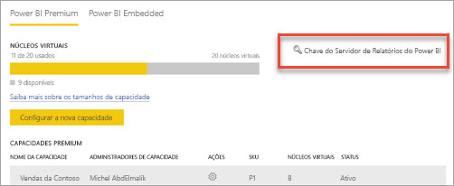

# Como encontrar a chave do produto (Product Key) do servidor de relatório
Saiba como você pode encontrar a chave do produto (Product Key) do Servidor de Relatório do Power BI para instalar o servidor em um ambiente de produção.

<iframe width="640" height="360" src="https://www.youtube.com/embed/6CQnf-NGtpU?rel=0&amp;showinfo=0" frameborder="0" allowfullscreen></iframe>

Você baixou o Servidor de Relatório do Power BI e tem um contrato do Software Assurance do SQL Server Enterprise. Ou você comprou o Power BI Premium. Você deseja instalar o servidor em um ambiente de produção, mas precisa de uma chave do produto (Product Key) para fazer isso. Onde está a chave do produto (Product Key)? 

A chave do produto (Product Key) estará em um dos dois locais, dependendo do que você comprou.

## Compra do Power BI Premium
Se você tiver adquirido o Power BI Premium, na da guia **Configurações de capacidade** do portal de administração do Power BI, você terá acesso à sua chave do produto do Servidor de Relatórios do Power BI. Isso somente estará disponível para os administradores globais ou usuários atribuídos à função de administrador de serviços do Power BI.

Selecionar **chave do Servidor de Relatório do Power BI** exibirá uma caixa de diálogo que contém a chave do produto (Product Key). É possível copiá-la e usá-la com a instalação.

## Compra do contrato do Software Assurance
Se você tiver um contrato do SQL Server Enterprise SA, você poderá obter a chave do produto (Product Key) no [Centro de Serviços de Licenciamento por Volume](https://www.microsoft.com/Licensing/servicecenter/). Procure abaixo do último service pack para obter a última versão do SQL Server. Caso não a encontre, procure abaixo da versão RTM da última versão do SQL Server.

> [!NOTE]
> É necessário procure abaixo da seção de download. Não a seção de chaves.
> 
> 

## Próximas etapas
[Início rápido: instalar o Servidor de Relatório do Power BI](quickstart-install-report-server.md)  
[Instalar o Power BI Desktop otimizado para o Servidor de Relatório do Power BI](install-powerbi-desktop.md)  
[Instalar o Construtor de Relatórios](https://docs.microsoft.com/sql/reporting-services/install-windows/install-report-builder)  
[Baixar o SSDT (SQL Server Data Tools)](http://go.microsoft.com/fwlink/?LinkID=616714)

Mais perguntas? [Experimente perguntar à Comunidade do Power BI](https://community.powerbi.com/)

