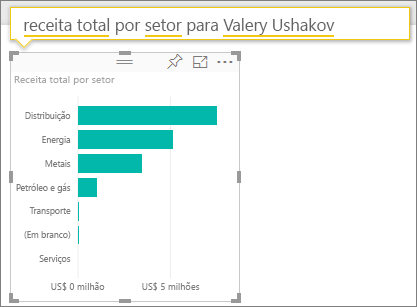

# Exemplo de Rentabilidade do Cliente para o Power BI: faça um tour

## Visão geral do exemplo de Rentabilidade do Cliente
O pacote de conteúdo “Exemplo de lucratividade do cliente”" contém um painel, o relatório e o conjunto de dados para uma empresa que fabrica materiais de marketing. Esse painel foi criado por um diretor financeiro para ver as métricas chave sobre seu 5 gerentes de unidade comercial (também conhecidos como executivos), produtos, clientes e margens brutas (GM). Ele pode ver rapidamente quais fatores têm impacto sobre a lucratividade.

Este exemplo faz parte de uma série de exemplos que ilustra como o Power BI pode ser usado com dados, relatórios e painéis orientados aos negócios. Os exemplos são dados reais de obviEnce ([www.obvience.com](http://www.obvience.com/)) que foram mantidos anônimos. Os dados estão disponíveis em vários formatos: aplicativo/pacote de conteúdo, a pasta de trabalho do Excel ou arquivo do Power BI Desktop .pbix. Veja [Conjuntos de dados de exemplo](sample-datasets.md).

## Pré-requisitos
Quer me acompanhar? Este tutorial usa o serviço Power BI e o pacote de conteúdo de exemplo "Lucratividade do Cliente".  Como as experiências de relatório são tão semelhantes, você também pode acompanhar usando o Power BI Desktop e o arquivo de exemplo PBIX. A seguir, as instruções para conexão com o pacote de conteúdo e o arquivo PBIX.

### Obter o pacote de conteúdo para este exemplo

1. Abra o serviço do Power BI (app.powerbi.com) e faça logon.
2. No canto inferior esquerdo, selecione **Obter dados**.
   
    
3. Na página Obter Dados que aparece, selecione o ícone **Exemplos**.
   
   
4. Selecione o **Exemplo de Rentabilidade do Cliente** e, em seguida, escolha **Conectar**.  
   
   
5. O Power BI importa o pacote de conteúdo e adiciona um novo dashboard, um relatório e um conjunto de dados ao seu espaço de trabalho atual. O novo conteúdo é marcado com um asterisco amarelo. Use os exemplos para realizar uma execução de teste no Power BI.  
   
   
  
### Obter o arquivo. pbix para este exemplo

Como alternativa, você pode baixar o exemplo como um arquivo .pbix, que é projetado para uso com o Power BI Desktop. [Exemplo de Rentabilidade do Cliente] (<http://download.microsoft.com/download/6/A/9/6A93FD6E-CBA5-40BD-B42E-4DCAE8CDD059/Customer>> Exemplo de Rentabilidade PBIX.pbix)

### Obter a pasta de trabalho do Excel para este exemplo

Se você quiser examinar a fonte de dados para este exemplo, observe que ela também está disponível como uma [(pasta de trabalho do Excel)](http://go.microsoft.com/fwlink/?LinkId=529781). A pasta de trabalho contém planilhas do Power View que você pode exibir e modificar. Para ver os dados brutos, selecione **Power Pivot > Gerenciar**.

## O que é nosso painel está dizendo?

Em **Meu Espaço de Trabalho**, localize o dashboard para o exemplo de Rentabilidade do Cliente:

### Blocos de painel de toda a empresa
1. Abra o painel no serviço Power BI. Esses blocos de painel dão ao nosso diretor financeiro métricas de empresa de alto nível importante para ela.  Quando ela vir algo interessante, pode selecionar um bloco para examinar os dados.

2. Examine os blocos no lado esquerdo do painel.

    

- A margem bruta da nossa empresa é de 42,5%.
- Temos 80 clientes.
- Vendemos 5 produtos diferentes.
- Tivemos nossa menor % de variação de receita para o orçamento de Fevereiro, seguida por nossa maior alta em março.
- A maioria da nossa receita é proveniente das regiões leste e norte. A margem bruta nunca excedeu o orçamento, com ER-0 e MA-0 exigindo mais investigações.
- A receita total para o ano é quase o orçamento.

### Blocos do painel específico do gerente
Os blocos no lado direito do painel fornecem uma pontuação da equipe. O diretor financeiro precisa manter o controle de seus gerentes e essas peças apresentam uma visão geral de alto nível do lucro – usando GM %. Se a tendência de % GM é inesperada para qualquer gerenciador, poderá investigar mais.

- Todos os executivos, exceto Carlos, já excederam suas metas de vendas. Mas as vendas reais do Carlos são as mais altas. 
- O percentual de GM de Annelie é o mais baixo, mas podemos ver um aumento gradual desde março.
- Valery, por outro lado, teve queda na % de GM significante. 
- E Andrew teve um ano volátil. 

## Explore os dados subjacentes do painel
Este painel tem blocos que vinculam a um relatório e a uma pasta de trabalho do Excel. 

### Abra a fonte de dados do Excel Online
Dois blocos neste painel "Destino vs Real" e "Crescimento de receita ano a ano" foram fixados de uma pasta de trabalho do Excel. Assim, quando você seleciona qualquer um desses blocos, o Power BI abre a fonte de dados – nesse caso, o Excel Online.

1. Selecione qualquer um dos blocos que foram fixados do Excel. O Excel Online é aberto dentro do serviço Power BI.
2. Observe que a pasta de trabalho tem três guias de dados. Abrir "Receita".
3. Vamos dar uma olhada para saber por que Carlos ainda não atingiu sua meta.  
    a. No controle deslizante "Executivo", selecione **Carlos Lima**.   
    b. A primeira Tabela Dinâmica informa que a receita de Carlos para seu principal produto, Primus, diminuiu 152% desde o ano passado. E o gráfico de ano a ano mostra que na maioria dos meses ele está abaixo do orçamento.  

    

    

4. Continuar explorando e, se você encontrar algo interessante, selecione **Fixar**  do canto superior direito para [fixá-lo a um painel](service-dashboard-pin-tile-from-excel.md).

5. Use a seta Voltar do navegador para retornar ao painel. 

### Abra o relatório subjacente do Power BI
A maioria dos blocos no painel de exemplo Lucratividade do Cliente foi fixada do relatório de exemplo Lucratividade do Cliente. 

1. Selecione um desses blocos para abrir o relatório no modo de exibição de leitura. 

2. O relatório tem três páginas. Cada guia na parte inferior do relatório representa uma página. 

    

    * “Scorecard da Equipe” enfoca o desempenho dos cinco gerentes e seus “livros de negócios”.
    * “Análise de Margem do Setor” fornece uma maneira para analisar nossa rentabilidade comparado ao que está acontecendo em todo nosso setor.
    * “Scorecard Executivo” fornece uma exibição de cada um dos nossos gerentes formatados para exibição na Cortana.

### Página de pontuação da equipe

Vejamos os dois membros da equipe em detalhes e quais informações podem ser obtidas. Na segmentação à esquerda, selecione nome de Andrw para filtrar a página do relatório para exibir apenas os dados sobre ele.

* Para um KPI rápido, examinar de Andrew **receita Status** -ele está verde. Ele está sendo bem executado.
* O gráfico de área "% de Receita Var para orçamento por mês” mostra a exceção para uma queda em fevereiro, Andrew está indo muito bem no geral. Sua região dominante é leste e ele manipula 49 clientes e 5 (de 7) produtos. A GM% não é o maior ou menor.
* A “% ReceitaTY e Receita Var para o Orçamento por Mês”, mostra um histórico de lucro até mesmo estático. Mas ao filtrar clicando no quadrado para **Central** na região treemap, você descobrirá que Andrew temi apenas receita em março e apenas em Indiana. Isso é intencional ou é algo que precisamos examinar?

Agora a diante com Valery. Na segmentação, selecione nome de Valery para filtrar a página do relatório para exibir apenas os dados sobre ela.  

* Observe o KPI vermelho para **o Status de ReceitaTY**. Isso definitivamente precisa de mais investigação.
* A variação de receita também pinta uma imagem preocupante – ela não atende suas margens de receita.
* Valery tem apenas 9 clientes, manipula somente 2 produtos e funciona quase exclusivamente com os clientes da região norte. Essa especialização poderia explicar ampla flutuações na sua métrica.
* Selecionando o quadrado **norte** no treemap mostra que a margem bruta de Valery na região norte é consistente com sua margem geral.
* Selecionar outros quadrados de **Região** apresenta uma história interessante: suas variações de % GM de 23% a 79% e seus números de receita, em todas as regiões, exceto norte, são extremamente sazonais.

Continue a ler para descobrir por que área de Valery não apresenta um bom desempenho. Examine as regiões, unidades de negócios e a próxima página do relatório – "Análise de margem do setor".

### Análise de margem do setor
Esta página de relatório fornece uma fatia diferente dos dados. Examina a margem bruta para todo o setor, dividido por segmento. O diretor financeiro usa essa página para comparar as métricas de unidade da empresa e comercial para métricas do setor para ajudar a explicar tendências e lucratividade. Você deve estar imaginando por que o gráfico de área "Margem bruta por mês e nome de execução” está nesta página, já que é específico de uma equipe. Tê-la aqui, nos permite filtrar a página pelo gerente da unidade de negócios.  

Como a lucratividade varia por setor? Como os produtos e clientes dividem por setor? Selecione um ou mais setores na parte superior esquerda. (iniciar no setor CPG) Para limpar o filtro, selecione o ícone de borracha.

No gráfico de bolhas, o CFO procura as bolhas maiores como são aqueles que têm o maior impacto na receita. Filtrar a página por gerente clicando em seus nomes no gráfico de área torna fácil ver cada impacto de gerente por segmento do setor.

* A área de Andrew de influência abrange vários setores diferentes com diferentes amplamente % GM (a maioria do lado positivo) e % Var. 
* O gráfico do Annelie é semelhante, exceto que ela se concentra em apenas alguns segmentos de mercado com um foco no segmento Federal e um foco no produto Gladius. 
* Carlos tem um foco claro no segmento de serviços, com bom lucro. Ele aumentou bastante a % de variação para o segmento de alta tecnologia e um novo segmento para ele, Industrial, executado muito bem em relação ao orçamento. 
* Tina trabalha com alguns segmentos e tem % GM mais alta, mas o tamanho pequeno em grande parte das suas bolhas mostra que seu impacto sobre o resultado da empresa é mínimo. 
* Valery, que é responsável por apenas um produto, trabalha apenas com 5 segmentos de mercado. Sua influência do setor é sazonal, mas sempre produz uma grande bolha, indicando um impacto significativo sobre o resultado da empresa. O setor explicar seu desempenho negativo?

### Scorecard executivo
Esta página é formatada como um Cartão de Respostas para a Cortana. Para obter mais informações, consulte [criar Cartões de Respostas para a Cortana](service-cortana-answer-cards.md)

## Investigue os dados fazendo perguntas em P e R
Para nossa análise, seria útil determinar qual setor gera a maior parte da receita para Valery. Vamos usar P e R.

1. Abra o relatório no modo de exibição Editar selecionado **Editar Relatório**. O modo de exibição de edição só estará disponível se você for o "dono" do relatório; às vezes, isso é conhecido como modo do **criador**. Se esse relatório tivesse sido compartilhado com você, você não poderia abri-lo no modo de exibição de edição.

2.  Na barra de menus superior, selecione **Fazer uma pergunta** para abrir a caixa de perguntas e respostas.

    

3. Digite **receita total pelo setor de Valery**. Observe como a visualização atualiza conforme você digita a pergunta.
   
    
   
   A distribuição é a maior área de receita para Valery.

### Aprofunde-se adicionando filtros
Vamos dar uma olhada na *distribuição* do setor.  

1. Abra a página de relatório de "Análise de margem do setor".
2. Sem selecionar nenhuma visualização na página do relatório, expanda o painel de filtro à direita (se já não estiver expandido). O Painel de filtros deve exibir apenas filtros de Nível de página.  
   
   
3. Localize o filtro para **Setor** e selecione a seta para expandir a lista. Vamos adicionar um filtro de página para o Setor de distribuição. Primeiro, limpe todas as seleções, desmarcando a caixa de seleção **Selecionar tudo**. Em seguida, selecione apenas **Distribuição.**  
   
   
4. O gráfico de área "Margem bruta por mês e o nome do executivo" informa que apenas Valery e Tina têm clientes neste setor e Valery só trabalhou com o setor de junho a novembro.   
5. Selecione **Tina** e **Valery** na legenda do gráfico da área “Margem bruta por mês e executivo”. Observe a parte de Tina "Receita Total por produto" é muito pequeno se comparada a Valery. 
6. Para ver a receita real, use as perguntas e respostas para perguntar a **receita total da distribuição por cenário e executivo**.  
   
     

    Podemos explorar de forma semelhante a outros setores e até mesmo adicionar clientes a nossos visuais para compreender as causas para o desempenho de Valery.

Este é um ambiente seguro para experimentar. Você pode optar por não salvar as alterações. Mas se você salvá-las, sempre é possível acessar **Obter Dados** para ter uma nova cópia deste exemplo.

Também é possível [baixar apenas o conjunto de dados (pasta de trabalho do Excel)](http://go.microsoft.com/fwlink/?LinkId=529781) para este exemplo

## Próximas etapas: conectar-se aos seus dados
Esperamos que este tour tenha mostrado como os painéis do Power BI, perguntas e respostas, e os relatórios podem fornecer ideias sobre dados do cliente. Agora é sua vez, conecte-se aos seus próprios dados. Com o Power BI, é possível se conectar a uma grande variedade de fontes de dados. Saiba mais sobre como [começar a usar o Power BI](service-get-started.md)

[Voltar para exemplos no Power BI](sample-datasets.md)  

