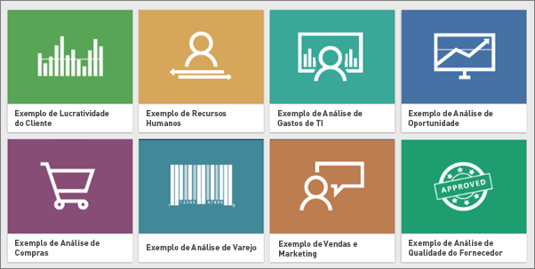
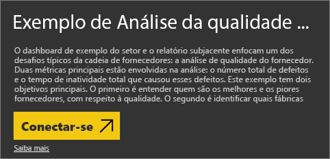
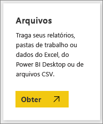
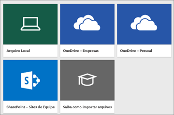
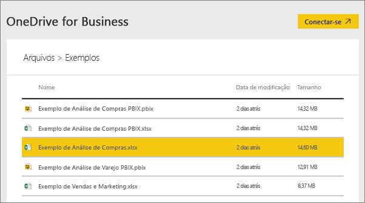
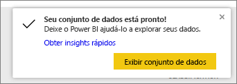
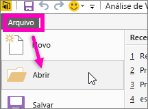

# Quais dados de exemplo estão disponíveis para uso com o Power BI?
Digamos que você é novo no Power BI e queira experimentá-lo, mas não tem todos os dados.  Ou talvez você tenha um conjunto de dados, mas visto que você não entende (ainda) como o Power BI funciona, você se preocupa que de alguma forma, poderá danificar seu conjunto de dados?

Você não precisa se estressar! A obviEnce ([www.obvience.com](http://www.obvience.com/)) e a Microsoft criaram exemplos para você usar até se sentir mais confortável com o Power BI.  Os dados são anônimos e representam setores diferentes: financeiro, RH, vendas e muito mais. E, à medida que ler a documentação online, você descobrirá tutoriais e demonstrações que usam esses mesmos exemplos, o que significa que você poderá acompanhá-los.      

   

Cada um desses exemplos está disponível em vários formatos: como um pacote de conteúdo, como uma planilha individual do Excel e como um arquivo .pbix. Não se preocupe se você não conhece essas coisas ou não sabe como obtê-las. Explicaremos tudo posteriormente neste artigo. E para cada exemplo, criamos um *tour*, que é um tipo de artigo que revela a história por trás do exemplo e orienta você em diferentes cenários. Um cenário pode responder perguntas para seu gerente, o outro pode procurar por insights competitivos, ou criar relatórios e dashboards para compartilhamento ou explicar um turno de negócios.   

Mas, antes de começar, leia estas diretrizes legais para usar os exemplos. Quando você terminar, apresentaremos os exemplos e mostraremos como usá-los.   

## Diretrizes de uso para as pastas de trabalho do Excel de exemplo do Power BI
Leia estas informações antes de usar os exemplos do Power BI.

©2015 Microsoft Corporation. Todos os direitos reservados. Os documentos e pastas de trabalho são fornecidos "como são". Informações e opiniões expressas em pastas de trabalho, incluindo URLs e outras referências a sites da Internet, podem ser alteradas sem aviso prévio. Você assume o risco de usá-las. Alguns exemplos são apenas para ilustração e são fictícios. Nenhuma associação real é proposital ou inferida. A Microsoft não oferece garantias, expressas ou implícitas, das informações aqui fornecidas.

As pastas de trabalho não concedem a você nenhum direito legal sobre nenhuma propriedade intelectual de nenhum produto da Microsoft. Você pode copiar e usar essa pasta de trabalho para fins internos e de referência.

As pastas de trabalho e os dados relacionados são fornecidos pela obviEnce. [www.obvience.com](http://www.obvience.com)

A ObviEnce é um ISV (distribuidor independente de software) e uma incubadora de propriedade intelectual voltada para Microsoft Business Intelligence. A ObviEnce trabalha em estreita colaboração com a Microsoft para desenvolver práticas recomendadas e liderança elaborada para início rápido e implantação de soluções de Microsoft Business Intelligence.

As pastas de trabalho e os dados são propriedade de obviEnce, LLC e foram compartilhadas exclusivamente com o objetivo de demonstrar a funcionalidade do Power BI com dados de exemplo do setor.

Quaisquer usos das pastas de trabalho e/ou dados devem incluir a atribuição acima (que também está na planilha de informações que acompanha cada pasta de trabalho). A pasta de trabalho e quaisquer visualizações devem ser acompanhadas pela seguinte notificação de direitos autorais: obviEnce ©.

Ao clicar em qualquer um dos links abaixo para baixar os arquivos de pasta de trabalho do Excel ou os arquivos .pbix, você estará concordando com os termos acima.

## Exemplos disponíveis
Oito exemplos estão disponíveis para uso.  Cada um representa um setor diferente.

### Exemplo de Rentabilidade do Cliente 
[Faça um tour pelo exemplo de Rentabilidade do Cliente](sample-customer-profitability.md)

Este exemplo de setor analisa as principais métricas do CFO para seus executivos, produtos e clientes. Você pode investigar quais fatores afetam a rentabilidade da sua empresa.

### Exemplo de Recursos Humanos 
[Faça um tour nos exemplos de RH](sample-human-resources.md)

Este exemplo de setor destaca a estratégia de contratação de uma empresa por meio da análise de novos contratados, funcionários ativos e funcionários dispensados.  Ao explorar os dados, você pode encontrar as tendências em separações voluntárias e desvios na estratégia de contratação.

### Exemplo de Análise de Gastos de TI 
[Faça um tour pelo exemplo de Análise de Gastos de TI](sample-it-spend.md)

Neste exemplo de setor, analisamos os custos planejados vs. os custos reais do departamento de TI de uma empresa. Essa comparação nos ajuda a entender como a empresa se preparou para o ano e investigar áreas com grandes desvios do plano. A empresa neste exemplo passa por um ciclo de planejamento anual e, em seguida, gera trimestralmente uma nova LE (Estimativa mais Recente) para ajudar a analisar as alterações nos gastos de TI no ano fiscal.

### Exemplo de Análise de Oportunidade 
[Faça um tour pelo exemplo de Análise de Oportunidade](sample-opportunity-analysis.md)

Este exemplo de setor explora o canal de vendas de uma empresa de software. Os gerentes de vendas monitoram seus canais de vendas diretas e de parceiros acompanhando as oportunidades e receita por região, tamanho da oferta e canal.

### Exemplo de Análise de Compras 
[Faça um tour pelo exemplo de Análise de Compras](sample-procurement.md)

Este exemplo de setor analisa as principais métricas do CFO para seus executivos, produtos e clientes. Você pode investigar quais fatores afetam a rentabilidade da sua empresa

### Exemplo de Análise de Varejo 
[Faça um tour pelo exemplo de Análise de Varejo](sample-retail-analysis.md)

Este exemplo de setor analisa dados de vendas de varejo de itens vendidos em várias lojas e distritos. As métricas comparam o desempenho deste ano ao do ano passado nestas áreas: vendas, unidades, margem bruta e variação, assim como uma análise do novo estoque.

### Exemplo de Vendas e Marketing 
[Faça um tour pelo exemplo de Vendas e Marketing](sample-sales-and-marketing.md)

Este exemplo de setor analisa uma empresa de fabricação, VanArsdel Ltd. Ele permite que o Diretor de Marketing inspecione o setor e a participação no mercado da VanArsdel.  Ao explorar o exemplo, você pode encontrar a participação no mercado da empresa, volume de produtos, vendas e opinião.

### Exemplo de Qualidade do Fornecedor 
[Faça um tour pelo exemplo de Qualidade do Fornecedor](sample-supplier-quality.md)

Este exemplo de setor destaca um dos desafios típicos da cadeia de fornecedores – análise de qualidade do fornecedor. Duas métricas principais estão envolvidas na análise: o número total de defeitos e o tempo de inatividade total que causou esses defeitos. Este exemplo tem dois objetivos principais: compreender quem são os melhores e piores fornecedores em relação à qualidade e identificar quais plantas realizam um trabalho melhor na localização e rejeição de defeitos, para minimizar o tempo de inatividade.

Agora você sabe o que está disponível. Hora de aprender a encontrar esses exemplos.  

## Como obter as amostras
Conforme você lê as informações acima, os exemplos estão disponíveis em vários formatos: pacotes de conteúdo, pastas de trabalho do Excel e arquivos .pbix. Descreveremos como usar cada um deles, começando com os pacotes de conteúdo.

## Os exemplos do Power BI como pacotes de conteúdo
Os pacotes de conteúdo são o único formato de exemplo que está disponível no Power BI. Você não precisa sair do Power BI para localizá-los. Um pacote de conteúdo é essencialmente um conjunto de um ou mais dashboards, um conjunto de dados e um relatórios que alguém cria e que pode ser usado com o serviço do Power BI. As pessoas criam pacotes de conteúdo para compartilhar com colegas. Cada um dos pacotes de conteúdo de exemplo do Power BI contém um conjunto de dados, um relatório e um dashboard.  Os pacotes de conteúdo não estão disponíveis no Power BI Desktop. Se você quiser saber mais sobre os pacotes de conteúdo, leia [Intro to content packs in Power BI](service-organizational-content-pack-introduction.md) (Introdução aos pacotes de conteúdo no Power BI).

### Obter e abrir um pacote de conteúdo de exemplo no serviço do Power BI
1. Abra o serviço do Power BI (app.powerbi.com) e faça logon.
2. No canto inferior esquerdo, selecione **Obter dados**.
   
    
3. Na página Obter Dados que aparece, selecione o ícone **Exemplos**.
   
   
4. Selecione um dos exemplos para abrir uma descrição do exemplo. Em seguida, escolha **Conectar**.  
   
   
5. O Power BI importa o pacote de conteúdo e adiciona um novo dashboard, um relatório e um conjunto de dados ao seu espaço de trabalho atual. O novo conteúdo é marcado com um asterisco amarelo. Use os exemplos para realizar uma execução de teste no Power BI.  
   
   

Agora que já tem os dados, você está no caminho certo.  Experimente alguns dos nossos tutoriais usando pacotes de conteúdo de exemplo ou abra o serviço do Power BI e explore.

## Exemplos do Power BI como arquivos do Excel
Cada um dos pacotes de conteúdo de exemplo também está disponível como uma planilha do Excel. As pastas de trabalho do Excel são projetadas para serem usadas com o serviço do Power BI.  

1. Baixe os arquivos individuais usando os links abaixo ou [baixe um arquivo zip de todos os arquivos de exemplo](http://go.microsoft.com/fwlink/?LinkId=535020). Se você for um usuário avançado, convém baixar as pastas de trabalho do Excel para explorar ou editar os modelos de dados.
   
   * [Exemplo de Análise de Varejo](http://go.microsoft.com/fwlink/?LinkId=529778)
   * [Exemplo de Análise de Qualidade do Fornecedor](http://go.microsoft.com/fwlink/?LinkId=529779)
   * [Exemplo de Recursos Humanos](http://go.microsoft.com/fwlink/?LinkId=529780)
   * [Exemplo de Rentabilidade do Cliente](http://go.microsoft.com/fwlink/?LinkId=529781)
   * [Exemplo de Acompanhamento de Oportunidades](http://go.microsoft.com/fwlink/?LinkId=529782)
   * [Exemplo de Análise de Gastos de TI](http://go.microsoft.com/fwlink/?LinkId=529783)
   * [Exemplo de Análise de Compras](http://go.microsoft.com/fwlink/?LinkId=529784)
   * [Exemplo de Vendas e Marketing](http://go.microsoft.com/fwlink/?LinkId=529785)
2. Salve o arquivo baixado. O local em que você salva o arquivo faz diferença.
   
   *   **Local** – Se você salvar o arquivo em uma unidade local no computador ou em outro local em sua organização, por meio do Power BI, será possível importar o arquivo para o Power BI. Na verdade, o arquivo permanecerá na unidade local; portanto, o arquivo completo não é, de fato, importado para o Power BI. O que realmente ocorre é que um novo conjunto de dados é criado no site do Power BI e os dados e, em alguns casos, o modelo de dados, são carregados nesse conjunto de dados. Se o arquivo tiver relatórios, eles serão exibidos no site do Power BI em Relatórios.
   *  **OneDrive – Business** – Caso você tenha o OneDrive for Business e entre com a mesma conta usada para o logon no Power BI, essa será, sem dúvida, a maneira mais efetiva de manter seu trabalho no Excel, no Power BI ou em um arquivo .CSV em sincronia com seu conjunto de dados, seus relatórios e dashboards no Power BI. Visto que tanto o Power BI quanto o OneDrive ficam na nuvem, o Power BI se conecta ao seu arquivo no OneDrive em intervalos aproximados de sessenta minutos. Caso sejam encontradas alterações, o conjunto de dados, os relatórios e os dashboards serão atualizados automaticamente no Power BI.
   *  **OneDrive – Pessoal** – Caso os arquivos sejam salvos em sua própria conta do OneDrive, você aproveitará vários dos mesmos benefícios que teria com o OneDrive for Business. A maior diferença é que, na primeira conexão ao arquivo (usando Obter Dados > Arquivos > OneDrive – Personal), será necessário entrar no OneDrive com sua conta da Microsoft, que, normalmente, é diferente daquela usada para fazer logon no Power BI. Ao entrar no OneDrive com sua conta da Microsoft, certifique-se de selecionar a opção Mantenha-me conectado. Dessa forma, o Power BI poderá se conectar ao seu arquivo em intervalos aproximados de sessenta minutos e garantir que o conjunto de dados no Power BI está em sincronia.
   *  **SharePoint – Sites de Equipe** – Salvar seus arquivos do Power BI no SharePoint – Sites de Equipe é muito semelhante a salvá-los no OneDrive for Business. A maior diferença nesse caso é como você se conecta ao arquivo do Power BI. É possível especificar uma URL ou conectar-se à pasta raiz.
3. Abra o serviço do Power BI (app.powerbi.com) e faça logon.
   
   > [!TIP]
   > Neste ponto, convém criar um novo dashboard e nomeá-lo depois do arquivo que você planeja importar.  Caso contrário, quando você importar o conjunto de dados do Excel, o Power BI não criará um novo dashboard nomeado após o exemplo mas em vez disso, adicionará um bloco no dashboard que você abriu no momento. Ao selecionar esse bloco, você será levado para o relatório do conjunto de dados. Isso não é um grande problema, já que você sempre pode criar um novo dashboard, mas ao começar com um novo dashboard, ele salva uma etapa ou duas para você.
   > 
   > 
4. No canto inferior esquerdo, selecione **Obter dados**.
   
    
5. Na página Obter Dados que aparece, selecione **Arquivos > Obter**.
   
     
6. Navegue até o local em que você baixou e salvou o exemplo.
   
   
7. Selecione o arquivo, neste caso **Procurement Analysis Sample.xlsx**, que foi salvo no OneDrive for Business, e escolha **Conectar**.
   
   
8. Escolha se deseja importar os dados ou colocar a pasta de trabalho no Power BI e vê-la exatamente como é no Excel online.
   
    
9. Se você selecionar **Importar**, o Power BI importará a pasta de trabalho de exemplo e a adicionará como um novo conjunto de dados chamado **Exemplo de Análise de Compras**.  Se a pasta de trabalho tiver planilhas, tabelas, intervalos ou um modelo de dados do Power View, o Power BI também criará um relatório (com o mesmo nome). E se você ainda não tiver um dashboard aberto, Power BI criará um novo dashboard. (Se tivesse um dashboard aberto quando clicou em **Obter Dados**, você teria visto um novo bloco em branco nesse dashboard.  Ao clicar nesse bloco, você será levado para o relatório do conjunto de dados que acabou de adicionar). O novo conteúdo é nomeado após a amostra e é marcado com um asterisco amarelo.
10. Quando a tela **Seu conjunto de dados está pronto!** aparecer, selecione **Exibir conjunto de dados** ou **Obter Insights Rápidos**, ou use a barra de navegação esquerda do Power BI para localizar e abrir o relatório ou o dashboard associado.  
    
     

### (Opcional) Dê uma olhada nos exemplos do Excel de dentro do próprio Excel
Deseja compreender como os dados em uma planilha do Excel são convertidos em relatórios e conjuntos de dados do Power BI? Você terá algumas respostas ao abrir os exemplos do Excel ***no Excel*** e explorar as planilhas.

* Ao abrir uma pasta de trabalho de exemplo no Excel pela primeira vez, você verá dois avisos. O primeiro diz que a pasta de trabalho está em Modo de Exibição Protegido. Selecione **Habilitar Edição**. O segundo pode dizer que a pasta de trabalho tem conexões de dados externas. Selecione **Habilitar Conteúdo**.
* Cada pasta de trabalho contém várias planilhas. Uma vez que todos esses exemplos do Excel têm, pelo menos, uma planilha do Power View com visualizações, ao importar o arquivo do Excel no Power BI, você acabará com um conjunto de dados **e** um relatório.
  
   Talvez você precise [habilitar o suplemento do Power View](https://support.office.com/article/Create-a-Power-View-sheet-in-Excel-2013-B23D768D-7586-47FE-97BD-89B80967A405#__toc328591957).
* Então, onde estão os dados reais? Eles estão no modelo de dados do Power Pivot. Para ver os dados, na guia **PowerPivot** selecione **Gerenciar Modelo de Dados**.
  
    Não vê a guia PowerPivot? [Habilite o suplemento do Power Pivot](https://support.office.com/article/Start-Power-Pivot-in-Microsoft-Excel-2013-add-in-A891A66D-36E3-43FC-81E8-FC4798F39EA8). 
* A guia Informações fornece informações sobre a obviEnce, a empresa que criou o exemplo.

## Os exemplos do Power BI como arquivos .pbix
Cada um dos pacotes de conteúdo de exemplo também está disponível como um arquivo .pbix do Power BI. Os arquivos .pbix foram projetados para serem usados com o Power BI Desktop.  

1. Baixe os arquivos individualmente clicando nos links abaixo.
   
   * [Exemplo de Análise de Varejo](http://download.microsoft.com/download/9/6/D/96DDC2FF-2568-491D-AAFA-AFDD6F763AE3/Retail Analysis Sample PBIX.pbix)
   * [Exemplo de Análise de Qualidade do Fornecedor](http://download.microsoft.com/download/8/C/6/8C661638-C102-4C04-992E-9EA56A5D319B/Supplier-Quality-Analysis-Sample-PBIX.pbix)
   * [Exemplo de Recursos Humanos](http://download.microsoft.com/download/6/9/5/69503155-05A5-483E-829A-F7B5F3DD5D27/Human Resources Sample PBIX.pbix)
   * [Exemplo de Rentabilidade do Cliente](http://download.microsoft.com/download/6/A/9/6A93FD6E-CBA5-40BD-B42E-4DCAE8CDD059/Customer Profitability Sample PBIX.pbix)
   * [Exemplo de Acompanhamento de Oportunidades](http://download.microsoft.com/download/9/1/5/915ABCFA-7125-4D85-A7BD-05645BD95BD8/Opportunity Analysis Sample PBIX.pbix)
   * [Exemplo de Análise de Gastos de TI](http://download.microsoft.com/download/E/9/8/E98CEB6D-CEBB-41CF-BA2B-1A1D61B27D87/IT Spend Analysis Sample PBIX.pbix)
   * [Exemplo de Análise de Compras](http://download.microsoft.com/download/D/5/3/D5390069-F723-413B-8D27-5888500516EB/Procurement Analysis Sample PBIX.pbix)
   * [Exemplo de Vendas e Marketing](http://download.microsoft.com/download/9/7/6/9767913A-29DB-40CF-8944-9AC2BC940C53/Sales and Marketing Sample PBIX.pbix)
2. Salve o arquivo baixado.
3. Na Área de Trabalho, selecione **Arquivo > Abrir** e navegue até o local em que você salvou o .pbix de exemplo.
   
   
4. Selecione o arquivo .pbix para abri-lo na Área de Trabalho.

## Próximas etapas
[Conceitos básicos do Power BI](service-basic-concepts.md)

[Tutorial: conectar-se aos exemplos do Power BI](sample-tutorial-connect-to-the-samples.md)

[Fontes de dados do Power BI](service-get-data.md)

Mais perguntas? [Experimente a Comunidade do Power BI](http://community.powerbi.com/)

