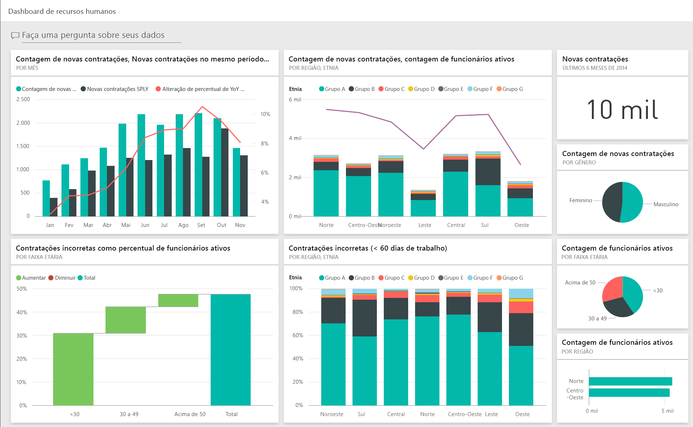
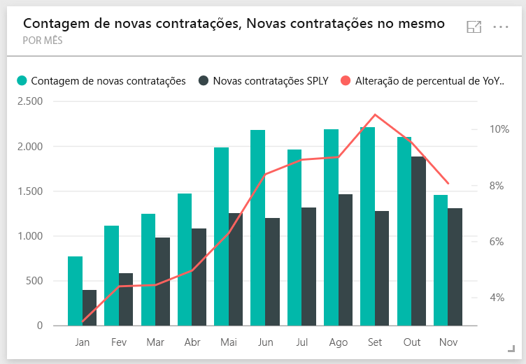
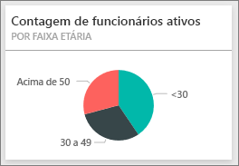
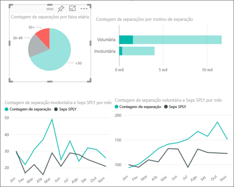
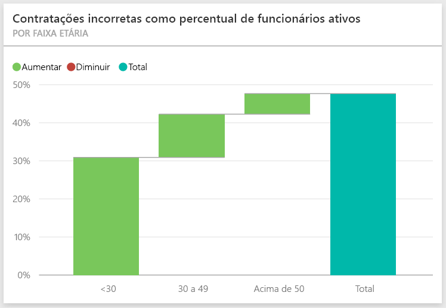
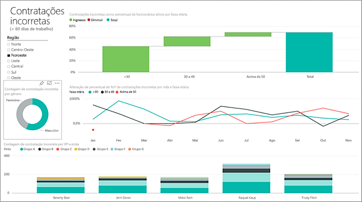
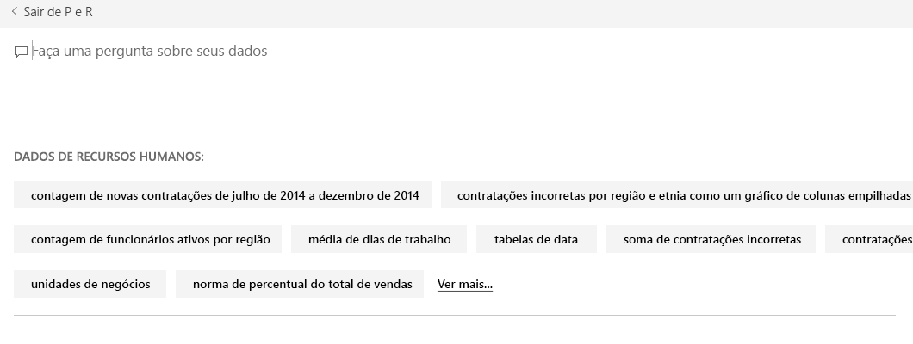
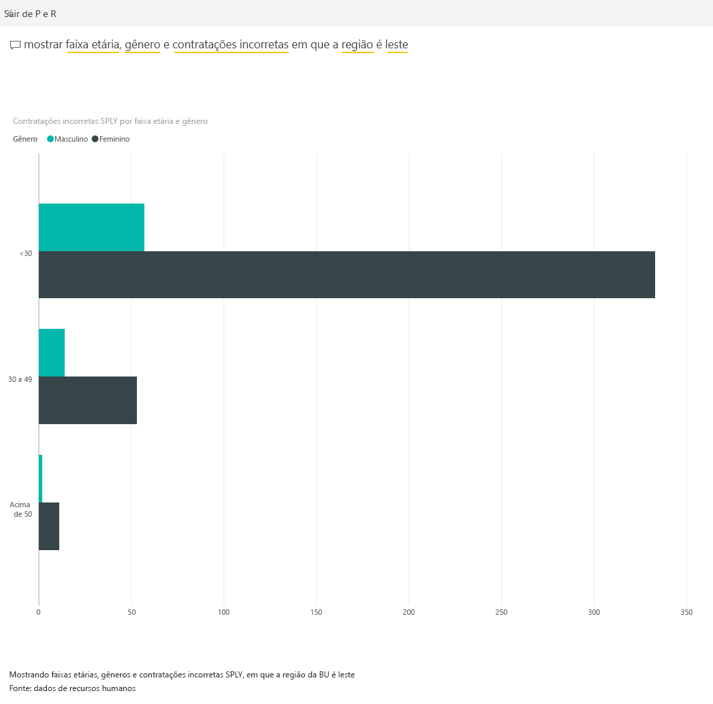

# Exemplo de Recursos Humanos para o Power BI: faça um tour
O departamento de RH tem o mesmo modelo de relatório em diferentes empresas, mesmo quando eles diferem em setor ou tamanho. Este exemplo examina novas contratações, funcionários ativos e funcionários que saíram e tenta descobrir tendências na estratégia de contratação. Nossos principais objetivos devem entender:

* Quem contratamos
* Desvios em nossa estratégia de contratação
* Tendências nas separações voluntárias

Este exemplo faz parte de uma série de exemplos que ilustra como o Power BI pode ser usado com dados, relatórios e painéis orientados aos negócios. Os exemplos são dados reais de obviEnce ([www.obvience.com)](http://www.obvience.com/) que foram mantidos anônimos.

Quer me acompanhar? No [Serviço do Power BI](https://powerbi.com), vá para **Obter Dados > Exemplos > Exemplo de Recursos Humanos > Conectar** para obter sua própria cópia do exemplo.

Também é possível [baixar apenas o conjunto de dados (pasta de trabalho do Excel)](http://go.microsoft.com/fwlink/?LinkId=529780) para este exemplo.

## Novas contratações
Primeiro, vamos explorar as novas contratações.

1. No seu espaço de trabalho, selecione a guia **Dashboards** e abra o dashboard Recursos Humanos.
2. No dashboard, selecione o bloco **Contagem de novas contratações, Novas contratações no mesmo período do ano passado, Alteração de % de YoY de funcionários ativos** **Por mês**.  
     
   
   O relatório de Exemplo de Recursos Humanos é aberto na página **Novas contratações** .  
   
   

Observe o seguinte:

* O gráfico de combinação **Contagem de novas contratações, Novas contratações no mesmo período do ano passado, Alteração de % de YoY de funcionários ativos por mês** mostra que contratamos mais pessoas a cada mês neste ano, comparado ao ano passado &#151; um número significativamente maior de pessoas em alguns meses.
* No gráfico de combinação **Contagem de novas contratações e Contagem de funcionários ativos por região e etnia**, observe que estamos contratando menos pessoas na região **Leste** .
* O gráfico de cascata **Var. de YoY de novas contratações por faixa etária** mostra que estamos contratando principalmente pessoas mais jovens. Isso pode ser devido à natureza principalmente de meio período dos trabalhos.
* O gráfico de pizza **Contagem de novas contratações por gênero** mostra uma divisão bem uniforme.

Você pode encontrar mais informações, por exemplo, uma região em que a divisão de gênero não é uniforme? Selecione diferentes faixas etárias e gêneros nos gráficos para explorar as relações entre idade, gênero, região e grupo étnico.

Selecione o nome do dashboard na barra de navegação superior para retornar ao dashboard.

## Comparar os funcionários atuais e antigos
Vamos explorar os dados de funcionários ativos atuais e funcionários que não trabalham mais na empresa.

No painel, selecione o bloco **Contagem de funcionários ativos por faixa etária** .  

O relatório de Exemplo de Recursos Humanos é aberto na página **Funcionários ativos vs. Separações**.  

**Itens de interesse**:

* Os gráficos de combinação no lado esquerdo mostraram alteração de ano a ano para funcionários ativos e separações. Temos mais ativos deste ano devido a contratação rápida, mas também mais separações do que o último ano.
* Em agosto tivemos que separar mais em comparação com outros meses. Selecione as diferentes faixas etárias, gêneros ou regiões para ver se você consegue encontrar quaisquer exceções.
* Examinando os gráficos de pizza, observamos que temos uma divisão boa, até mesmo em nossos funcionários ativos por grupos de idade e gênero. Selecione diferentes faixas etárias para ver que a divisão de gênero é distinta por idade. Temos uma divisão até mesmo por gênero em cada faixa etária? 

## Motivos para separação
Abra novamente no relatório no modo de Exibição de Edição. Selecione **Editar relatório** no canto superior esquerdo. 

Altere os gráficos de pizza para mostrar os dados Separados em vez de ativos.

1. Selecione o gráfico de pizza **Contagem de funcionários ativos por faixa etária** .
2. Em **Campos**, selecione a seta ao lado de **Funcionários** para expandir a tabela Funcionários. Desmarque a caixa de seleção ao lado de **Contagem de Funcionários Ativos** para remover esse campo.
3. Marque a caixa de seleção ao lado de **Contagem de separação** na tabela Funcionários para adicioná-la à caixa **Valores** bem no contêiner do campo.
4. De volta à tela do relatório, selecione a barra **Voluntário** no gráfico de barras **Contagem de separações por motivo de separação**. Isso realça os funcionários que deixaram a empresa voluntariamente nos outros visuais do relatório.
5. Clique na fatia +50 do gráfico de pizza Contagem de separações por faixa etária.
   
   Examine as separações pelo gráfico de linhas do Motivo no canto inferior direito. Este gráfico é filtrado para mostrar separações voluntárias.  
   
   
   Observa a tendência no grupo etário 50+? Durante a última parte do ano, mais funcionários acima de 50 anos estão deixando a empresa voluntariamente. É uma área para investigar melhor com mais dados.
6. Você também pode seguir as mesmas etapas para o gráfico de pizza **Contagem de funcionários ativos por gênero** , alterando-o para “separações” em vez de “funcionários ativos”. Examine os dados de separação voluntário por gênero para ver se você encontrar quaisquer outras informações.
7. Clique no **Power BI** na barra de navegação superior para retornar ao painel. Você pode salvar as alterações feitas no relatório ou não.

## Contratações incorretas
A última área para explorar são as contratações incorretas. Contratações incorretas são definidas como funcionários que não duraram mais de 60 dias. Estamos contratando rapidamente. Estamos contratando bons candidatos?

1. Selecione o bloco do painel **Contratações incorretas como % de funcionários ativos por faixa etária** . Isso abre o relatório na página 3, “Contratações Incorretas”.
   
     
2. Selecione a caixa de seleção **Noroeste** na segmentação Região à esquerda e a fatia **Masculino** no gráfico de rosca Contagem de Contratações Incorretas por Sexo.  Examine outros gráficos na página “Contratações Incorretas”. Mais contratações incorretas de homens do que mulheres, em muitas contratações incorretas do Grupo A.
     
3. Observando o gráfico de rosca **Contratações incorretas por gênero** e clicando na segmentação **Região** , percebemos que Leste é a Região com mais contratações incorretas de mulheres do que de homens.  
4. Selecione o nome do dashboard na barra de navegação superior para retornar ao dashboard.

## Faça uma pergunta na caixa de perguntas e respostas
A [caixa de P e R](service-how-to-q-and-a.md) é onde você digita uma pergunta usando a linguagem natural. A P e R reconhece as palavras que você digita e descobre onde, em seu conjunto de dados, a resposta será encontrada.

1. Clique na caixa de P e R. Observe que, antes mesmo de começar a digitar, a caixa de P e R contém sugestões:
   
   
2. Você pode escolher uma dessas sugestões ou digitar: **mostrar faixa etária, gênero e contratações incorretas no mesmo período do ano passado na região é leste**.  
   
   
   
   Observe que a maioria das contratações incorretas de mulheres estão abaixo de 30 anos.

Este é um ambiente seguro para experimentar. Você pode optar por não salvar as alterações. Se você salvá-las, sempre é possível acessar **Obter Dados** para obter uma nova cópia desse exemplo.

## Próximas etapas: conectar-se aos seus dados
Esperamos que este tour tenha mostrado como os painéis, P e R e relatórios do Power BI podem fornecer informações sobre os dados de recursos humanos. Agora é sua vez, conecte-se aos seus próprios dados. Com o Power BI, é possível se conectar a uma grande variedade de fontes de dados. Saiba mais sobre como [começar a usar o Power BI](service-get-started.md)  

