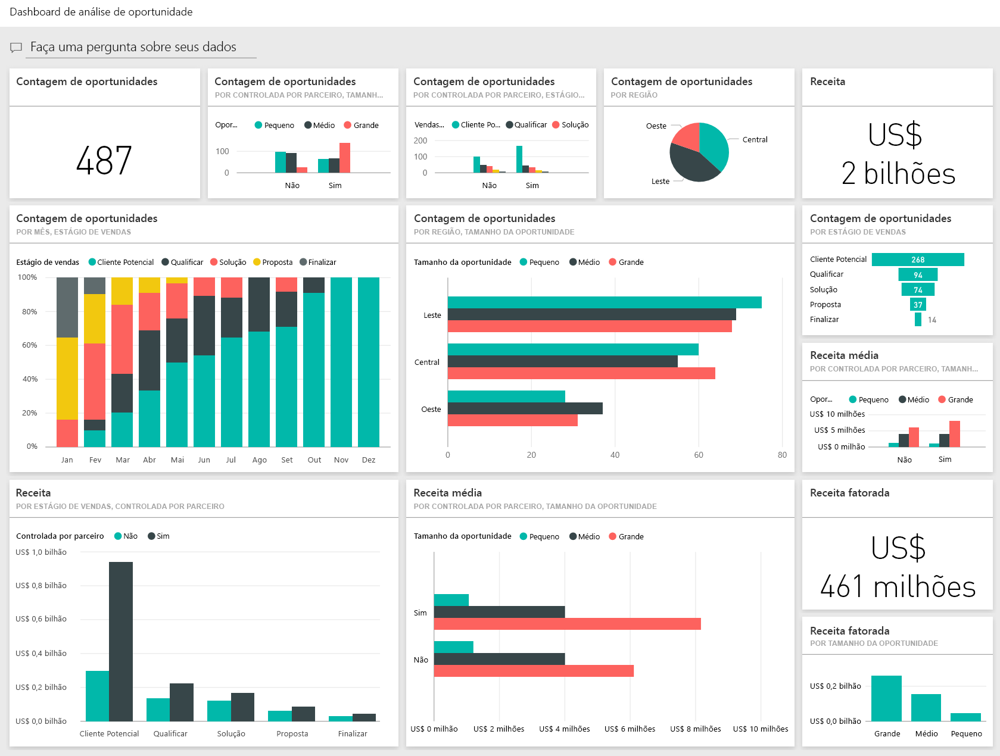
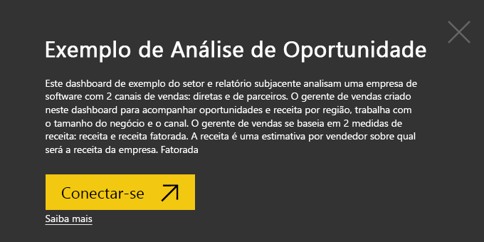
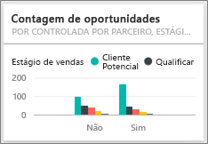

# Oportunidade de Análise de Varejo para o Power BI: faça um tour

## Visão geral do exemplo de Análise de Oportunidade
O **Exemplo de Análise de Oportunidade** contém um dashboard (e um relatório associado) de uma empresa de software que tem dois canais de vendas: *direta* e de *parceiro*. O gerente de vendas criado neste painel para acompanhar oportunidades e receita por região, trabalha com o tamanho do negócio e o canal.

O gerente de vendas se baseia em duas medidas de receita:

* **Receita** – esta é uma estimativa por vendedor sobre o que ele acredita que será a receita da empresa.
* **Receita Fatorada** – esta é calculada como a porcentagem (%) entre a Receita x Probabilidade e é aceita normalmente como sendo uma previsão mais precisa da receita de vendas real. A probabilidade é determinada pelo ***Estágio de Venda do negócio*** em andamento.
  * Cliente potencial – 10%  
  * Qualificar – 20%  
  * Solução – 40%  
  * Proposta — 60%  
  * Finalizar – 80%

  

Este exemplo faz parte de uma série de exemplos que ilustra como o Power BI pode ser usado com dados, relatórios e painéis orientados aos negócios. Os exemplos são dados reais de obviEnce ([www.obvience.com)](http://www.obvience.com/) que foram mantidos anônimos.

## Pré-requisitos

 Antes de usar o exemplo, primeiro você deve baixá-lo como um [pacote de conteúdo](https://docs.microsoft.com/en-us/power-bi/sample-opportunity-analysis#get-the-content-pack-for-this-sample), [arquivo .pbix](http://download.microsoft.com/download/9/1/5/915ABCFA-7125-4D85-A7BD-05645BD95BD8/Opportunity Analysis Sample PBIX.pbix) ou [pasta de trabalho do Excel](http://go.microsoft.com/fwlink/?LinkId=529782).

### Obter o pacote de conteúdo para este exemplo

1. Abra o serviço do Power BI (app.powerbi.com) e faça logon.
2. No canto inferior esquerdo, selecione **Obter dados**.
   
    
3. Na página Obter Dados que aparece, selecione o ícone **Exemplos**.
   
   
4. Selecione o **Exemplo de Análise de Oportunidades** e escolha **Conectar**.  
  
   
   
5. O Power BI importa o pacote de conteúdo e adiciona um novo dashboard, um relatório e um conjunto de dados ao seu espaço de trabalho atual. O novo conteúdo é marcado com um asterisco amarelo. 
   
   
  
### Obter o arquivo. pbix para este exemplo

Como alternativa, você pode baixar o exemplo como um arquivo .pbix, que é projetado para uso com o Power BI Desktop. 

 * [Exemplo de Análise de Oportunidade](http://download.microsoft.com/download/9/1/5/915ABCFA-7125-4D85-A7BD-05645BD95BD8/Opportunity%20Analysis%20Sample%20PBIX.pbix)

### Obter a pasta de trabalho do Excel para este exemplo
Também é possível [baixar apenas o conjunto de dados (pasta de trabalho do Excel)](http://go.microsoft.com/fwlink/?LinkId=529782) para este exemplo A pasta de trabalho contém planilhas do Power View que você pode exibir e modificar. Para ver os dados brutos, selecione **Power Pivot > Gerenciar**.

## O que é nosso painel está dizendo?
Nossa gerente de vendas criou um painel para acompanhar as métricas mais importantes para ela. Quando ela vir algo interessante, pode selecionar um bloco para examinar os dados.

1. A receita da empresa é de US $2 bilhões e a receita fatorada é de US $461 milhões.
2. Receita e contagem de oportunidade seguem um padrão de funil familiar, com tos otais diminuindo cada estágio subsequente.
3. A maioria de nossas oportunidades são na região leste.
4. As grandes oportunidades geram receita maior do que as oportunidades de pequenas ou médias.
5. Ofertas de grande parceiro geram mais receita: US $8 milhões em média contra US $6 milhões de vendas direta.

Uma vez que o esforço necessário para colocar um acordo é o mesmo se o problema é classificado como grande, médio e pequeno. nossa empresa deve examinar os dados para saber mais sobre grandes oportunidades.

Selecione o bloco **Contagem de oportunidades controlada por parceiro e estágio de venda** para abrir a página 1 do relatório.  

## Explore outras páginas no relatório
### A página 1 do nosso relatório é intitulada “Visão geral das contagens de oportunidades”.

* Leste é nossa região maior em termos de contagens de oportunidade.  
* No gráfico de pizza, selecione uma região por vez para filtrar a página. Para cada região, os parceiros estão buscando significativamente mais oportunidades grandes.   
* A contagem de oportunidade, controlada por parceiro e tamanho da oportunidade de gráfico de colunas mostra claramente que a maioria das grandes oportunidades são controladas por parceiro e mais oportunidades de pequenas e médias não são controladas por parceiro.
* Selecione cada estágio de vendas no gráfico de barras na parte inferior esquerda para ver a diferença na contagem regional e observe que, embora leste seja nossa região maior em termos de contagens, nos estágios de Solução, Proposta e Finalizar, todas as 3 regiões têm contagens comparáveis. Isso significa que podemos fechar uma porcentagem maior de acordos na região central e oeste.

### A página 2 do nosso relatório é intitulada "Visão geral da receita".
Esta página examina de modo semelhante os dados, mas usando uma perspectiva de receita em vez de contagem.  

* Leste também é nossa maior região não apenas na contagem de oportunidade, mas em receita.  
* Filtragem por parceiros (selecione **Sim** na legenda no canto superior direito) para revelar a receita de US$1,5 bilhões e US$294 milhões. Compare isso com US $644B e $166 M para receitas de não parceiros.  
* A receita média para contas grandes é maior (8M) se é a oportunidade de parceiros em comparação com 6 M para empresas não parceiras.  
* Para parceiros comerciais, a receita média por grandes oportunidades é quase dupla de oportunidades de empresas de médio porte (4M).  
* A receita média para pequenas e médias empresas é comparável aos parceiros e não parceiros comerciais.   

Claramente, nossos parceiros estão fazendo um trabalho melhor de venda aos clientes.  Pode fazer sentido para direcionar mais negócios por meio de nossos parceiros.

### A página 3 do nosso relatório é intitulada "Visão geral da receita"
Esta página analisa dados semelhantes, mas divide-os por região e estágio.  

* Ao filtrar a região leste (selecione **Leste** no gráfico de pizza) revela que as oportunidades na região leste são divididas quase iguais entre parceiros e não parceiros.
* Grandes oportunidades são mais comuns na região central, pequena oportunidades são as mais comuns na região leste e oportunidades de médio porte são as mais comuns na região oeste.

### A página 4 do nosso relatório é intitulada "Oportunidades futuras"
Novamente, estamos analisando fatores semelhantes, mas desta vez de uma perspectiva de data/hora.  

Nosso CFO usa esta página para gerenciar a carga de trabalho. Ao examinar as oportunidades de receita por mês e o estágio de vendas, ela pode planejar adequadamente.

* A receita média para o estágio Finalizar é a mais alta. Essas ofertas de fechamento são prioridade.
* Filtrar por mês (selecionando o nome do mês na segmentação de dados à esquerda) mostra que janeiro tem uma grande proporção dos negócios grandes no estágio Finalizar com receita fatorada de US $75 milhões. Fevereiro, por outro lado, tem principalmente negociações médias no estágio de proposta e solução.
* Em geral, os números de receita fatorada flutuam com base no estágio de vendas, o número de oportunidades e o tamanho do negócio. Adicione filtros (usando o painel de filtro à direita) para esses fatores descobrirem mais informações.

Este é um ambiente seguro para experimentar. Você pode optar por não salvar as alterações. Mas se você salvá-las, sempre é possível acessar **Obter Dados** para ter uma nova cópia deste exemplo.

## Próximas etapas: conectar-se aos seus dados
Esperamos que este tour tenha mostrado como os painéis, P e R e relatórios do Power BI podem fornecer informações sobre os dados de controle de oportunidade. Agora é sua vez - conecte-se aos seus próprios dados. Com o Power BI, é possível se conectar a uma grande variedade de fontes de dados. Saiba mais sobre como [começar a usar o Power BI](service-get-started.md)

[Baixar exemplos](sample-datasets.md)  
