# Exemplo de Análise de Varejo para o Power BI: faça um tour

Este painel de exemplo do setor, juntamente com o relatório subjacente, analisam dados de vendas de varejo de itens vendidos em várias lojas e distritos. As métricas comparam o desempenho deste ano ao do ano passado nestas áreas: vendas, unidades, margem bruta e variação, bem como uma análise do novo estoque. Os exemplos são dados reais de obviEnce ([www.obvience.com](http://www.obvience.com)) que foram mantidos anônimos.

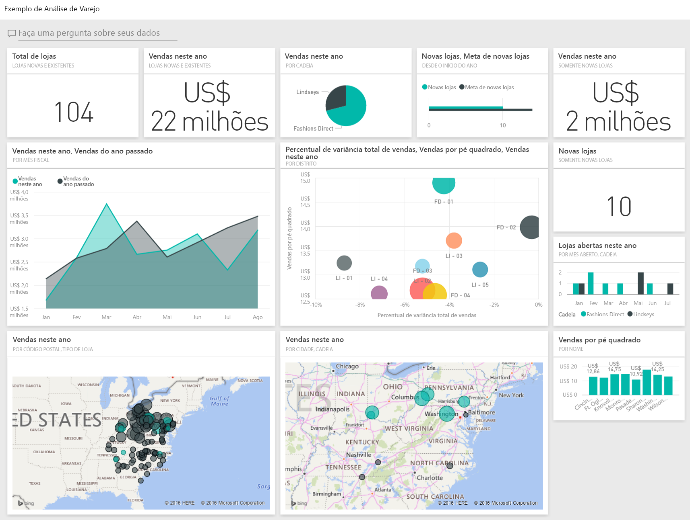

## Pré-requisitos

 Antes de usar o exemplo, primeiro você deve baixá-lo como um [pacote de conteúdo](https://docs.microsoft.com/power-bi/sample-datasets#get-and-open-a-sample-content-pack-in-power-bi-service), [arquivo .pbix](http://download.microsoft.com/download/9/6/D/96DDC2FF-2568-491D-AAFA-AFDD6F763AE3/Retail-Analysis-Sample-PBIX.pbix) ou [pasta de trabalho do Excel](http://go.microsoft.com/fwlink/?LinkId=529778).

### Obter o pacote de conteúdo para este exemplo

1. Abra o serviço do Power BI (app.powerbi.com) e faça logon.
2. No canto inferior esquerdo, selecione **Obter dados**.
   
    
3. Na página Obter Dados que aparece, selecione o ícone **Exemplos**.
   
   
4. Selecione o **exemplo de Análise de Varejo** e escolha **Conectar**.  
  
   
   
5. O Power BI importa o pacote de conteúdo e adiciona um novo dashboard, um relatório e um conjunto de dados ao seu espaço de trabalho atual. O novo conteúdo é marcado com um asterisco amarelo. 
   
   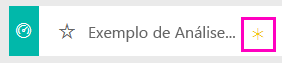
  
### Obter o arquivo. pbix para este exemplo

Como alternativa, você pode baixar o exemplo como um arquivo .pbix, que é projetado para uso com o Power BI Desktop. 

 * [Exemplo de Análise de Varejo](http://download.microsoft.com/download/9/6/D/96DDC2FF-2568-491D-AAFA-AFDD6F763AE3/Retail%20Analysis%20Sample%20PBIX.pbix)

### Obter a pasta de trabalho do Excel para este exemplo
Também é possível [baixar apenas o conjunto de dados (pasta de trabalho do Excel)](http://go.microsoft.com/fwlink/?LinkId=529778) para este exemplo A pasta de trabalho contém planilhas do Power View que você pode exibir e modificar. Para ver os dados brutos, selecione **Power Pivot > Gerenciar**.

## Iniciar no painel e abrir o relatório
1. No painel, selecione o bloco “Total de Lojas”:

   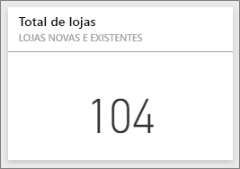  

   Isso leva você à página “Visão geral das vendas da loja” no relatório. Veja que temos 104 lojas no total, sendo que 10 delas são novas. Temos duas redes, Fashions Direct e Lindseys. Em média, as lojas Fashions Direct são maiores.
2. No gráfico de pizza, selecione **Fashions Direct**.

   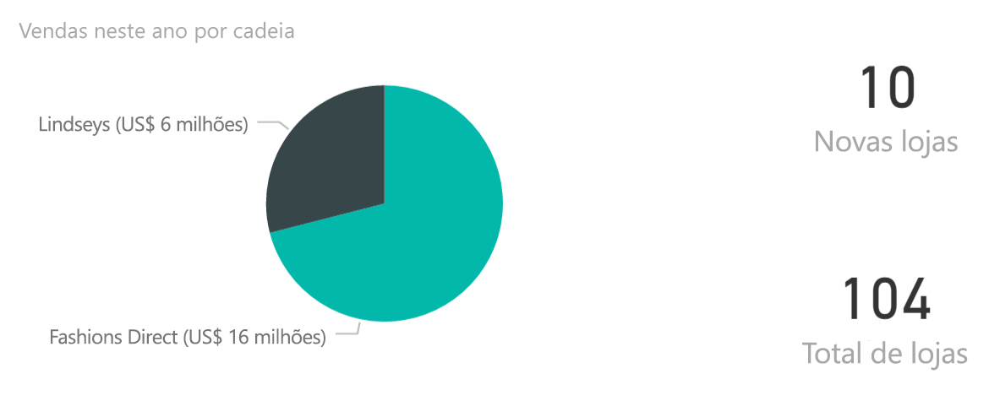  

   Observe o resultado no gráfico de bolhas:

   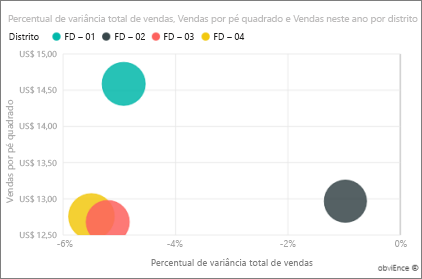  

   O distrito FD-01 tem a maior média de vendas por metro quadrado, FD-02 tem a menor variação em vendas em comparação ao ano passado, FD-03 e FD-04 têm os piores desempenhos gerais.
3. Selecione algumas das bolhas individuais ou outros gráficos para ver o realce cruzado revelando o impacto de suas seleções.
4. Para retornar ao dashboard, selecione seu nome na barra de navegação superior (trilhas).

   
5. No painel, selecione o bloco que contém “Vendas deste ano”.

   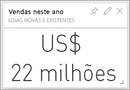

   Isso é equivalente a digitar “Vendas deste ano” na caixa de pergunta.

   Você verá esta tela:

   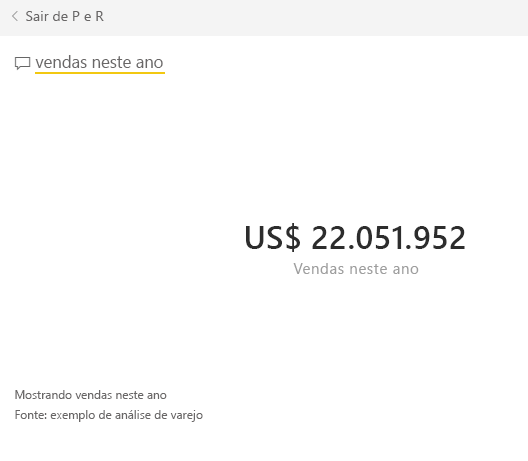

## Examinar um bloco criado com P e R do Power BI
Vamos analisar mais detalhadamente.

1. Adicione “vendas deste ano **por distrito**” à pergunta. Observe o resultado: ele coloca automaticamente a resposta em um gráfico de barras e sugere outras frases:

   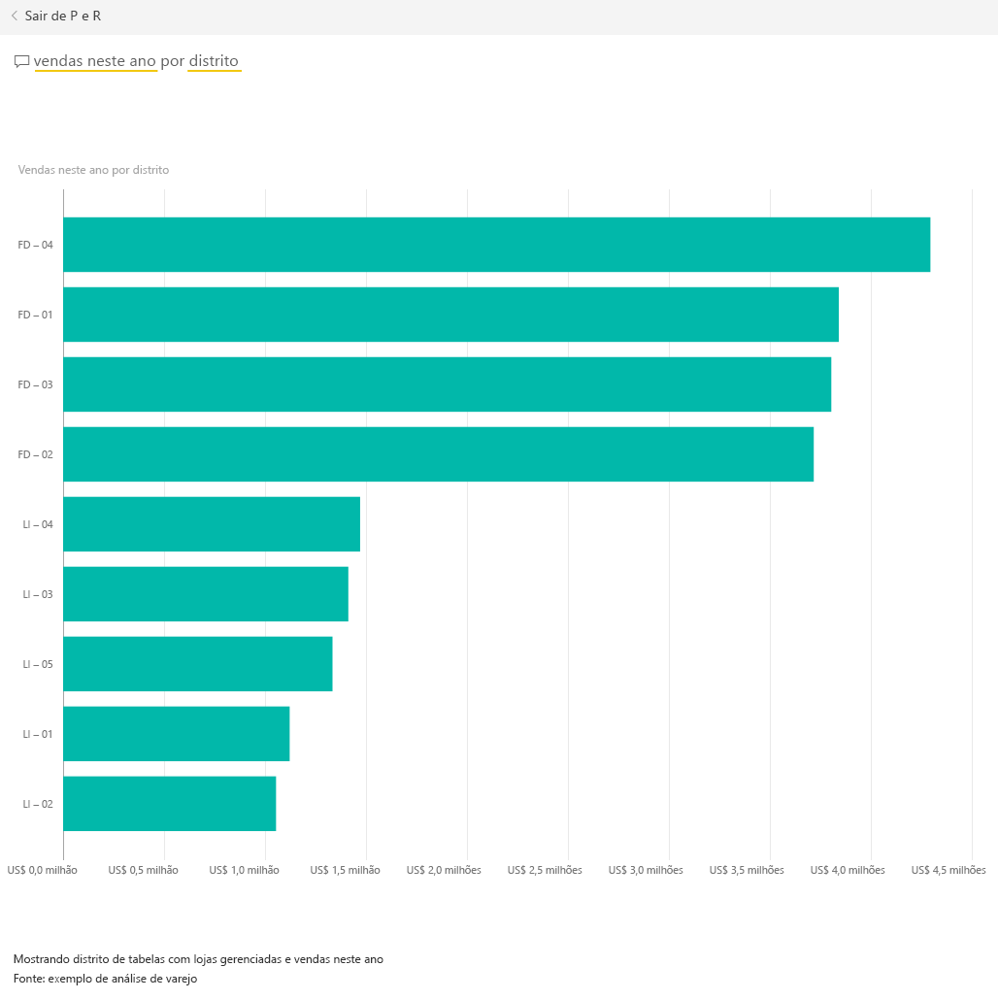
2. Agora, altere a pergunta para “vendas deste ano **por CEP e rede**”.

   Observe como ele responde à pergunta conforme você digita com os gráficos apropriados.
3. Experimente com mais perguntas e veja que tipo de resultados são obtidos.
4. Quando estiver pronto, retorne ao dashboard.

## Aprofundar-se nos dados
Agora vamos explorar em um nível mais detalhado, observando os desempenhos dos distritos.

1. No painel, selecione o bloco, comparando as vendas deste ano às vendas do ano passado.

   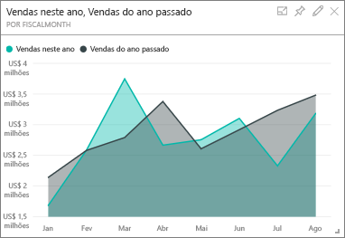

   Observe a grande variabilidade na % de Variação em relação ao ano passado, com janeiro, abril e julho apresentando especificamente um desempenho ruim.

   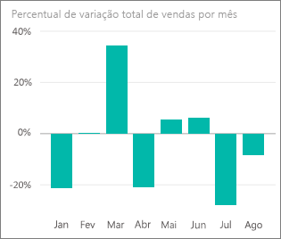

   Vamos ver se podemos chegar até onde os problemas podem estar.
2. Selecione o gráfico de bolhas e escolha **020-Mens**.

   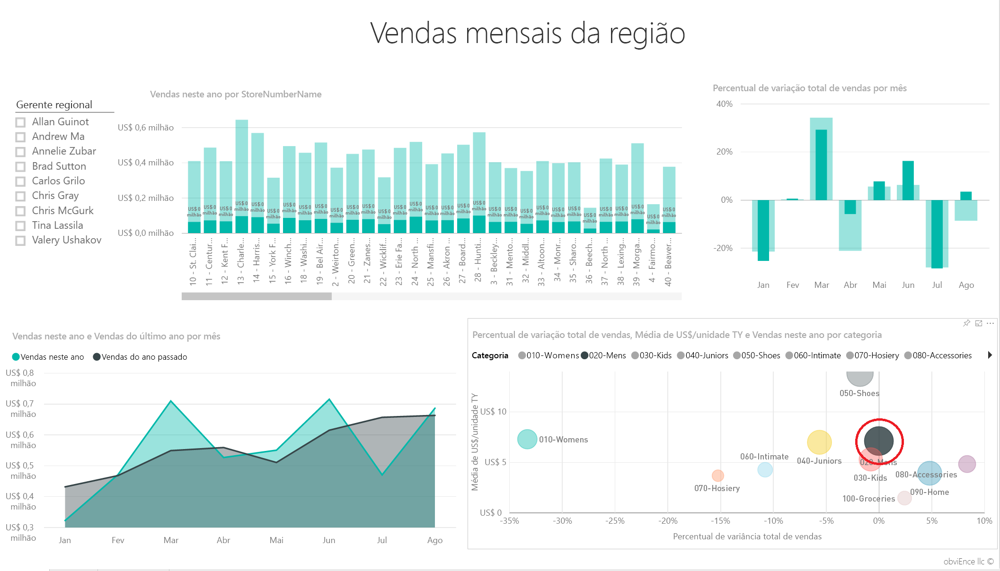  

   Observe que a categoria Masculino não foi tão prejudicada em abril como os negócios em geral, mas janeiro e julho ainda foram meses com problemas.
3. Agora, selecione a **bolha 010-Womens**.

   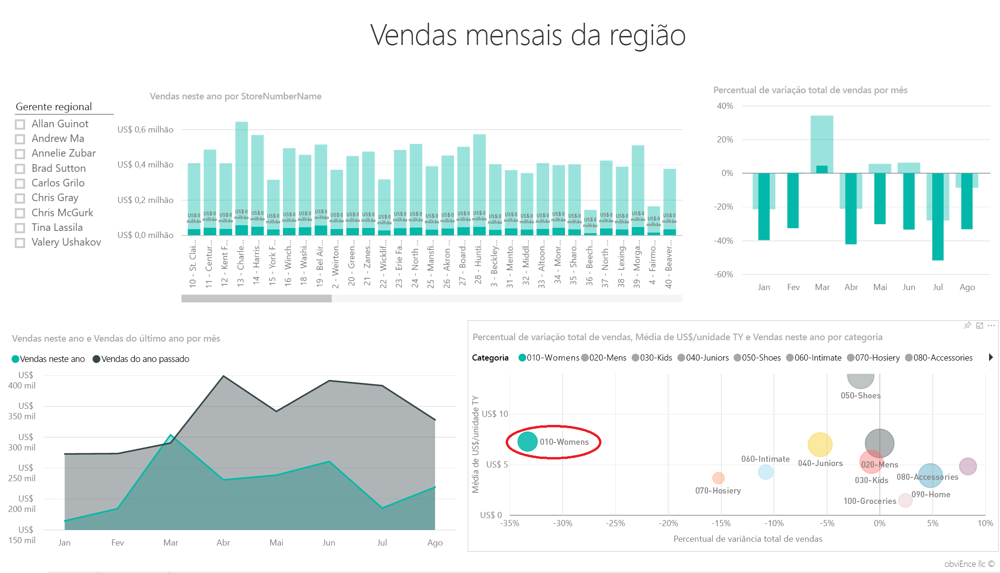

   Observe que a categoria Feminino teve desempenho muito pior do que os negócios em geral em todos os meses, e muito pior em quase todos os meses, em comparação com o ano interior.
4. Selecione a bolha novamente para limpar o filtro.

## Experimentar a segmentação
Vejamos o desempenho de distritos específicos.

1. Clique em Artur Gomes na parte superior esquerda da segmentação.

   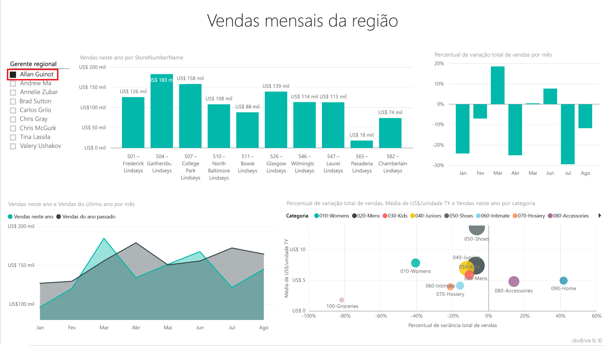

   Observe que o distrito de Artur teve um desempenho superior no Ano Passado em março e junho.
2. Agora, com Artur ainda selecionado, selecione a bolha Feminino.

   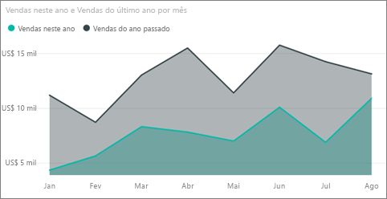

   Observe que para a categoria Feminino, seu distrito nunca atendeu o volume do ano passado.
3. Explore os outros gerentes e categorias de distrito – quais outras informações você pode encontrar?
4. Quando estiver pronto, retorne ao painel.

## O que nossos dados estão nos dizendo sobre o crescimento de vendas deste ano?
A última área que desejamos explorar é nosso crescimento – as novas lojas abertas neste ano.

1. Selecione o bloco “Lojas abertas neste ano”

   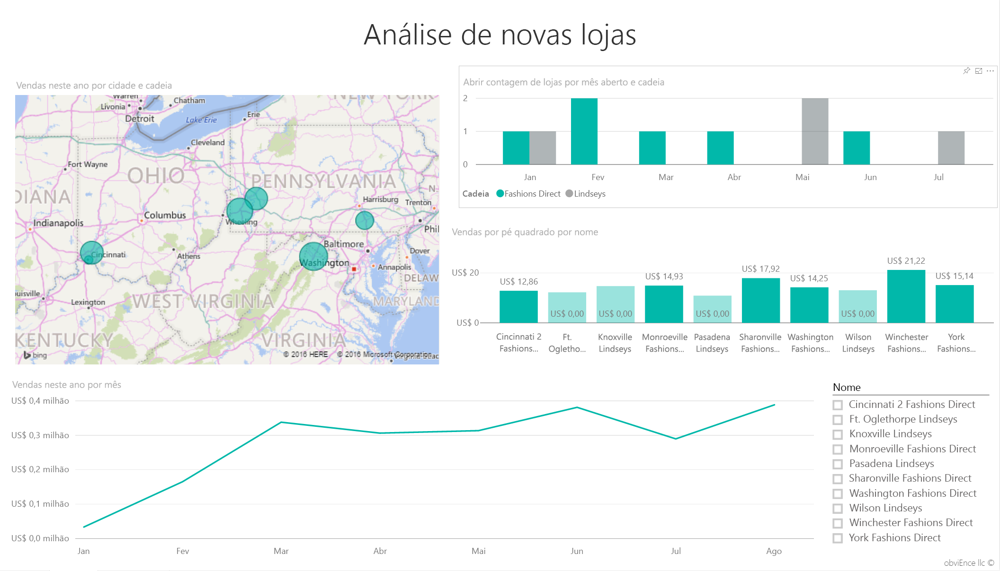

   Como pode ser viso no bloco - foram abertas mais lojas Fashion Direct do que Lindseys este ano.
2. Observe o gráfico “Vendas por pés quadrados por nome”:

   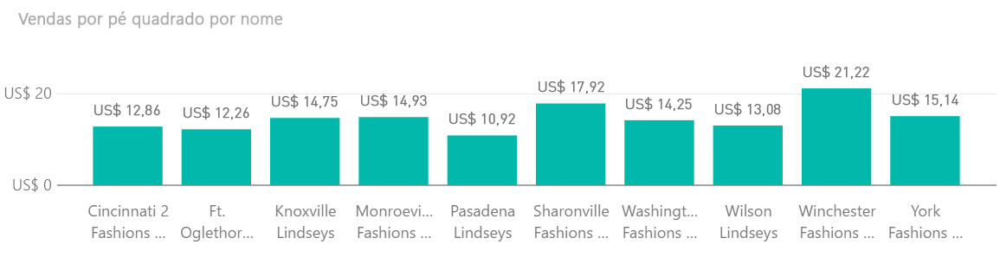

    Há bastante diferença na Média de Vendas por Pés Quadrados entre as novas lojas.
3. Clique no item de legenda Fashions Direct no gráfico à direita superior. Observe, que mesmo para a mesma rede, a melhor loja (Winchester Fashions Direct), em desempenho, significativamente supera a pior loja (Cincinnati 2 Fashions Direct): US$ 21,22 vs. US$ 12,86, respectivamente.

   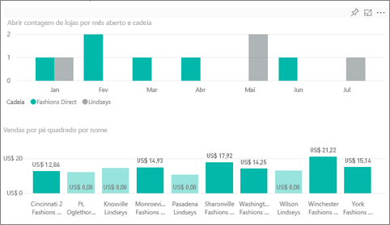
4. Clique em Winchester Fashions Direct na segmentação e observe o gráfico de linhas. Os primeiros números de vendas foram relatados em fevereiro.
5. Clique em Cincinnati 2 Fashions Direct na segmentação e você verá no gráfico de linhas que ela foi aberta em junho e parece ser a loja com o pior desempenho.
6. Como antes, explore clicando nas outras barras, linhas e bolhas em todo os gráficos e veja quais informações você poderá descobrir.

Este é um ambiente seguro para experimentar. Você pode optar por não salvar as alterações. Mas se você salvá-las, sempre é possível acessar Obter Dados para ter uma nova cópia deste exemplo.

## Conecte-se aos seus dados
Esparamos que este tour tenha mostardo como os painéis, P e R e relatório do Power BI podem fornecer informações sobre os dados de varejo. Agora é sua vez - conecte-se aos seus próprios dados. Com o Power BI, é possível se conectar a uma grande variedade de fontes de dados. Saiba mais sobre como [começar a usar o Power BI](service-get-started.md)

## Próximas etapas
* [Baixar o pacote de conteúdo de exemplo de Análise de Varejo](sample-tutorial-connect-to-the-samples.md)
* [Baixar um arquivo zip de todos os arquivos de exemplo](http://go.microsoft.com/fwlink/?LinkId=535020)    
* [Baixar a pasta de trabalho do Excel para esta amostra do Power BI](http://go.microsoft.com/fwlink/?LinkId=529778)    
* [Obter dados (para o Power BI)](service-get-data.md)    
* [Power BI – conceitos básicos](service-basic-concepts.md)    
* Mais perguntas? [Experimente a Comunidade do Power BI](http://community.powerbi.com/)
