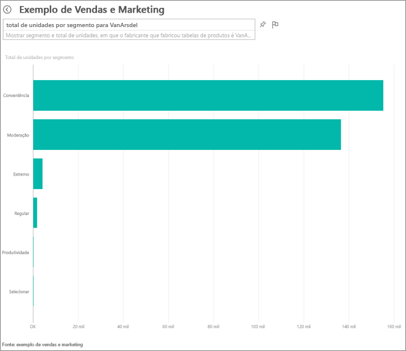
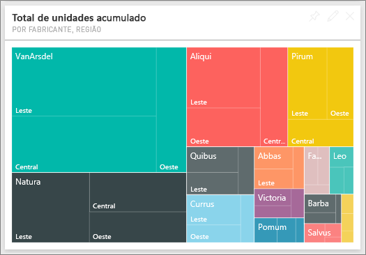
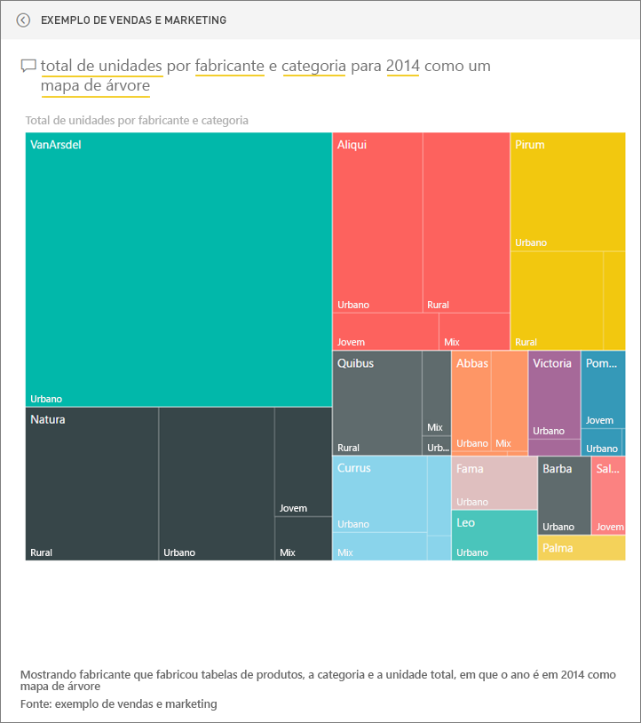
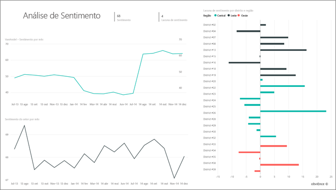
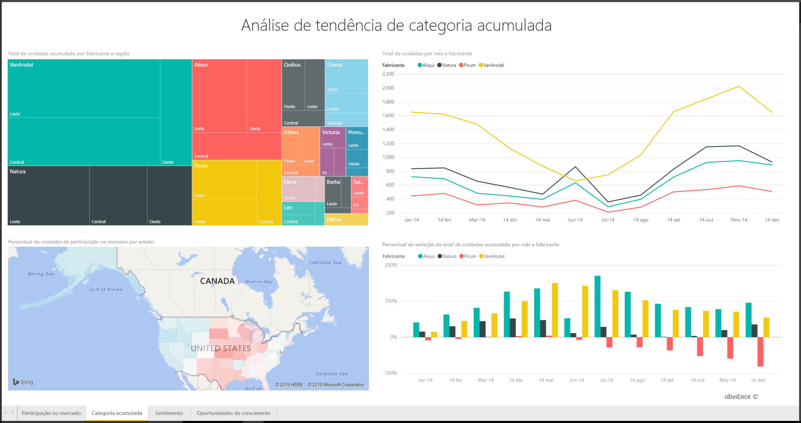
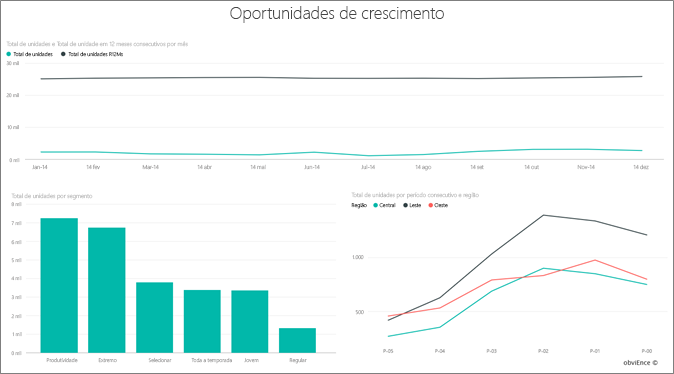

# Exemplo de vendas e marketing para o Power BI: faça um tour

## Visão geral do exemplo de Vendas e Marketing
O **exemplo de Marketing e Vendas** contém um painel de controle e um relatório para uma empresa de fabricação fictícia chamada VanArsdel Ltd. Esse painel foi criado pelo Presidente de Marketing (CMO) da VanArsdel para ficar atento ao setor e sua participação de mercado da empresa, volume de produto, vendas e sensibilidade.

A VanArsdel tem muitos concorrentes, mas é líder do mercado em seu setor. O CMO quer aumentar a participação no mercado e descobrir as oportunidades de crescimento. Mas, por algum motivo, a participação no mercado do VanArsdel começou a cair, com uma queda significativa em junho.

Este exemplo faz parte de uma série de exemplos que ilustra como o Power BI pode ser usado com dados, relatórios e painéis orientados aos negócios. Os exemplos são dados reais de obviEnce (www.obvience.com) que foram mantidos anônimos.

## Pré-requisitos

 Antes de usar o exemplo, primeiro você deve baixá-lo como um [pacote de conteúdo](https://docs.microsoft.com/en-us/power-bi/sample-sales-and-marketing#get-the-content-pack-for-this-sample), [arquivo .pbix](http://download.microsoft.com/download/9/7/6/9767913A-29DB-40CF-8944-9AC2BC940C53/Sales and Marketing Sample PBIX.pbix) ou [pasta de trabalho do Excel](http://go.microsoft.com/fwlink/?LinkId=529785).

### Obter o pacote de conteúdo para este exemplo

1. Abra o serviço do Power BI (app.powerbi.com) e faça logon.
2. No canto inferior esquerdo, selecione **Obter dados**.
   
    
3. Na página Obter Dados que aparece, selecione o ícone **Exemplos**.
   
   
4. Selecione o **Exemplo de Marketing e Vendas** e, em seguida, escolha **Conectar**.  
  
   
   
5. O Power BI importa o pacote de conteúdo e adiciona um novo dashboard, um relatório e um conjunto de dados ao seu espaço de trabalho atual. O novo conteúdo é marcado com um asterisco amarelo. 
   
   
  
### Obter o arquivo. pbix para este exemplo

Como alternativa, você pode baixar o exemplo como um arquivo .pbix, que é projetado para uso com o Power BI Desktop. 

 * [Exemplo de Vendas e Marketing](http://download.microsoft.com/download/9/7/6/9767913A-29DB-40CF-8944-9AC2BC940C53/Sales%20and%20Marketing%20Sample%20PBIX.pbix)

### Obter a pasta de trabalho do Excel para este exemplo
Também é possível [baixar apenas o conjunto de dados (pasta de trabalho do Excel)](http://go.microsoft.com/fwlink/?LinkId=529785) para este exemplo A pasta de trabalho contém planilhas do Power View que você pode exibir e modificar. Para ver os dados brutos, selecione **Power Pivot > Gerenciar**.

## O que é nosso painel está dizendo?
Vamos começar nosso tour no painel e examinar as peças que o CMO decidiu fixar. Podemos ver informações sobre nossa participação no mercado, vendas e sensibilidade. E podemos ver esses dados divididos por região, hora e concorrência.

* Os blocos abaixo da coluna esquerda mostram volume de vendas do setor este ano passado (50K), mercado (% 32.86), volume de vendas (16K), pontuação de sensibilidade (68) lacuna (4) e o total de unidades vendidas (1M).
* O gráfico de linha superior mostra como nosso mercado varia ao longo do tempo. Nosso mercado realmente cai em junho. Além disso, nossa participação R12M (12 meses sem interrupção) que estava aumentando até agora, está começando a cair.
* O nosso principal concorrente é Aliqui (evidente no bloco de gráfico de coluna do meio).
* A maioria dos nossos negócios é na região leste e central.
* O gráfico de linha na parte inferior mostra que a nossa queda em junho não é sazonal – nenhum de nossos concorrentes mostram a mesma tendência.
* Os blocos de "Total de unidades" mostram unidades vendidas, por segmento e por região/fabricante. O segmento de mercado maior para nosso setor são **Produtividade** e **Conveniência**.

### Usar P e R para aprofundar-se
#### Quais segmentos conduzem nossas vendas? Correspondem à tendência do setor?
1. Selecione o bloco “Visão geral de unidades totais por segmento” que abrirá o P e R.
2. Digite **para VanArsdel** ao final da consulta existente. P e R interpreta a pergunta e exibe um gráfico atualizado com a resposta. Nosso volume do produto vem de conveniência e a moderação.

   
3. Nossa participação nas categorias **Moderação** e **Conveniência** é muito alta; esses são os segmentos nos quais podemos concorrer.
4. Navegue de volta para o dashboard, selecionando o nome do dashboard na barra de navegação superior (trilhas).

#### Com o que aparece participação de mercado total para a categoria (versus região)?
1. Observe o bloco “Unidades totais no ano por fabricante, região”. Gostaria de saber como está a participação no mercado em unidades totais por categoria.

   
2. Na caixa de perguntas na parte superior do dashboard, digite a pergunta **total de unidades por fabricante e categoria em 2014 como um mapa de árvore**. Observe como a visualização atualiza conforme você digita a pergunta.
   
3. Para comparar as descobertas, fixe o gráfico até o painel. Muito interessante; em 2014 VanArsdel vendeu apenas produtos que se enquadram na categoria **Urbana** .
4. Navegue de volta para o painel.

Os painéis de controle também são um ponto de entrada em relatórios.  Se um bloco for criado por meio de um relatório subjacente, clicar em um bloco abre o relatório.

Em nosso painel, a linha R12M (12 meses sem interrupção) mostra que a nossa participação no mercado não está aumentando ao longo do tempo, ainda está diminuindo um pouco. E por que temos uma grande queda na participação do mercado em junho? Para investigar melhor, clique nesta visualização para abrir o relatório subjacente.

### Nosso relatório tem 4 páginas
#### A página 1 do nosso relatório se concentra no mercado do VanArsdel.

1. Examine o gráfico de colunas "Total de unidades por mês e isVanArsdel" na parte inferior. A coluna preta representa VanArsdel (nossos produtos) e a concorrência é verde. A queda em junho de 2014 que VanArsdel teve não é apresentada pelos concorrentes.
2. O gráfico de barras "Volume de Categoria Total por Segmento” no meio à direita, é filtrado para mostrar os 2 principais segmentos de VanArsdel. Dê uma olhada em como esse filtro foi criado:  

   a.  Expanda o painel de filtros à direita.  
   b.  Clique para selecionar a visualização.  
   c.  Em Filtros de nível Visual, observe que o **Segmento** é filtrado para incluir somente **Conveniência** e **Moderação**.  
   d.  Modifique o filtro selecionando Segmento para expandir essa seção e marcando **Produtividade** para também adicionar esse segmento também.  
3. Em "Unidades totais por mês e isVanArsdel, selecione o “Sim” preto na legenda para filtrar a página por VanArsdel de maneira cruzada. Observe que nós não competimos no segmento de produtividade.
4. Selecione o “Sim” preto novamente para remover o filtro.
5. Observe o gráfico de linhas. Ele mostra as participações de mercado mensal e 12 meses sem interrupção. Os dados de 12 meses sem interrupção ajudam a suavizar as flutuações mensais e mostram as tendências de longo prazo. Selecione Conveniência e, em seguida, Moderação no gráfico de barras para ver a flutuação na participação no mercado para cada segmento. O segmento de moderação mostra flutuação muito mais no mercado que o segmento de conveniência.

Ainda queremos descobrir por que a nossa participação no mercado caiu tanto em junho. Vamos verificar a sensibilidade.

#### A página 3 do nosso relatório se concentra na Sensibilidade.

Tweets, Facebook, blogs, artigos, etc. contribuem para sentimento mostrado nos gráficos de duas linhas. O gráfico de sensibilidade na parte superior esquerda mostra que a sensibilidade para os nossos produtos foi bastante neutra até fevereiro. Em seguida, uma grande queda iniciada em fevereiro e aumentada em junho. O que aconteceu para causar a queda nessa sensibilidade? Precisamos examinar fontes externas. Em fevereiro, vários artigos e postagens do blog o serviço ao cliente da VanArsdel como o pior do setor. Essa mídia ruim tem uma correlação direta no sentimento do cliente e nas vendas. A VanArsdel trabalhou muito para melhorar o atendimento ao cliente e os clientes e o setor observou. Em julho, o sentimento positivo começou a aumentar, em seguida, ficou sempre em alta nos anos 60. Esse aumento no sentimento pode ser visto refletido nas “Unidades Totais por Mês”, nas páginas 1 e 3. Talvez isso explica parcialmente nossa queda de participação de mercado para junho?

Lacuna de sensibilidade seria outra área para explorar: quais distritos têm a maior lacuna de sensibilidade, como podemos gerenciar isso, e descobrir formas de replicar em outros distritos.

#### A página 2 do nosso relatório se concentra na categoria YTD

* De todas as empresas nessa categoria, a VanArsdel é o maior e nossos maiores concorrentes são Natura, Aliqui e Pirium. Vamos manter o olhos neles.
* A Aliqui está crescendo, mas o volume de produto em comparada a nós ainda está baixo.
* O Treemap mostra a VanArsdel em verde. No região leste, os clientes preferem a concorrência, na região central estamos bem e nossa participação de mercado na região leste é a nossa menor.
* A geografia tem um impacto em unidades vendidas. Leste é a região dominante para a maioria dos fabricantes e VanArsdel tem uma forte presença na região Central.
* No gráfico "% de Unidades Totais YTD por Mês e Fabricante” no canto superior direito, nós temos uma variação positiva que isso é um sinal, nós estamos ainda melhor do que o ano passado, mas este é apenas um concorrente, Aliqui.

#### A página 4 do nosso relatório se concentra na análise de produtos dos concorrentes.

* O gráfico da parte inferior esquerda mostra todos os segmentos de categoria, exceto dois segmentos mais fortes da VanArsdel. Para filtrar por categoria, clique nas barras de ajuda a identifique as áreas potenciais de expansão para VanArsdel. Os segmentos **Extremo** e **Produtividade** estão crescendo mais rapidamente do que outros.
* Mas não concorremos nesses segmentos. Se quisermos mover nessas áreas, podemos usar nossos dados para ver quais segmentos são populares em quais regiões. É possível investigar questões como qual região está crescendo mais rapidamente e quem seria o principal concorrente no segmento.
* Lembra-se da queda na nossa participação no mercado em junho? Junho é um mês enorme para o segmento de produtividade - um segmento que não competimos no todo. Isso poderia explicar a queda na nossa participação no mercado em junho.

Filtrando as visualizações por VanArsdel, por segmento, por mês e por região, é possível descobrir as oportunidades de crescimento para VanArsdel.

Este é um ambiente seguro para experimentar. Você pode optar por não salvar as alterações. Mas se você salvá-las, sempre é possível acessar **Obter Dados** para ter uma nova cópia deste exemplo.

## Próximas etapas: conectar-se aos seus dados
Esperamos que este tour tenha mostrado como os painéis, P e R e relatórios do Power BI podem fornecer informações sobre os dados de vendas e marketing. Agora é sua vez - conecte-se aos seus próprios dados. Com o Power BI, é possível se conectar a uma grande variedade de fontes de dados. Saiba mais sobre como [começar a usar o Power BI](service-get-started.md)  
