# Análise de Varejo de fornecedor para o Power BI: faça um tour

## Uma breve visão geral do exemplo de Análise da Qualidade do Fornecedor
Este painel de exemplo do setor, e relatório subjacente, enfocam um dos desafios típicos da cadeia de fornecedores – análise de qualidade do fornecedor.
Duas métricas principais estão envolvidas na análise: o número total de defeitos e o tempo de inatividade total que causou esses defeitos. Este exemplo tem dois objetivos principais:

* Entender quem são os melhores e os piores fornecedores, com respeito à qualidade
* Identificar quais fábricas realizam um trabalho melhor em localizar e rejeitar defeitos, a fim de reduzir o tempo de inatividade

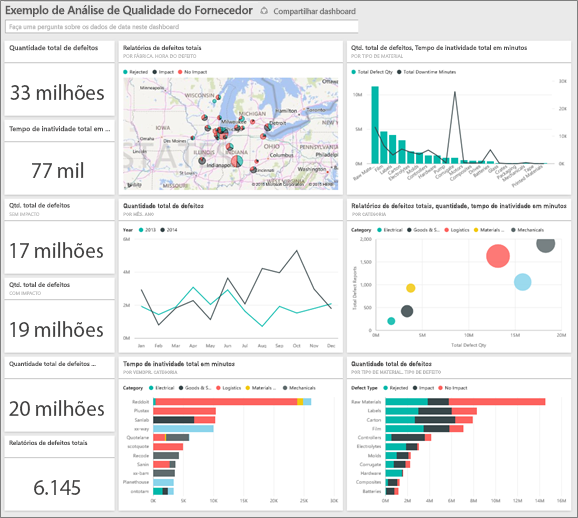

Este exemplo faz parte de uma série de exemplos que ilustra como o Power BI pode ser usado com dados, relatórios e painéis orientados aos negócios.
Os exemplos são dados reais de obviEnce ([www.obvience.com](http://www.obvience.com/)) que foram mantidos anônimos.

## Pré-requisitos

 Antes de usar o exemplo, primeiro você deve baixá-lo como um pacote de conteúdo, arquivo .pbix ou pasta de trabalho do Excel.

### Obter o pacote de conteúdo para este exemplo

1. Abra o serviço do Power BI (app.powerbi.com) e faça logon.
2. No canto inferior esquerdo, selecione **Obter dados**.
   
    
3. Na página Obter Dados que aparece, selecione o ícone **Exemplos**.
   
   
4. Selecione o **exemplo de Análise da Qualidade do Fornecedor** e, em seguida, escolha **Conectar**.  
  
   
   
5. O Power BI importa o pacote de conteúdo e adiciona um novo dashboard, um relatório e um conjunto de dados ao seu espaço de trabalho atual. O novo conteúdo é marcado com um asterisco amarelo. 
   
   
  
### Obter o arquivo. pbix para este exemplo

Como alternativa, você pode baixar o exemplo como um arquivo .pbix, que é projetado para uso com o Power BI Desktop. 

 * [Exemplo de Análise de Qualidade do Fornecedor](http://download.microsoft.com/download/8/C/6/8C661638-C102-4C04-992E-9EA56A5D319B/Supplier-Quality-Analysis-Sample-PBIX.pbix)

### Obter a pasta de trabalho do Excel para este exemplo
Também é possível [baixar apenas o conjunto de dados (pasta de trabalho do Excel)](http://go.microsoft.com/fwlink/?LinkId=529779) para este exemplo A pasta de trabalho contém planilhas do Power View que você pode exibir e modificar. Para ver os dados brutos, selecione **Power Pivot > Gerenciar**.

## Tempo de inatividade causado por materiais com defeito
Vamos analisar o tempo de inatividade causado por material defeituoso e ver quais fornecedores são responsáveis.  

1. No painel, selecione o título de número da **Quantidade Total de Defeito** ou o número de título **Total de minutos de inatividade** .  

   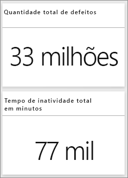  

   O relatório "Exemplo de análise de qualidade do fornecedor" abre a página "Análise de tempo de inatividade". Observe que temos 33M total de peças com defeito, e o tempo de inatividade total causado por essas partes com defeito é 77K minutos. Alguns materiais têm menos peças com defeito, mas podem causar um atraso enorme, resultando em maior tempo de inatividade. Vamos explorá-los na página do relatório.  
2. Observando a linha **Total de minutos de inatividade** no gráfico de combinação **Defeitos e tempo de inatividade (min) por tipo de Material** , podemos ver materiais corrugados que causam a maior tempo de inatividade.  
3. Selecione a **Corrugado** no mesmo gráfico de combinação para ver quais fábrica têm impacto por esse defeito e qual fornecedor é responsável.  

     
4. Selecione plantas individuais no mapa para ver quais fornecedores ou material é responsável por tempo de inatividade nessa fábrica.

### Quais são os piores fornecedores?
 Queremos localizar os oito piores fornecedores e determinar qual é o percentual do tempo de inatividade que eles são responsáveis. Podemos fazer isso alterando o gráfico de área **Tempo de inatividade (min) por fornecedor** para um treemap.  

1. Na página 3 do relatório, "Análise de Inatividade", selecione **Editar relatório** no canto superior esquerdo.  
2. Selecione o gráfico de área **Tempo de inatividade (min) por fornecedor** e, no painel de visualizações, selecione Treemap.  

   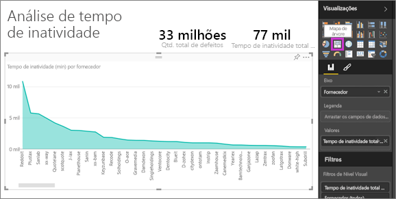  

    O Treemap automaticamente coloca o campo **Fornecedor** como o **grupo**.  

    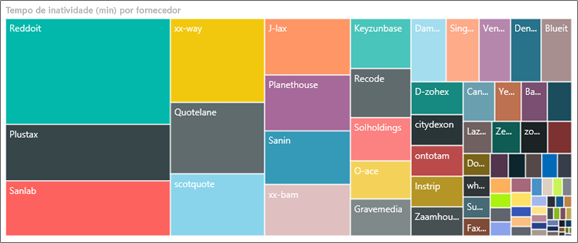  

   Nesse treemap, podemos ver quais são os oito principais fornecedores à esquerda o mapa de árvore. Também é possível observar que se responsabilizam por cerca de 50% de todos os minutos de inatividade.  
3. Selecione **Exemplo de Análise da Qualidade do Fornecedor** na barra de navegação superior para retornar ao dashboard.

### Comparando fábricas
Agora vamos explorar quais fábricas fazem um trabalho de melhor gerenciamento de material com defeito, resultando em menor tempo de inatividade.  

1. Selecione o título do mapa **Relatórios de defeito totais por fábrica, tipo de defeito** .  

    O relatório abre a página “Qualidade do Fornecedor”.  

   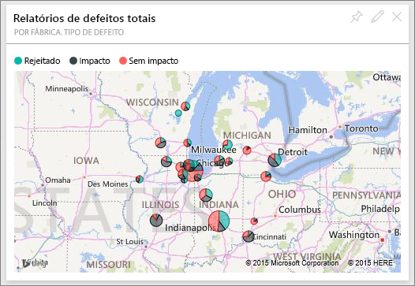  
2. Na legenda do mapa, selecione o círculo **Impacto** .  

    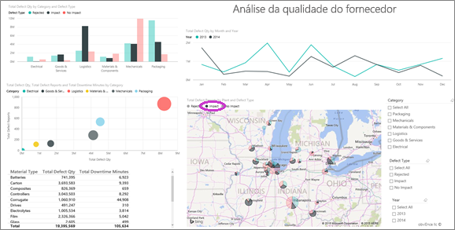  

    Observe no gráfico de bolha que a **Logística** é categoria mais problemática – é a maior em termos de quantidade total de defeito, relatórios de defeitos total e minutos de tempo de inatividade total. Vamos explorar mais essa categoria.  
3. Selecione a bolha de Logística no gráfico de bolhas e observa as fábricas em Springfield, IL e Naperville, IL. Naperville parece fazer um trabalho melhor de gerenciamento de fornecimentos com defeitos, uma vez tem um número alto de rejeição e alguns impactos, se comparado ao grande número de impactos de Springfield.  

   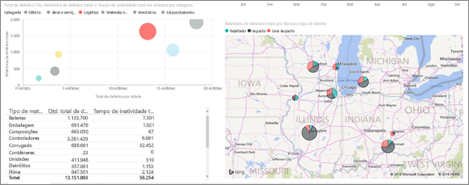  
4. Selecione **Exemplo de Análise de Qualidade do Fornecedor** na barra de navegação superior para retornar ao espaço de trabalho ativo.

## Que tipo de material é melhor gerenciado?
O melhor tipo material gerenciado é aquele com o menor tempo de inatividade ou nenhum impacto, independentemente da quantidade de defeito.

* No painel, examine o bloco **Quantidade de Defeito Total pelo Tipo de Material, Tipo de Defeito**.

  

Observe que **Matérias-Primas** têm muitos defeitos totais, mas a maioria dos defeitos é rejeitada ou não tem um impacto.

Vamos verificar se as matérias-primas não causam muito tempo de inatividade, apesar da quantidade de defeito alta.

* No painel, examine o bloco **Quantidade de Defeito Total, Total de Minutos de Inatividade por tipo de Material**.

  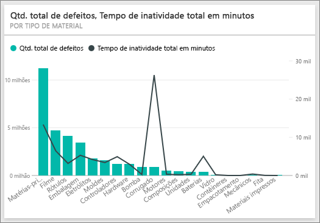

Aparentemente as matérias-primas são bem gerenciado: elas têm mais defeitos, mas menos minutos de inatividade total.

### Comparar defeitos em tempo de inatividade por ano
1. Selecione a peça de mapa **Relatórios de defeito totais por fábrica, tipo de defeito** para abrir o relatório na primeira página, Qualidade do Fornecedor.
2. Observe que **Qtd de defeito** é maior em 2014 que em 2013.  

    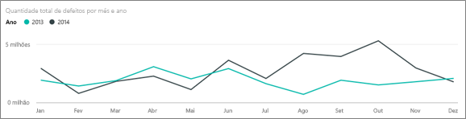  
3. Mais defeitos se traduz em mais tempo de inatividade? Podemos fazer perguntas na caixa de P e R para descobrir.  
4. Selecione **Exemplo de Análise da Qualidade do Fornecedor** na barra de navegação superior para retornar ao dashboard.  
5. Como sabemos que as matérias-primas têm o maior número de defeitos, na caixa pergunta, digite "Mostrar tipos de material, ano e quantidade total de defeito".  

    Havia muitos mais defeitos de matérias-primas em 2014 que em 2013.  

    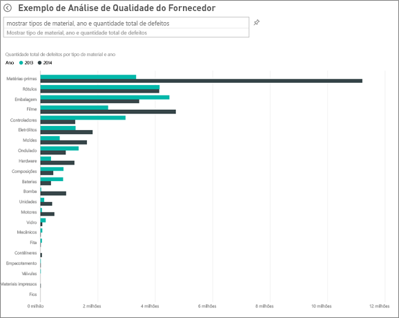  
6. Agora, altere a pergunta para "Mostrar tipos de material, ano e minutos de tempo de inatividade total".  

   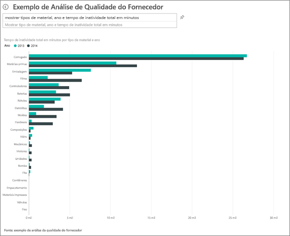

O tempo de inatividade de matérias-primas era quase o mesmo em 2013 e 2014, mesmo que houvesse muitos mais defeitos de matérias-primas do que em 2014.

Ocorre que mais matérias-primas com defeitos em 2014 não levou a mais tempo de inatividade no mesmo período.

### Compare defeitos em tempo de inatividade mês a mês
Vejamos outro bloco de painel relacionado à quantidade total de defeito.  

1. Selecione a seta voltar  no canto superior esquerdo acima da caixa de pergunta para retornar ao painel.  

    Olhando mais de perto o bloco **Quantidade Total de Defeitos por Mês, Anos** , mostra que o primeiro semestre de 2014 tinha um número semelhante de defeitos do que em 2013, mas no segundo semestre de 2014, o número de defeitos aumentou significativamente.  

    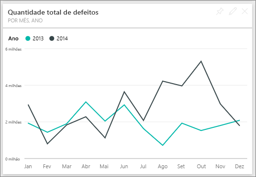  

    Vamos ver se esse aumento na quantidade de defeito levou a um aumento igual em minutos do tempo de inatividade.  
2. Na caixa de pergunta, digite "minutos totais de inatividade por mês e ano como um gráfico de linha”.  

   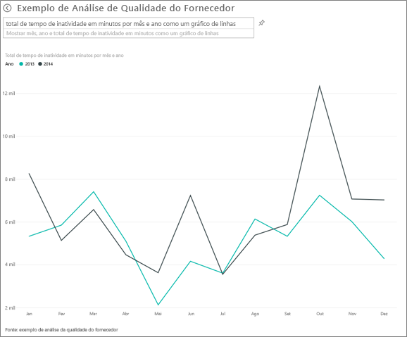

   Vemos um salto em minutos de inatividade durante junho e outubro, mas fora isso, o salto no número de defeitos não resulta em tempo de inatividade significantemente maior. Isso mostra que estamos gerenciando bem os defeitos.  
3. Para fixar este gráfico ao seu painel, selecione o ícone de pino  à direita da caixa de pergunta.  
4. Para explorar os meses de exceções, verifique os minutos de tempo de inatividade durante outubro por tipo de material, introduzir local, categoria, etc., fazendo perguntas como "minutos de tempo de inatividade total em outubro pela fábrica".    
5. Selecione a seta voltar  no canto superior esquerdo acima da caixa de pergunta para retornar ao painel.

Este é um ambiente seguro para experimentar. Você pode optar por não salvar as alterações. Mas se você salvá-las, sempre é possível acessar **Obter Dados** para ter uma nova cópia deste exemplo.

## Próximas etapas: conectar-se aos seus dados
Esperamos que este tour tenha mostrado como os painéis, P e R e relatórios do Power BI podem fornecer informações sobre os dados de gastos na qualidade do fornecedor. Agora é sua vez - conecte-se aos seus próprios dados. Com o Power BI, é possível se conectar a uma grande variedade de fontes de dados. Saiba mais sobre como [começar a usar o Power BI](service-get-started.md)
