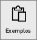
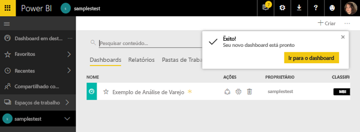
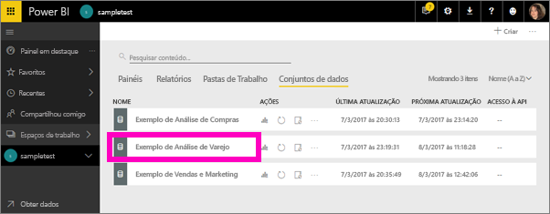
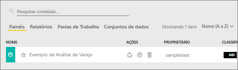
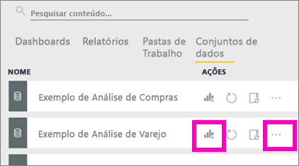
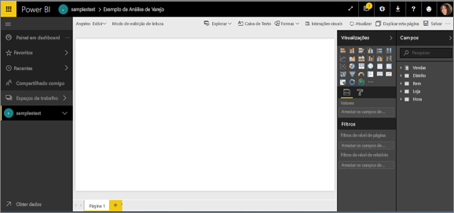
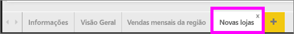
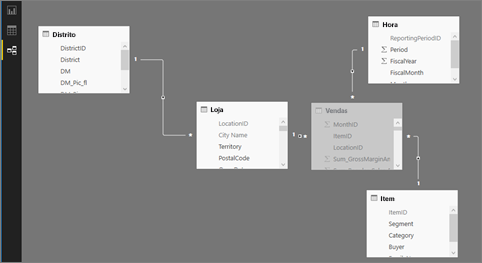

# Os exemplos do Power BI

Recomendamos que você comece com o artigo [Samples datasets for Power BI](sample-datasets.md) (Exemplo de conjuntos de dados para Power BI). Neste artigo, você aprenderá sobre os exemplos; como obtê-los, em que local salvá-los, como usá-los e algumas das histórias de cada um deles. Então, quando você tiver uma compreensão dos fundamentos, volte para este Tutorial.   

### Pré-requisitos
As amostras estão disponíveis para o serviço Power BI e no Power BI Desktop. Para acompanhar, usaremos o exemplo de análise de varejo.

O pacote de conteúdo de exemplo de *Análise de Varejo* usado neste tutorial consiste em um painel, um relatório e um conjunto de dados.
Para se familiarizar com este pacote de conteúdo específico e com seu cenário, talvez você queira [fazer um tour pelo exemplo de Análise de Varejo](sample-retail-analysis.md) antes de começar.

## Sobre este tutorial
Este tutorial ensina como 
- importar um pacote de conteúdo de exemplo, adicioná-lo ao serviço Power BI e abrir o conteúdo. Um *pacote de conteúdo* é um tipo de exemplo em que o conjunto de dados é fornecido em um pacote com um dashboard e um relatório. 
-  abrir um arquivo .pbix no Power BI Desktop.

## Exemplos e o serviço Power BI

1. Abra e entre no serviço do Power BI (app.powerbi.com).
2. Selecione **Obter Dados** na parte inferior do painel de navegação esquerdo. Se **Obter Dados** não for exibido, expanda o painel de navegação selecionando .
   
   
5. Selecione **Exemplos**.  
   
   
6. Selecione o **Exemplo de Análise de Varejo** e escolha *Conectar*.   
   
   

## O que foi importado exatamente?
Com os pacotes de conteúdo de exemplo, quando você seleciona **Conectar**, o Power BI, na verdade, está trazendo uma cópia desse pacote de conteúdo e armazenando-a para você na nuvem. Porque a pessoa que criou o pacote de conteúdo incluiu um conjunto de dados, um relatório e um dashboard – isso é o que você obtém quando clica em **Conectar**. 

1. O Power BI cria o novo dashboard e o lista na guia **Dashboards**. O asterisco amarelo permite que você saiba se ele é novo.
   
   
2. Abra a guia **Relatórios**.  Aqui você verá um novo relatório chamado *Exemplo de Análise de Varejo*.
   
   
   
   E confira a guia **Conjuntos de dados**.  Há um novo conjunto de dados também.
   
   

## Explore o novo conteúdo
Agora, explore o dashboard, o conjunto de dados e o relatório por conta própria. Há várias formas diferentes de navegar em seus dashboards, relatórios e conjuntos de dados, e apenas uma dessas várias formas está descrita abaixo.  

> [!TIP]
> Quer uma ajuda primeiro?  Experimente o [Tour pelo Exemplo de Análise de Varejo](sample-retail-analysis.md) para obter uma explicação passo a passo deste exemplo.
> 
> 

1. Volte para a guia **Dashboards** e selecione o dashboard *Exemplo de Análise de Varejo* para abri-lo.    
   
   
2. O dashboard será aberto.  Ele tem uma variedade de blocos de visualização.
   
   
3. Selecione um dos blocos para abrir o relatório subjacente.  Neste exemplo, vamos selecionar o gráfico de área (contornado em rosa na imagem anterior). O relatório é aberto na página que contém esse gráfico de área.
   
    
   
   > [!NOTE]
   > Se o bloco tivesse sido criado usando [P e R do Power BI](power-bi-q-and-a.md), a página de P e R teria sido aberta. Se o bloco estivesse [fixado do Excel](service-dashboard-pin-tile-from-excel.md), o Excel Online teria sido aberto dentro do Power BI.
   > 
   > 
1. De volta à guia **Conjuntos de dados**, você tem várias opções para explorar seu conjunto de dados.  Você não conseguirá abri-lo e ver todas as linhas e colunas (como no Power BI Desktop ou Excel).  Quando uma pessoa compartilha um pacote de conteúdo com os colegas, ela normalmente deseja compartilhar as ideias, e não fornecer acesso direto aos dados para seus colegas. Mas isso não significa que você não pode explorar o conjunto de dados.  
   
   
   
   * Uma maneira de explorar o conjunto de dados é criar suas próprias visualizações e relatórios do zero.  Selecione o ícone de gráfico  para abrir o conjunto de dados no modo de edição de relatório.
     
       
   * Outra maneira de explorar o conjunto de dados é executar os [Insights Rápidos](service-insights.md). Selecione as reticências (...) e escolha **Obter insights**. Quando os insights estiverem prontos, selecione **Exibir insights**.
     
       

## Exemplos e Power BI Desktop 
Quando você abre o arquivo de exemplo PBIX pela primeira vez, ele é exibido no modo de exibição de relatório em que você pode explorar, criar e modificar qualquer número de páginas do relatório com visualizações. O modo de exibição de Relatório oferece praticamente a mesma experiência de design que aquela encontrada no modo de exibição Editar de um relatório no serviço Power BI. Você pode mover as visualizações de um lugar para outro, copiar e colar, mesclar, etc.

A diferença entre eles é que ao usar o Power BI Desktop, você pode trabalhar com suas consultas e modelar seus dados para garantir que os dados deem suporte às melhores ideias em seus relatórios. Você pode, então, salvar o seu arquivo do Power BI Desktop onde quiser, seja em sua unidade local ou na nuvem.

1. Abra o [arquivo .pbix de amostra de análise de varejo](http://download.microsoft.com/download/9/6/D/96DDC2FF-2568-491D-AAFA-AFDD6F763AE3/Retail-Analysis-Sample-PBIX.pbix) no Power BI Desktop. 

    

1. O arquivo é aberto no modo de exibição de relatório. Você está vendo as quatro guias na parte inferior do editor de relatório? Isso significa que há quatro páginas neste relatório e a página "Novas lojas" está selecionada no momento. 

    .

3. Para um mergulho no editor de relatórios, confira [Faça um tour do editor de relatórios](service-the-report-editor-take-a-tour.md)

## O que foi importado exatamente?
Quando você abre o arquivo PBIX de exemplo no Desktop, o Power BI, na verdade, está trazendo uma cópia desses dados e armazenando-a para você na nuvem. No Desktop, você tem acesso ao relatório ***e o conjunto de dados subjacente***. Quando os dados forem carregados, o Power BI Desktop tentará localizar e criar relações para você.  

1. Alternar para [Exibição de dados](desktop-data-view.md) selecionando o ícone de tabela  .
 
    

    A Exibição de Dados ajuda a inspecionar, explorar e compreender os dados em seu modelo do Power BI Desktop. É diferente do modo que você exibe tabelas, colunas e dados no Editor de Consultas. Com a Exibição de Dados, você está olhando para seus dados após eles terem sido carregados no modelo.

    Quando você está modelando seus dados, às vezes você deseja ver o que está realmente em uma tabela ou coluna, sem criar um elemento visual na tela de relatório, geralmente imediatamente abaixo do nível de linha. Isso é especialmente verdadeiro quando você está criando colunas calculadas e medidas, ou quando você precisa identificar um tipo de dados ou uma categoria de dados.

1. Alternar para [modo de exibição de relações](desktop-relationship-view.md) selecionando o ícone  .
 
    

    A Exibição de Relações mostra todas as tabelas, colunas e relações em seu modelo. Aqui você pode exibir, alterar e criar relações.

## Explore o novo conteúdo
Agora, explore o conjunto de dados, as relações e o relatório por conta própria. Para obter ajuda para começar, visite o [Guia de introdução ao Desktop](desktop-getting-started.md).    

## Próximas etapas
[Conceitos básicos do Power BI](service-basic-concepts.md)

[Exemplos para o serviço do Power BI](sample-datasets.md)

[Fontes de dados do Power BI](service-get-data.md)

Mais perguntas? [Experimente a Comunidade do Power BI](http://community.powerbi.com/)

