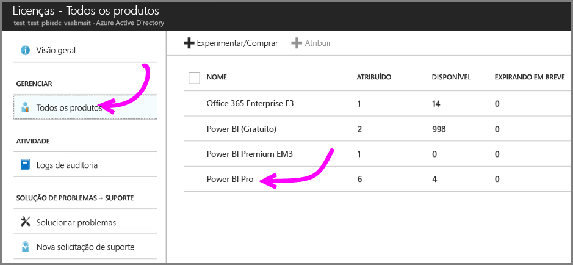

# Início Rápido: Atribuir licenças do Power BI Pro no Azure

O Power BI Pro é uma licença individual que permite acesso a todo o conteúdo e a todas as funcionalidades no serviço do Power BI, incluindo a capacidade de compartilhar conteúdo e colaborar com outros usuários do Pro. Somente usuários Pro podem publicar e consumir conteúdo de espaços de trabalho do aplicativo, compartilhar dashboards e assinar dashboards e relatórios. Este artigo explica como atribuir licenças do Power BI Pro no Azure. Você também pode [atribuir licenças no Office 365](service-admin-assigning-power-bi-pro-licenses.md).

## Pré-requisitos

Você precisa ser um proprietário da assinatura do Azure que o Power BI usa para pesquisas no Active Directory.

Você precisa [comprar pelo menos uma licença](service-admin-purchasing-power-bi-pro.md) antes de iniciar.

## Atribuir licenças a contas de usuário individuais

Siga estas etapas para atribuir licenças do Power BI Pro a contas de usuário individuais:

1. Abra o [portal do Azure](https://ms.portal.azure.com/#@microsoft.onmicrosoft.com/dashboard/private/39bc3cf7-31a4-43f6-954c-f2d69ca2f0). 

2. Na barra de navegação esquerda, selecione **Azure Active Directory**.

    

3. Em **Azure Active Directory**, selecione **Licenças**.

    

4. Em **Licenças**, selecione **Todos os produtos** e selecione **Power BI Pro** para ver a lista de usuários licenciados.

    

5. Selecione **Atribuir** para adicionar uma licença do Power BI Pro a uma conta de usuário adicional.

    

## Próximas etapas

Agora que você atribuiu licenças, saiba mais sobre o Power BI Pro.

[Power BI Pro em sua organização](service-admin-power-bi-pro-in-your-organization.md)

[Encontrar usuários do Power BI que entraram](service-admin-access-usage.md)

Mais perguntas? [Experimente perguntar à Comunidade do Power BI](https://community.powerbi.com/)