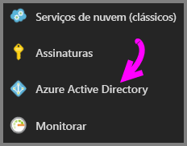
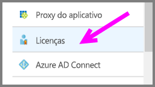
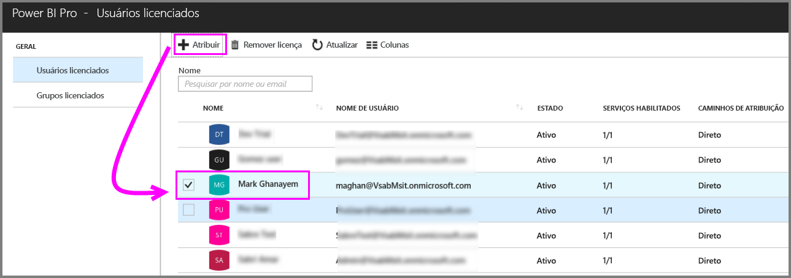
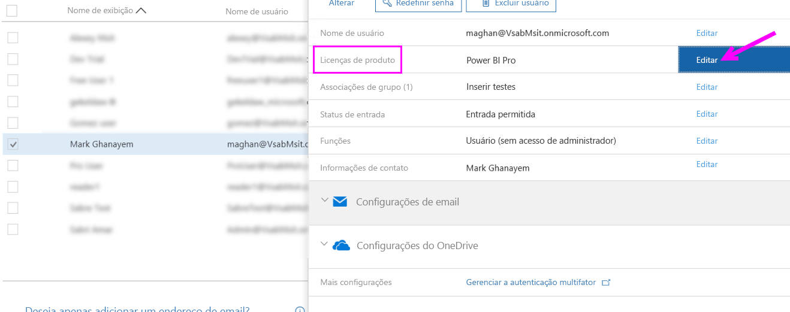
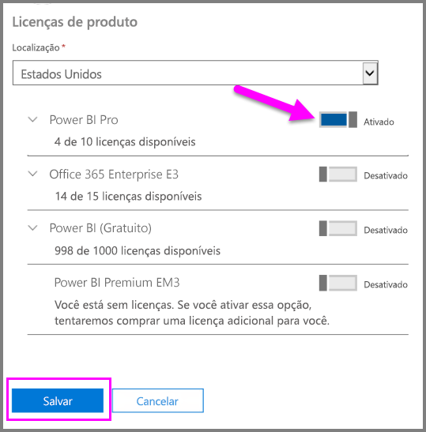
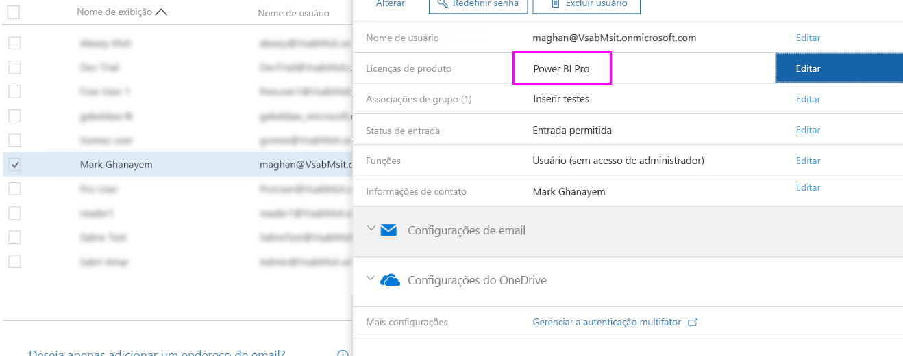

# Atribuir licenças do Power BI Pro

Os administradores podem optar entre uma variedade de portais de gerenciamento e cmdlets do PowerShell para atribuir licenças do Power BI Pro a usuários. O gerenciamento de licenças do Power BI é feito pelo Azure AD (Azure Active Directory).

* Os proprietários de assinatura do Azure podem usar a folha Azure Active Directory no [Portal do Azure](https://ms.portal.azure.com/#@microsoft.onmicrosoft.com/dashboard/private/39bc3cf7-31a4-43f6-954c-f2d69ca2f0). 

* Os administradores globais e os administradores de contas de usuário podem usar o [Centro de administração do Office 365](https://portal.office.com/AdminPortal/Home#/homepage).

## Gerenciar licenças do Power BI Pro no Portal do Azure

O Power BI usa o Azure AD como um serviço básico. O Azure AD armazena as contas de usuário e grupos, armazenando simultaneamente outras configurações, tais como informações sobre produtos adquiridos.

### Atribuir licenças a contas de usuário individuais

Siga estas etapas para atribuir licenças Pro a contas de usuário individuais, se você é um proprietário de assinatura do Azure:

1. Navegue até o [Portal do Azure](https://ms.portal.azure.com/#@microsoft.onmicrosoft.com/dashboard/private/39bc3cf7-31a4-43f6-954c-f2d69ca2f0). 

2. Na barra de navegação à esquerda, clique no Azure Active Directory.

    

3. Na folha do Azure Active Directory, clique em Licenças.

    

4. Na folha Licenças, clique em todos os produtos e clique em Power BI Pro para ver a lista de usuários licenciados.

    

5. Clique em Atribuir para adicionar uma licença do Power BI Pro para uma conta de usuário adicional.

    

> [!NOTE]
> Embora a maioria dos aspectos de licenciamento possam ser gerenciados, não é possível comprar licenças do Power BI Pro no Portal do Azure. Use o Centro de administração do Office 365 para comprar uma assinatura do Power BI Pro. Para obter mais informações, consulte [Comprando o Power BI Pro](https://docs.microsoft.com/en-us/power-bi/service-admin-purchasing-power-bi-pro).
>

## Gerenciar licenças do Power BI Pro no Centro de administração do Office 365

Se você é um administrador global, é no Centro de administração do Office 365 que você pode comprar uma assinatura do Power BI Pro e gerenciar as licenças associadas para a organização.

Siga estas etapas para atribuir licenças Pro a contas de usuário individuais, se você é um administrador do Centro de administração do Office 365:

1. Navegue até o centro de administração do Office 365

2. No painel de navegação esquerdo, expanda Usuários e, em seguida, clique em Usuários ativos.

    

3. Selecione um ou vários usuários e, em seguida, clique em Editar licenças de produto.

    

4. No Power BI Pro, mude a configuração para Ativa e, em seguida, clique em Salvar.

    

5. Em Status para as contas selecionadas, verifique se a licença do Power BI Pro foi atribuída com êxito.

    

> [!NOTE]
> Se as licenças de sua assinatura acabaram, adicione mais delas expandindo Cobrança no painel de navegação esquerdo e, em seguida, clicando em Assinaturas. Selecione a assinatura do Power BI Pro na página Assinaturas e, em seguida, clique em Adicionar/Remover licenças.
>

## Próximas etapas
[Power BI Pro em sua organização](service-admin-power-bi-pro-in-your-organization.md)
 
[Ativação da Avaliação Pro Estendida](service-extended-pro-trial.md)
 
[Contrato de Serviço do Power BI para usuários individuais](https://powerbi.microsoft.com/terms-of-service/)
 
[Comunicado do Power BI Premium](https://aka.ms/pbipremium-announcement)
 
[Encontrar usuários do Power BI que entraram](service-admin-access-usage.md)

Mais perguntas? [Experimente perguntar à Comunidade do Power BI](https://community.powerbi.com/)