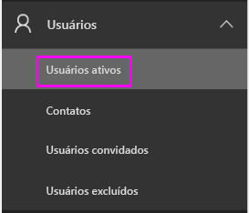

# Início Rápido: Atribuir licenças do Power BI Pro no Office 365

O Power BI Pro é uma licença individual que permite acesso a todo o conteúdo e a todos os recursos no serviço do Power BI, incluindo a capacidade de compartilhar conteúdo e colaborar com outros usuários do Pro. Somente usuários Pro podem publicar e consumir conteúdo de espaços de trabalho do aplicativo, compartilhar painéis e se inscrever para obter painéis e relatórios. Este artigo explica como atribuir licenças do Power BI Pro no Office 365. Você também pode [atribuir licenças no Azure](service-admin-assigning-power-bi-pro-licenses-azure.md).

## Pré-requisitos

Você deve ser um membro da função [**Administrador global** ou **Administrador de Conta de Usuário**](https://support.office.com/article/about-office-365-admin-roles-da585eea-f576-4f55-a1e0-87090b6aaa9d?ui=en-US&rs=en-US&ad=US) no Office 365.

Você deve [comprar pelo menos uma licença](service-admin-purchasing-power-bi-pro.md) antes de iniciar.

## Atribuir licenças a contas de usuário individuais

Siga estas etapas para atribuir licenças do Power BI Pro a contas de usuário individuais:

1. Abra o [Centro de administração do Office 365](https://portal.office.com/adminportal/home#/homepage).

2. No painel de navegação à esquerda, expanda **Usuários** e, em seguida, selecione **Usuários ativos**.

    

3. Selecione um usuário. Em seguida, em **Licenças de produto**, selecione **Editar**.

    

4. No **Power BI Pro**, mude a configuração para **Ativa** e, em seguida, selecione **Salvar**.

    

5. Em **Status** para a conta selecionada, verifique se a licença do Power BI Pro foi atribuída com êxito.

    

## Próximas etapas

Agora que você atribuiu licenças, saiba mais sobre o Power BI Pro.

[Power BI Pro em sua organização](service-admin-power-bi-pro-in-your-organization.md)

[Encontrar usuários do Power BI que entraram](service-admin-access-usage.md)

Mais perguntas? [Experimente perguntar à Comunidade do Power BI](https://community.powerbi.com/)