# Gerenciar capacidades no Power BI Premium e no Power BI Embedded
Saiba como gerenciar as capacidades que oferecem recursos dedicados ao seu conteúdo no Power BI Premium e no Power BI Embedded.

A capacidade é a peça central das ofertas do Power BI Premium e do Power BI Embedded.

## O que é capacidade?
Capacidade é o conjunto de recursos reservados para seu uso exclusivo. Ter capacidade permite publicar dashboards, relatórios e conjuntos de dados para usuários de toda a organização sem precisar comprar licenças para eles. Ela também garante desempenho confiável e consistente para o conteúdo hospedado na capacidade.

A capacidade é transparente para seus usuários finais. Eles continuarão usando o Power BI ou seu aplicativo como de costume. Eles não precisam estar cientes de que uma parte do (ou todo o) conteúdo está hospedado na sua capacidade dedicada. Para os usuários, tudo funciona exatamente como antes.

[!INCLUDE [powerbi-premium-illustration](./includes/powerbi-premium-illustration.md)]

Para obter mais informações, consulte [O que é Power BI Premium?](service-premium.md).

## Compre capacidade
Para usar a capacidade dedicada, será necessário comprar uma assinatura do Power BI Premium no Centro de Administração do Office 365 ou criar um recurso do Power BI Embedded no portal do Microsoft Azure. Para obter mais informações, consulte o seguinte:

* **Power BI Premium:** [Como comprar o Power BI Premium](service-admin-premium-purchase.md)
* **Power BI Embedded:** [Criar capacidade do Power BI Embedded no portal do Azure](https://docs.microsoft.com/en-us/azure/power-bi-embedded/create-capacity)

Quando você comprar os SKUs do Power BI Premium, seu locatário receberá o número de núcleos virtuais correspondentes para uso nas capacidades em execução. Por exemplo, a compra de um SKU P3 do Power BI Premium fornece ao locatário 32 núcleos virtuais.

## Administradores de capacidade
> [!NOTE]
> Na capacidade do Power BI Embedded, os administradores de capacidade são definidos no portal do Microsoft Azure.
> 
> 

Quando você é atribuído a uma capacidade como administrador de capacidade, você tem controle total sobre a capacidade e seus recursos administrativos. No portal de administração do Power BI, é possível adicionar mais administradores de capacidade (somente no Power BI Premium) ou dar aos usuários permissões de atribuição de capacidade. É possível atribuir espaços de trabalho em massa a uma capacidade e exibir métricas de uso em uma capacidade.

Cada capacidade tem seus próprios administradores. Definir um administrador de capacidade para uma capacidade não lhe concede acesso a todas as capacidades em sua organização. Os administradores de capacidade não têm acesso a todas as áreas de administração do Power BI por padrão, como as métricas de uso, os logs de auditoria ou as configurações do locatário. Os administradores de capacidade também não têm permissões para configurar novas capacidades ou alterar o SKU das capacidades existentes. Somente os administradores Globais ou os administradores do serviço do Power BI têm acesso a esses itens.

Todos os administradores Globais do Office 365 e os administradores do Power BI administram automaticamente as capacidades do Power BI Premium e do Power BI Embedded.

## Gerenciando a capacidade
Após a compra dos nós de capacidade no Office 365, em seguida, será necessário configurar uma nova capacidade. Isso é feito por meio do [portal de administração do Power BI](service-admin-portal.md). No portal de administração, há uma seção chamada **Configurações de capacidade**. É lá que você gerenciará as capacidades do Power BI Premium para sua organização.

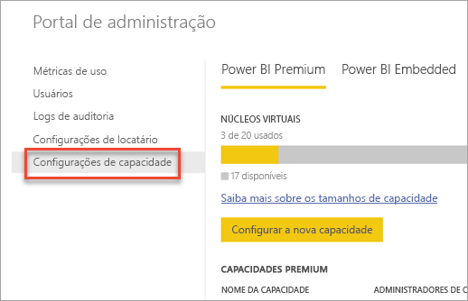

As **Configurações de capacidade** levam à tela padrão de gerenciamento de capacidade do Power BI Premium.

### Configurar uma nova capacidade (Power BI Premium)
O número de núcleos virtuais corresponde à quantidade utilizada e à quantidade disponível para a criação de capacidades. A quantidade de núcleos virtuais disponíveis para sua organização é baseada nos SKUs Premium que você comprou. Por exemplo, comprar um P3 e um P2 resultaria em 48 núcleos disponíveis – 32 do P3 e 16 do P2.

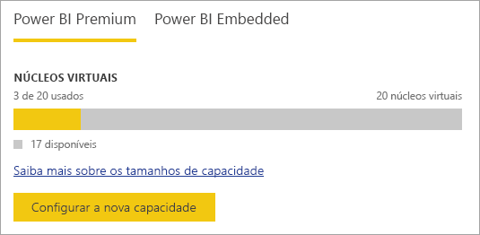

Se houver núcleos virtuais disponíveis, configure a nova capacidade desta maneira.

1. Selecione **Configurar nova capacidade**.
2. Dê um **nome** para a sua capacidade.
3. Defina quem é o administrador dessa capacidade.
   
    Os administradores de capacidade não precisam ser um administrador do Power BI ou um Administrador Global do Office 365. Para obter mais informações, consulte [Power BI Premium capacity admins (Administradores de capacidade do Power BI Premium)](#capacity-admins)
4. Selecione o tamanho da capacidade. As opções disponíveis dependem de quantos núcleos virtuais disponíveis você tem. Não é possível selecionar uma opção maior que a que está disponível.
   
    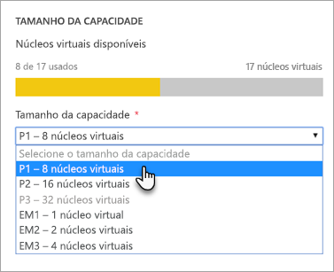
5. Selecione **Configurar**.

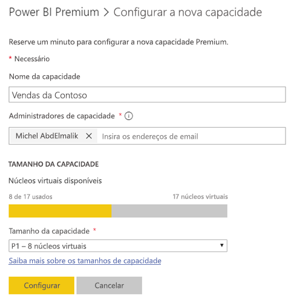

Os administradores de capacidade, bem como administradores do Power BI e administradores globais do Office 365, verão a capacidade listada no portal do administrador.

### Configurações de capacidade
Na tela de gerenciamento da capacidade Premium, é possível selecionar o **ícone de engrenagem (configurações)** em ações. Isso permitirá que você renomeie ou exclua uma capacidade. Também indicará quem são os administradores de serviço, o SKU/tamanho da capacidade e em qual região a capacidade está.

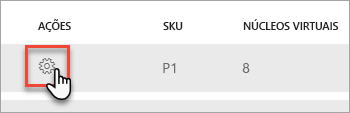

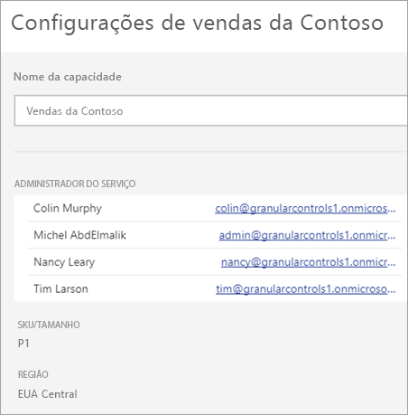

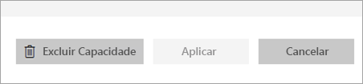

> [!NOTE]
> As configurações de capacidade do Power BI Embedded são gerenciadas no portal do Microsoft Azure.
> 
> 

### Alterar o tamanho da capacidade (Power BI Premium)
Os administradores do Power BI e os administradores Globais do Office 365 alteram o tamanho da capacidade do Power BI Premium ao selecionar **Alterar tamanho da capacidade**. Os administradores de capacidade que não são administradores do Power BI ou administradores Globais do Office 365 não terão essa opção.

A tela **Alterar tamanho da capacidade** permite atualizar ou fazer downgrade do tamanho da capacidade, se você tiver os recursos disponíveis. Os administradores são livres para criar, redimensionar e excluir nós, desde que tenham o número necessário de núcleos virtuais. 

Não é possível fazer downgrade dos SKUs P para SKUs EM. É possível focalizar as opções desabilitadas que fornecem uma explicação.

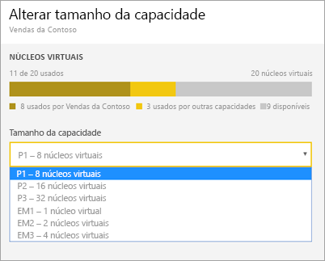

### Atribuição de capacidade
É possível gerenciar uma capacidade selecionando o nome dela. Isso o direcionará para a tela de gerenciamento de capacidade.

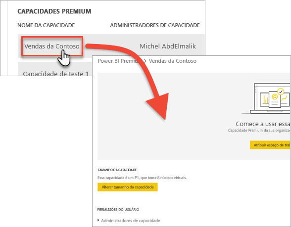

Se nenhum espaço de trabalho tiver sido atribuído à capacidade, será exibida uma mensagem que permite **Atribuir espaços de trabalho**.

#### Permissões do usuário
É possível atribuir mais **Administradores de capacidade** às capacidades do Power BI Premium. Também é possível atribuir usuários que terão **permissões de atribuição de capacidade**. Os usuários que tiverem permissões de atribuição poderão atribuir um espaço de trabalho do aplicativo à capacidade se eles forem administradores desse espaço de trabalho. Eles também podem atribuir o *Meu espaço de trabalho* pessoal à capacidade. Os usuários com permissões de atribuição não terão acesso ao portal de administração.

> [!NOTE]
> Na capacidade do Power BI Embedded, os administradores de capacidade são atribuídos no portal do Microsoft Azure.
> 
> 

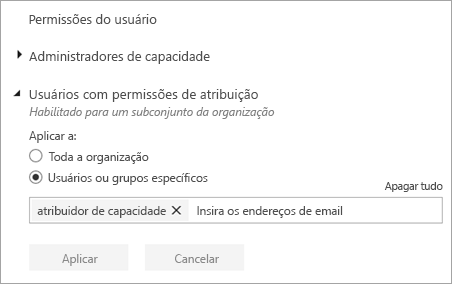

## Medidas de uso (Power BI Premium)
Para cada capacidade, você poderá usar medidas de uso para CPU, memória e Consulta Direta. Cada KPI tem três indicações, **Bom (verde)**, **Marginal (amarelo)** e **Crítico (vermelho)**. É recomendável monitorar essas métricas para garantir que seus usuários vejam o bom desempenho ao usar conteúdo Premium.

**O uso da capacidade do Power BI Embedded é monitorado no portal do Azure.**

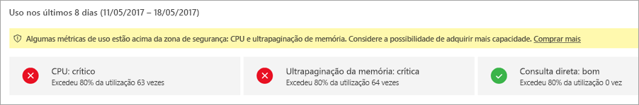

| Métrica | Descrição |
| --- | --- |
| CPU |Uso da CPU pelos seu núcleos. |
| Memória |Representa a pressão de memória de seus núcleos de back-end. Especificamente, essa é uma métrica da frequência com a qual os modelos são removidos da memória devido à pressão de memória do uso de vários modelos. |
| DQ/s |* Limitamos o número total de consultas DirectQuery e de conexão dinâmica por segundo. * Os limites são 30/s para P1, 60/s para P2 e 120/s para P3. * As consultas DirectQuery e de conexão dinâmica tem a mesma contagem para a restrição acima. Por exemplo, se você tiver 15 DirectQueries e 15 conexões dinâmicas em um segundo, você atingirá a restrição. * Isso se aplica igualmente a conexões locais e de nuvem. |

Quando essas métricas forem marginais/críticas, seus usuários poderão ver a degradação do desempenho de relatório e de atualização, principalmente durante os horários de pico de carregamento.

As métricas refletirão o uso durante a última semana e se destinarão à contagem de instâncias quando a capacidade estiver sobrecarregada e, portanto, estiver oferecendo um desempenho aquém do ideal para seus usuários.

Cada ocorrência de *mais de 80% de utilização* deve ser considerada um eventual caso de degradação do desempenho. Ter casos demais é um indicador de problemas de desempenho significativos para os usuários.

## Atribuir um espaço de trabalho a uma capacidade
Há algumas maneiras de atribuir um espaço de trabalho a uma capacidade.

### Gerenciamento da capacidade no portal de administração
Os administradores de capacidade, juntamente com os administradores do Power BI e os administradores globais do Office 365, podem atribuir espaços de trabalho em massa dentro da seção de gerenciamento da capacidade Premium do portal de administração. Quando você gerenciar uma capacidade, você verá uma seção **Espaços de trabalho** que permite que você atribua espaços de trabalho.

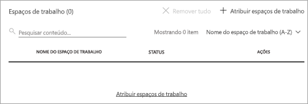

1. Selecione **Atribuir espaços de trabalho**. Isso está listado em vários locais e todos realizarão a mesma tarefa.
2. Selecione **Espaços de trabalho de toda a organização** ou **Espaços de trabalho específicos por usuário**.
   
   | Selection | Descrição |
   | --- | --- |
   | **Espaços de trabalho de toda a organização** |Atribuir espaços de trabalho de toda a organização à capacidade Premium atribuirá todos os Espaços de trabalho do aplicativo e Meus espaços de trabalho, em sua organização, a essa capacidade Premium. Além disso, todos os usuários atuais e futuros terão permissão para reatribuir espaços de trabalho individuais a essa capacidade. |
   | **Espaços de trabalho específicos por usuário** |Quando você atribui espaços de trabalho por usuário ou grupo, todos os espaços de trabalho pertencentes a esses usuários são atribuídos à capacidade Premium, incluindo o espaço de trabalho pessoal do usuário. Tais usuários obtêm permissões de atribuição de espaço de trabalho automaticamente. Isso inclui espaços de trabalho já atribuídos a uma capacidade diferente. |
3. Selecione **Aplicar**.

Essa opção não permite atribuir espaços de trabalho específicos a uma capacidade.

### Configurações de espaço de trabalho do aplicativo
Também é possível atribuir um espaço de trabalho do aplicativo a uma capacidade Premium das configurações desse espaço de trabalho. Para atribuir um espaço de trabalho do aplicativo a uma capacidade Premium, faça o seguinte.

Para mover um espaço de trabalho para uma capacidade, é necessário ter permissões de administrador para esse espaço de trabalho e também permissões de atribuição de capacidade para essa capacidade. Observe que os administradores de espaço de trabalho podem sempre remover um espaço de trabalho da capacidade Premium.

1. Edite um espaço de trabalho do aplicativo selecionando as **reticências (...)**  e **Editar espaço de trabalho**.
   
    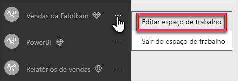
2. Em **Editar espaço de trabalho**, expanda **Avançado**.
3. Se você tiver recebido permissões de atribuição de capacidade para qualquer capacidade, você terá a opção de ativar **Premium** para esse espaço de trabalho.
4. Selecione a capacidade à qual você deseja atribuir esse Espaço de trabalho do aplicativo.
   
    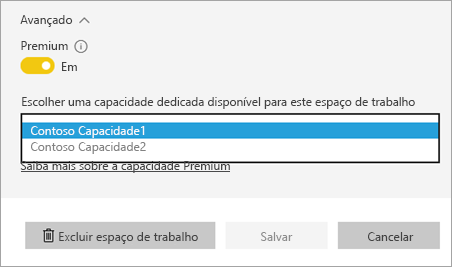
5. Selecione **Salvar**.

Depois de salvo, o espaço de trabalho e todo o seu conteúdo, será movido para a capacidade Premium sem qualquer interrupção para os usuários finais.

## Qual é a aparência do Premium para os usuários
Para a maior parte, os usuários nem mesmo precisarão saber que eles estão em uma capacidade Premium. Seus dashboards e relatórios apenas funcionarão. Como uma dica visual, você verá um ícone de losango ao lado dos espaços de trabalho que estão em uma capacidade Premium. 

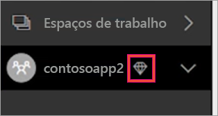

## Chave do produto do Servidor de Relatórios do Power BI)
Na guia **Configurações de capacidade** do portal de administração do Power BI, você terá acesso à sua chave do produto do Servidor de Relatórios do Microsoft Power BI. Isso estará disponível somente para os administradores Globais ou usuários atribuídos à função de administrador do serviço do Power BI e se você tiver comprado um SKU do Power BI Premium.

Selecionar **chave do Servidor de Relatório do Power BI** exibirá uma caixa de diálogo que contém a chave do produto (Product Key). É possível copiá-la e usá-la com a instalação.

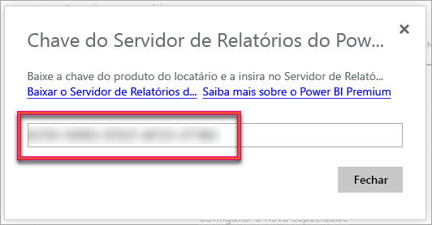

Para obter mais informações, consulte [Instalar o Servidor de Relatório do Power BI](report-server/install-report-server.md).

## Próximas etapas
Compartilhe aplicativos publicados com usuários Gratuitos ao atribuir o espaço de trabalho a uma capacidade Premium. Para obter mais informações, consulte [Criar e distribuir um aplicativo no Power BI](service-create-distribute-apps.md).

Mais perguntas? [Experimente perguntar à Comunidade do Power BI](http://community.powerbi.com/)

