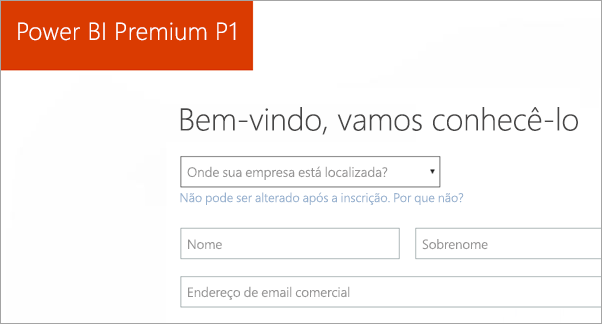
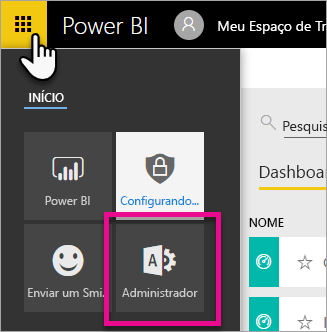
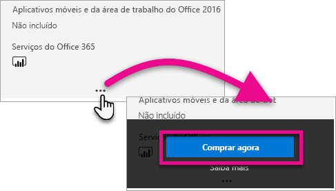
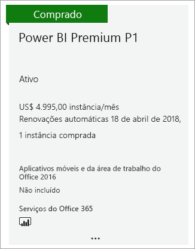
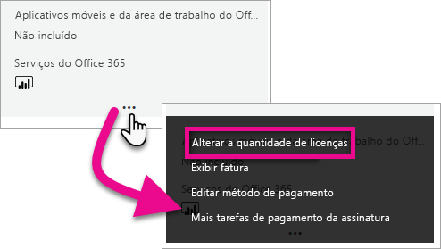
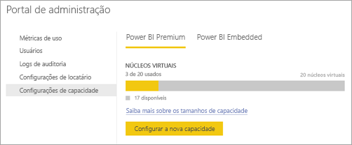
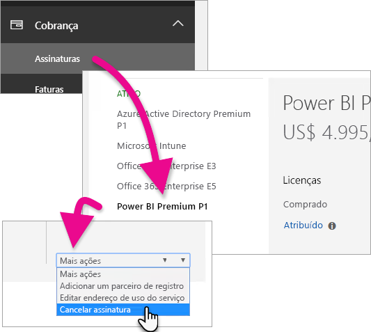
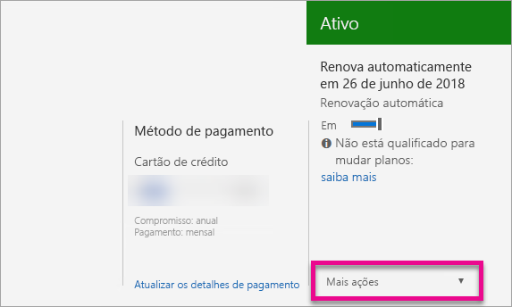

# Como comprar o Power BI Premium
Saiba como adquirir capacidade do Power BI Premium para sua organização.

<iframe width="640" height="360" src="https://www.youtube.com/embed/NkvYs5Qp4iA?rel=0&amp;showinfo=0" frameborder="0" allowfullscreen></iframe>

É possível adquirir um nó de capacidade do Power BI Premium por meio do Centro de Administração do Office 365. Também é possível ter qualquer combinação de SKUs de capacidade Premium (P1 até P3) dentro de sua organização. Eles fornecem diferentes capacidades de recursos.

Para obter mais informações sobre o que é o Power BI Premium, consulte [Power BI Premium – o que é?](service-premium.md). Para ver o preço atual do Power BI, consulte a [Power BI pricing page (Página de preços do Power BI)](https://powerbi.microsoft.com/pricing/). Também é possível planejar seus custos para o Power BI Premium usando a [Calculadora Power BI Premium](https://powerbi.microsoft.com/calculator/).

> [!IMPORTANT]
> Os autores de conteúdo ainda precisarão de uma licença do Power BI Pro, mesmo se você comprar o Power BI Premium.
> 
> 

## Criar um novo locatário com o Power BI Premium P1
Caso você não tenha um locatário e deseje criar um, poderá comprar o Power BI Premium ao mesmo tempo. O link a seguir o orientará pelo processo de criação de um novo locatário para uso com o Office 365 e permitirá que você compre o Power BI Premium. Você precisará comprar uma licença do Power BI Pro para um usuário depois que o locatário for criado. Ao criar seu locatário, você se tornará o Administrador Global desse locatário automaticamente.

Para fazer essa compra, consulte [Oferta do Power BI Premium P1](https://signup.microsoft.com/Signup?OfferId=b3ec5615-cc11-48de-967d-8d79f7cb0af1).

## Comprar uma capacidade do Power BI Premium para uma organização existente
Caso você tenha uma organização, precisará ser um Administrador global ou um Administrador de cobrança para comprar assinaturas e licenças. Para obter mais informações, consulte [About Office 365 admin roles (Sobre funções de administrador do Office 365)](https://support.office.com/article/About-Office-365-admin-roles-da585eea-f576-4f55-a1e0-87090b6aaa9d).

Para adquirir uma capacidade do Premium, será necessário fazer o seguinte.

1. No serviço do Power BI, selecione o **Seletor de aplicativo do Office 365** > **Admin**. Como alternativa, é possível navegar até o Centro de Administração do Office 365. Para isso, acesse https://portal.office.com e selecione **Administrador**.
   
    
2. Selecione **Cobrança** > **Serviços de compra**.
3. Em **Outros planos**, procure ofertas do Power BI Premium. Isso listará como P1 até o P3, EM3 e P1 (mês a mês).
4. Passe o mouse sobre as **reticências (...)** e, em seguida, selecione **Comprar agora**.
   
    
5. Siga as etapas para concluir a compra.

Você também pode selecionar os seguintes links para levá-lo diretamente para as páginas de compra desses itens. Para obter mais informações sobre essas SKUs, consulte [Power BI Premium – o que é?](service-premium.md#premiumskus).

Para adquirir um SKU do Power BI Premium, ***é necessário ser um Administrador global ou de cobrança*** dentro do seu locatário. Selecionar os links abaixo produzirá um erro se você não for administrador.

| Links de compra direta |
| --- |
| [SKU do EM3 (mês a mês)](https://portal.office.com/commerce/completeorder.aspx?OfferId=4004702D-749C-4F74-BF47-3048F1833780&adminportal=1) |
| [SKU do P1](https://portal.office.com/commerce/completeorder.aspx?OfferId=b3ec5615-cc11-48de-967d-8d79f7cb0af1&adminportal=1) |
| [SKU do P1 (mês a mês)](https://portal.office.com/commerce/completeorder.aspx?OfferId=E4C8EDD3-74A1-4D42-A738-C647972FBE81&adminportal=1) |
| [SKU do P2](https://portal.office.com/commerce/completeorder.aspx?OfferId=062F2AA7-B4BC-4B0E-980F-2072102D8605&adminportal=1) |
| [SKU do P3](https://portal.office.com/commerce/completeorder.aspx?OfferId=40c7d673-375c-42a1-84ca-f993a524fed0&adminportal=1) |

Depois de concluir a compra, a tela Serviços de compra mostrará que o item foi comprado e está ativo.

Agora é possível gerenciar essa capacidade dentro do centro de administração do Power BI. Para obter mais informações, consulte [Manage Power BI Premium (Gerenciar o Power BI Premium)](service-admin-premium-manage.md).

## Comprar mais capacidades
Quando você está na seção **Configurações Premium** do portal do administrador do Power BI, se você for um administrador, você verá o botão **Comprar mais**. Esse botão levará você ao portal do Office 365. Quando estiver no Centro de Administração do Office 365, será possível fazer o seguinte.

1. Selecione **Cobrança** > **Serviços de compra**.
2. Localize o item do Power BI Premium do qual você deseja adquirir mais em **Outros planos**.
3. Passe o mouse sobre as **reticências (...)** e, em seguida, selecione **Alterar quantidade de licenças**.
   
    
4. Altere o número de instâncias que você deseja ter para esse item. Em seguida, selecione **Enviar** quando terminar.
   
   > [!IMPORTANT]
   > Selecionar **Enviar** fará com que os encargos sejam debitados do cartão de crédito registrado.
   > 
   > 

Em seguida, a página **Serviços de compra** indicará o número de instâncias que você tem. No portal de administração do Power BI, nas **Configurações de capacidade**, os núcleos virtuais disponíveis correspondem à nova capacidade comprada.

Agora é possível gerenciar essa capacidade dentro do centro de administração do Power BI. Para obter mais informações, consulte [Manage Power BI Premium (Gerenciar o Power BI Premium)](service-admin-premium-manage.md).

## Cancelar sua assinatura
Cancele sua assinatura no centro de administração do Office 365. Para cancelar sua assinatura Premium, faça o seguinte.

1. Acesse o centro de administração do Office 365.
2. Selecione **Cobrança** > **Assinaturas**.
3. Selecione sua assinatura do Power BI Premium na lista.
4. Na lista suspensa **Mais ações**, selecione **Cancelar assinatura**.
   
    
5. A página **Cancelar assinatura** indicará se você é responsável ou não por uma [taxa de término antecipado](https://support.office.com/article/early-termination-fees-6487d4de-401a-466f-8bc3-c0beb5cc40d3). Essa página também permitirá saber quando os dados serão excluídos da assinatura.
6. Leia as informações e, caso deseje continuar, selecione **Cancelar assinatura**.

## Próximas etapas
[Página de preços do Power BI](https://powerbi.microsoft.com/pricing/)  
[Calculadora Power BI Premium](https://powerbi.microsoft.com/calculator/)  
[Power BI Premium – o que é?](service-premium.md)  
[Gerenciar o Power BI Premium](service-admin-premium-manage.md)  
[Perguntas Frequentes do Power BI Premium](service-premium-faq.md)  
[Notas de versão do Power BI Premium](service-premium-release-notes.md)  
[White paper do Microsoft Power BI Premium](https://aka.ms/pbipremiumwhitepaper)  
[Planejando um white paper de implantação do Power BI Enterprise](https://aka.ms/pbienterprisedeploy)  
[Portal de administração do Power BI](service-admin-portal.md)  
[Administração do Power BI em sua organização](service-admin-administering-power-bi-in-your-organization.md)  

Mais perguntas? [Experimente perguntar à Comunidade do Power BI](http://community.powerbi.com/)

