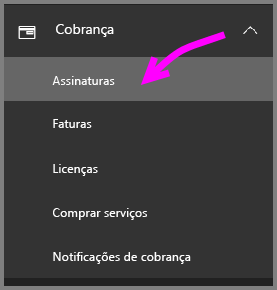
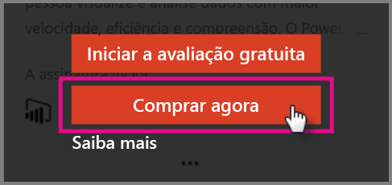
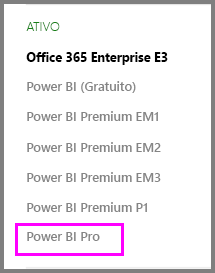

# Início Rápido: Comprar licenças do Power BI Pro

O Power BI Pro é uma licença individual que permite acesso a todo o conteúdo e a todos os recursos no serviço do Power BI, incluindo a capacidade de compartilhar conteúdo e colaborar com outros usuários do Pro. Somente usuários Pro podem publicar e consumir conteúdo de espaços de trabalho do aplicativo, compartilhar painéis e se inscrever para obter painéis e relatórios. Este artigo explica como comprar licenças do Power BI Pro no Office 365.

## Pré-requisitos

Você deve ser um membro da função [**Administrador global** ou **Administrador de cobrança**](https://support.office.com/article/about-office-365-admin-roles-da585eea-f576-4f55-a1e0-87090b6aaa9d?ui=en-US&rs=en-US&ad=US) no Office 365. 

## Comprar licenças do Power BI Pro pelo Office 365

Siga estas etapas para comprar licenças do Power BI Pro:

1. Abra o [Centro de administração do Office 365](https://portal.office.com/adminportal/home#/homepage).

2. No painel de navegação esquerdo, selecione **Cobrança** > **Assinaturas**.

    

3. No canto superior direito da página **Assinaturas**, selecione **Adicionar assinaturas**.

    

4. Localize a oferta de assinatura desejada:

    Em **Enterprise Suite**, selecione **Office 365 Enterprise E5**.

    

    Em **Outros Planos**, selecione **Power BI Pro**.

    

5. Passe o mouse sobre as reticências (...) para a assinatura desejada e selecione **Comprar agora**.

    

6. Escolha **Pagar mensalmente** ou **Pagar por um ano inteiro**, de acordo com sua preferência de cobrança.

7. Em **Quantos usuários você deseja?**, insira a quantidade de licenças desejada e, em seguida, selecione **Fazer check-out agora** para concluir a transação.

8. Verifique se a assinatura adquirida agora está listada na página **Assinaturas**.

   

9. Para adicionar mais licenças após a compra inicial, selecione **Power BI Pro** na página **Assinaturas** e, em seguida, selecione **Adicionar/Remover licenças**.

## Próximas etapas

Agora que você comprou licenças, atribua-as a usuários em seu locatário.

[Atribuir licenças a usuários no Office 365](service-admin-assigning-power-bi-pro-licenses.md)

[Atribuir licenças a usuários no Azure](service-admin-assigning-power-bi-pro-licenses-azure.md)

[Preços do Power BI](https://powerbi.microsoft.com/en-us/pricing/)
