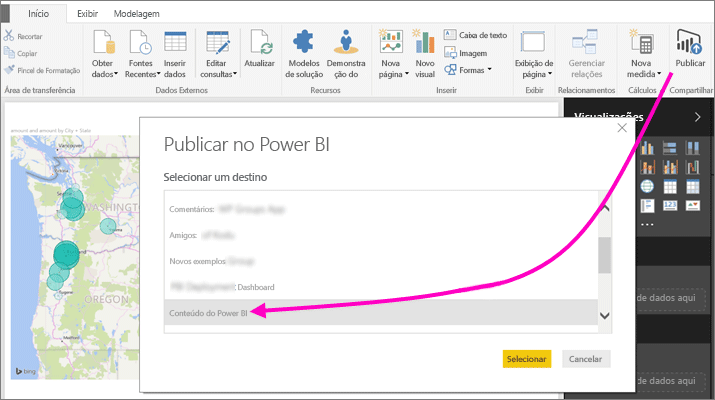
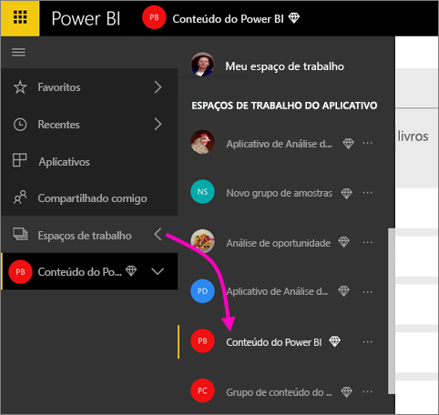
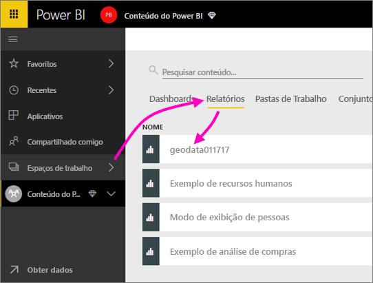
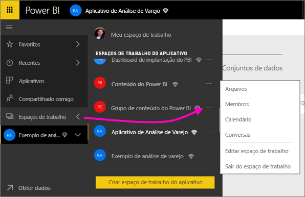
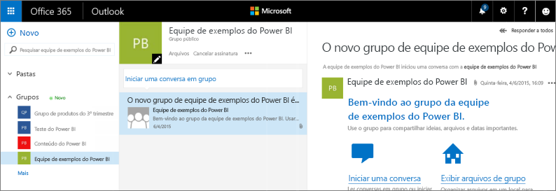
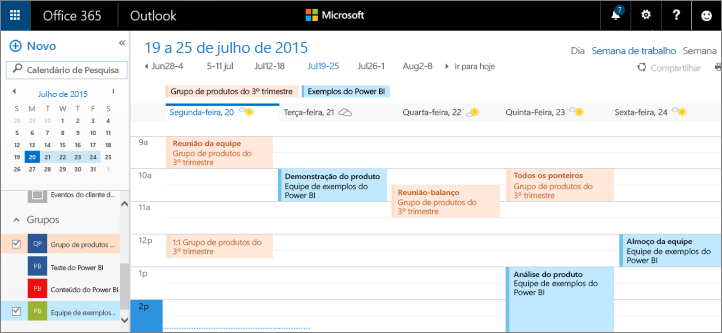

# Colaborar em seu espaço de trabalho de aplicativo do Power BI
Os espaços de trabalho de aplicativo do Power BI são ótimos lugares para colaborar com seus colegas em dashboards, relatórios e conjuntos de dados para criar *aplicativos*. Essa é a razão da criação dos espaços de trabalho: colaboração. Após concluir a colaboração em dashboards e relatórios com seus colegas, você os empacota como um aplicativo e os distribui. Leia mais sobre a [criação de aplicativos e espaços de trabalho de aplicativo no Power BI](service-create-distribute-apps.md). 

A colaboração não termina com os espaços de trabalho no Power BI. O Office 365 oferece outros serviços de grupo, como compartilhamento de arquivos no OneDrive for Business, conversas no Exchange, calendário e tarefas compartilhadas e assim por diante. Leia mais sobre os [grupos no Office 365](https://support.office.com/article/Create-a-group-in-Office-365-7124dc4c-1de9-40d4-b096-e8add19209e9).

Os espaços de trabalho de aplicativo estão disponíveis apenas no [Power BI Pro](service-free-vs-pro.md).

## Colaborar em arquivos do Power BI Desktop em seu espaço de trabalho de aplicativo
Depois de criar um arquivo do Power BI Desktop, se você o publicar em seu espaço de trabalho de aplicativo do Power BI, todas as pessoas do espaço de trabalho poderão colaborar nele.

1. No Power BI Desktop, selecione **Publicar** na faixa de opções **Início** e, na caixa **Selecionar um destino**, selecione seu espaço de trabalho de aplicativo.
   
    
2. No serviço do Power BI, selecione a seta próxima a Espaços de Trabalho > selecione seu espaço de trabalho de aplicativo.
   
    
3. Selecione a guia Relatórios e escolha seu relatório.
   
    
   
    A partir daqui, é como qualquer outro relatório no Power BI. Você e outras pessoas no seu espaço de trabalho de aplicativo podem [modificar o relatório](service-reports.md) e salvar blocos em um dashboard à sua escolha.

## Colaborar no Office 365
A colaboração no Office 365 inicia-se no espaço de trabalho de aplicativo no Power BI.

1. No serviço do Power BI, selecione a seta ao lado de Espaços de trabalho > selecione as reticências (**...**) ao lado do nome do espaço de trabalho. 
   
   
2. Nesse menu, você pode colaborar com seu grupo de algumas maneiras: 
   
   * Ter uma [conversa de grupo no Office 365](service-collaborate-power-bi-workspace.md#have-a-group-conversation-in-office-365).
   * [Agendar um evento](service-collaborate-power-bi-workspace.md#schedule-an-event-on-the-group-workspace-calendar) no calendário do espaço de trabalho de grupo do aplicativo.
   
   Na primeira vez em que você acessar seu espaço de trabalho de grupo do aplicativo no Office 365, poderá demorar um pouco. Aguarde de 15 a 30 minutos, em seguida, atualize seu navegador.

## Ter uma conversa de grupo no Office 365
1. Selecione as reticências (...) ao lado do nome do espaço de trabalho de aplicativo \> **Conversas**. 
   
    
   
   O site de email e conversa do espaço de trabalho de grupo do aplicativo é aberto no Outlook para Office 365.
   
   
2. Leia mais sobre [conversas em grupo no Outlook para o Office 365](https://support.office.com/Article/Have-a-group-conversation-a0482e24-a769-4e39-a5ba-a7c56e828b22).

## Agendar um evento no calendário do espaço de trabalho de grupo do aplicativo
1. Selecione as reticências (**...**) ao lado do nome do espaço de trabalho do aplicativo \> **Calendário**. 
   
   
   
   Isso abre o calendário do espaço de trabalho de grupo do aplicativo no Outlook para Office 365.
   
   
2. Leia mais sobre [calendários de grupo no Outlook no Office 365](https://support.office.com/Article/Add-edit-and-subscribe-to-group-events-0cf1ad68-1034-4306-b367-d75e9818376a).

## Gerenciar um espaço de trabalho de aplicativo
Se você é proprietário ou administrador de um espaço de trabalho de aplicativo, você também pode adicionar ou remover membros do espaço de trabalho. Leia mais sobre [como gerenciar seu espaço de trabalho de aplicativo do Power BI](service-manage-app-workspace-in-power-bi-and-office-365.md).

## Próximas etapas
* [Criar aplicativos e espaços de trabalho de aplicativo no Power BI](service-create-distribute-apps.md)
* Mais perguntas? [Experimente a Comunidade do Power BI](http://community.powerbi.com/)
* Comentários? Visite [Power BI Ideias](https://ideas.powerbi.com/forums/265200-power-bi) (Ideias do Power BI)

