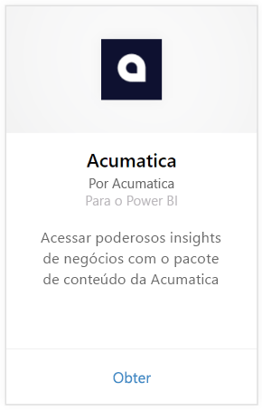
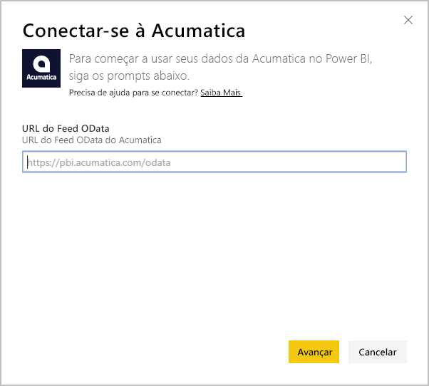
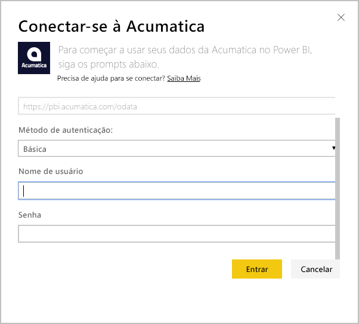
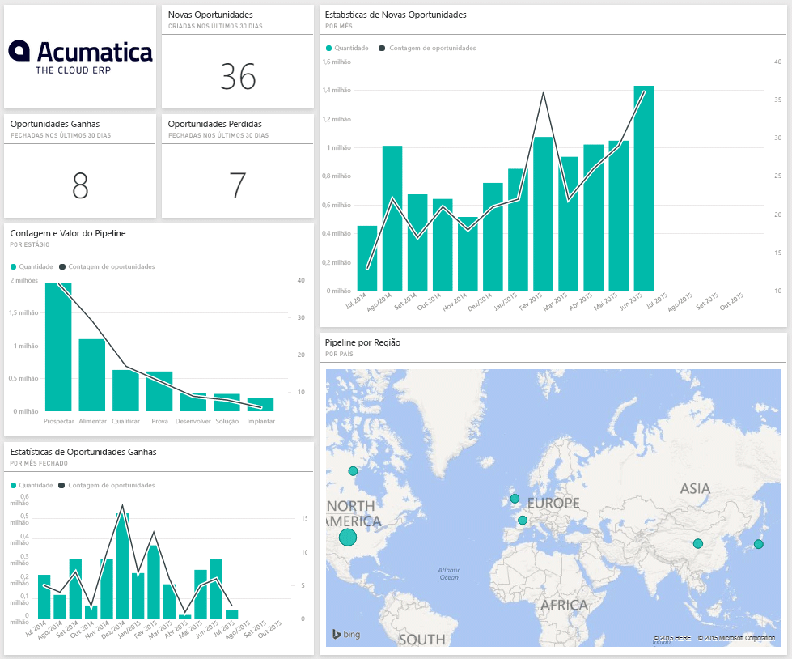
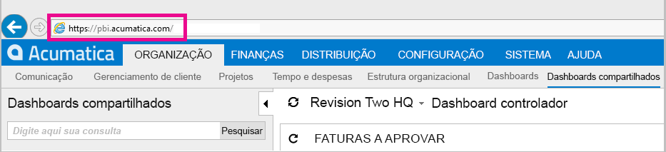
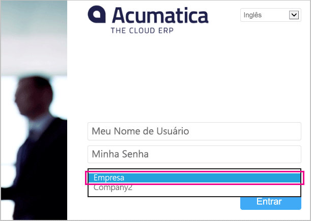

# Conectar-se ao Acumatica com o Power BI
O pacote de conteúdo do Acumatica para o BI Power permite que você obtenha informações rapidamente sobre os dados de sua oportunidade. O Power BI recupera seus dados, incluindo oportunidades, contas e clientes, e cria um painel padrão e relatórios relacionados com base nesses dados.

Conecte-se ao [pacote de conteúdo do Acumatica](https://app.powerbi.com/getdata/services/acumatica) ou leia mais sobre a [Integração do Acumatica](https://powerbi.microsoft.com/integrations/acumatica) com o Power BI.

>[!NOTE]
>Esse pacote de conteúdo exige o Acumatica v5.2 ou superior.

## Como se conectar
1. Selecione **Obter Dados** na parte inferior do painel de navegação esquerdo.
   
   
2. Na caixa **Serviços** , selecione **Obter**.
   
   
3. Selecione **Acumatica** \> **Obter**.
   
   
4. Insira o ponto de extremidade OData do Acumatica. Um ponto de extremidade OData permite que um sistema externo solicite dados do Acumatica. O ponto de extremidade OData do Acumatica é formatado da seguinte maneira e deve usar HTTPS:
   
     https://[sitedomain]/odata/[companyname]
   
   O Nome da Empresa só é necessário se você tiver uma implantação de várias empresas. Mais informações sobre como encontrar esse parâmetro em sua conta do Acumatica estão incluídas abaixo.
   
   
5. Como o Método de Autenticação, selecione **Básico**. Digite seu nome de usuário e a senha de sua conta do Acumatica e clique em **Entrar**.
   
    
6. Após o Power BI importar os dados, você verá novos elementos (painel, relatório e conjunto de dados) no painel de navegação esquerdo. Novos itens são marcados com um asterisco amarelo \* que desaparece quando é selecionado; escolher o painel mostrará um layout semelhante à seguinte:
   
    

**E agora?**

* Tente [fazer uma pergunta na caixa de P e R](power-bi-q-and-a.md) na parte superior do dashboard
* [Altere os blocos](service-dashboard-edit-tile.md) no dashboard.
* [Selecione um bloco](service-dashboard-tiles.md) para abrir o relatório subjacente.
* Enquanto seu conjunto de dados será agendado para ser atualizado diariamente, você pode alterar o agendamento de atualização ou tentar atualizá-lo sob demanda usando **Atualizar Agora**

## Requisitos de sistema
Este pacote de conteúdo exige o Acumatica v5.2 ou superior; confirme a versão com o administrador do Acumatica.

## Localizando parâmetros
**Ponto de extremidade OData do Acumatica**

O ponto de extremidade OData do Acumatica é formatado da seguinte maneira e deve usar HTTPS:

    https://[sitedomain]/odata/[companyname]

O Domínio do Site do Aplicativo pode ser encontrado na barra de endereços do navegador depois de entrar no Acumatica. No exemplo abaixo, o domínio do site é “https://pbi.acumatica.com”, portanto, o ponto de extremidade OData a ser fornecido seria “https://pbi.acumatica.com/odata”.

 

O Nome da Empresa só é necessário se você tiver uma implantação de várias empresas. Você pode encontrar essas informações na página de conexão do Acumatica.

## Solução de problemas
Se você não conseguir fazer logon, verifique se o ponto de extremidade OData do Acumatica fornecido está formatado corretamente.

    https://<application site domain>/odata/<company name>

Se tiver problemas para se conectar, confirme com o administrador sua versão do Acumatica. Este pacote de conteúdo requer a versão 5.2 ou posterior.

## Próximas etapas
[Introdução ao Power BI](service-get-started.md)

[Obter dados no Power BI](service-get-data.md)

