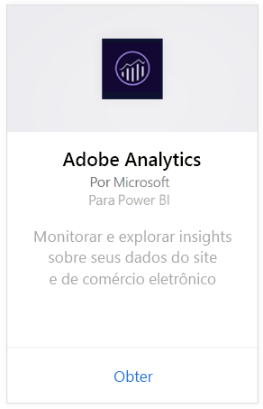
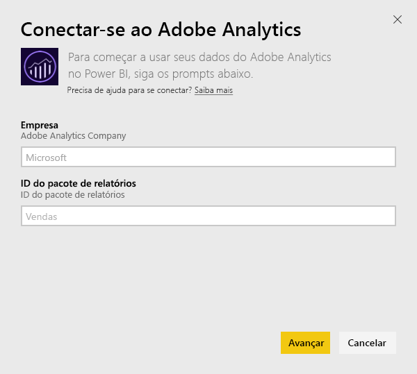
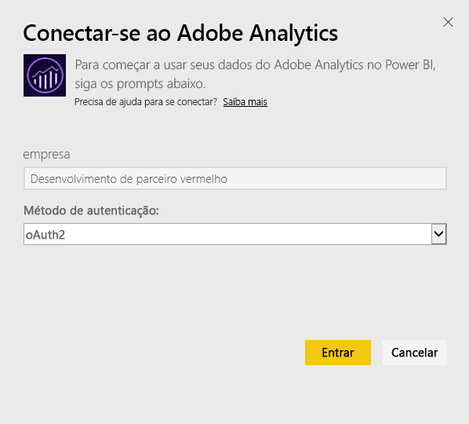
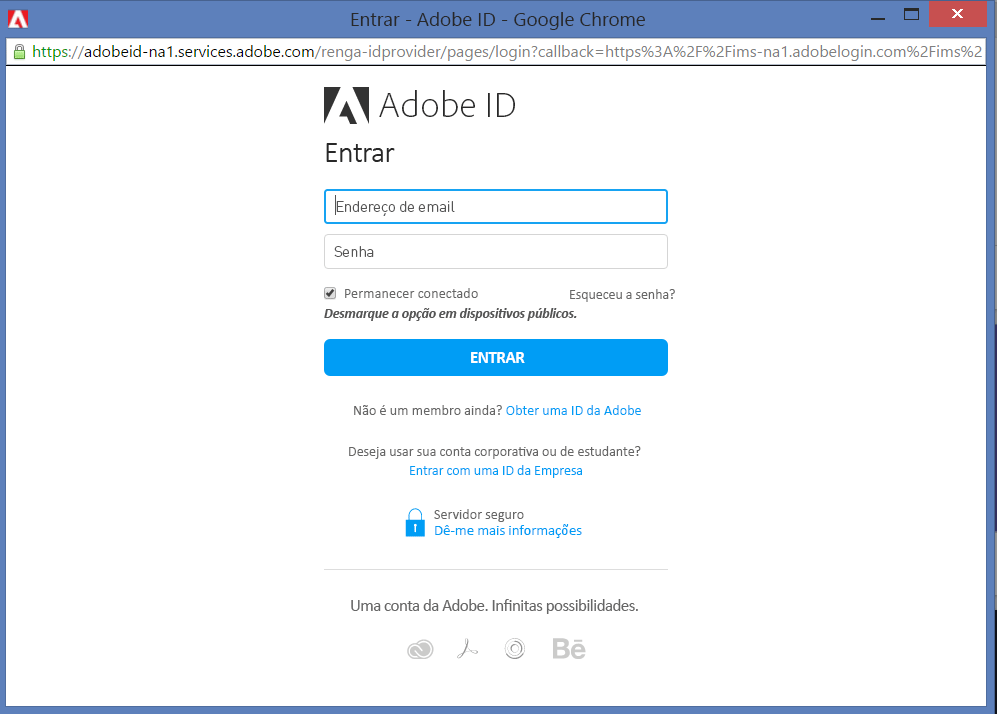
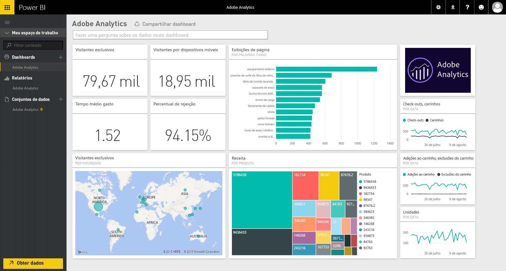
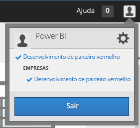

# Conectar-se ao Adobe Analytics com o Power BI
A conexão ao Adobe Analytics por meio do Power BI começa pela conexão à sua conta do Adobe Analytics Marketing Cloud. Você obterá um aplicativo com um dashboard e um conjunto de relatórios do Power BI que fornecem insights sobre as dimensões de usuários e de tráfego do site. Os dados são atualizados automaticamente uma vez por dia. Você pode interagir com o dashboard e os relatórios, mas não pode salvar as alterações.

Conecte-se ao [Adobe Analytics](https://app.powerbi.com/getdata/services/adobe-analytics) ou leia mais sobre a [integração do Adobe Analytics](https://powerbi.microsoft.com/integrations/adobe-analytics) com o Power BI.

## Como se conectar
[!INCLUDE [powerbi-service-apps-get-more-apps](./includes/powerbi-service-apps-get-more-apps.md)]

1. Selecione **Adobe Analytics** \>  **Obter**.
   
   
2. O Power BI se conecta a uma ID específica da Empresa e do Pacote de Relatórios do Adobe Analytics (não o nome do Pacote de Relatórios). Veja detalhes sobre como [encontrar esses parâmetros](#FindingParams) abaixo.
   
   
3. Para o **Método de Autenticação**, selecione **oAuth2** \> **Entrar**. Quando solicitado, insira suas credenciais do Adobe Analytics. 
   
    
   
    
4. Clique em **Aceitar** para permitir que o Power BI acesse os dados do Adobe Analytics.
   
   
5. Depois de sua aprovação, o processo de importação será iniciado automaticamente. 

## Exibir o dashboard e os relatórios do Adobe Analytics
[!INCLUDE [powerbi-service-apps-open-app](./includes/powerbi-service-apps-open-app.md)]

      

[!INCLUDE [powerbi-service-apps-open-app](./includes/powerbi-service-apps-what-now.md)]

## O que está incluído
O Power BI usa a API de Relatório do Adobe Analytics para definir e executar relatórios para as seguintes tabelas:

| **Nome da tabela** | **Detalhes da Coluna** |
| --- | --- |
| Produtos |elementos = "product" (os 25 primeiros)   métricas= "cartadditions", "cartremovals", "carts", "cartviews", "checkouts", "revenue", "units" |
| Navegadores |elementos= "browser" (os 25 primeiros)   métricas= "bounces", "bouncerate", "visitors", "visits", "uniquevisitors", "totaltimespent", "pageviews" |
| Páginas |elementos= "page" (as 25 primeiras)   métricas= "cartadditions", "cartremovals", "carts", "cartviews", "checkouts", "revenue", "units", "visits", "uniquevisitors", "pageviews", "bounces", "bouncerate", "totaltimespent" |
| JavaScript Habilitado |elementos= "javascriptenabled”, “browser” (os 25 primeiros) |
| SO para celular |elementos= "mobileos" (os 25 primeiros)  métricas= "bounces", "bouncerate", "visitors", "visits", "uniquevisitors", "totaltimespent", "cartadditions", "cartremovals", "checkouts", "revenue", "units", "pageviews" |
| Palavras-chave de Mecanismos de Pesquisa |elementos= "searchengine" "searchenginekeyword"   métricas= "bounces", "bouncerate", "visitors", "visits", "entries", "uniquevisitors", "totaltimespent", "cartadditions", "cartremovals", "carts", "cartviews", "checkouts", "revenue", "units", "pageviews" |
| Mecanismo de Pesquisa para Produtos |elementos= "searchengine", "product"   métricas= "bounces", "bouncerate", "visitors", "visits", "entries", "uniquevisitors", "totaltimespent", "cartadditions", "cartremovals", "carts", "cartviews", "checkouts", "revenue", "units", "pageviews" |
| Páginas de referência |elementos= "referrer" (os 15 primeiros), "page" (as 10 primeiras)   métricas= "bounces", "bouncerate", "visitors", "visits", "entries", "uniquevisitors", "totaltimespent", "cartadditions", "cartremovals", "carts", "cartviews", "checkouts", "revenue", "units", "pageviews" |
| Páginas de Geocountry |elementos= "geocountry" (os 20 primeiros), "page"   métricas= "bounces", "bouncerate", "visitors", "visits", "entries", "uniquevisitors", "totaltimespent", "cartadditions", "cartremovals", "carts", "cartviews", "checkouts", "revenue", "units", "pageviews" |
| Produto de Geocountry |elementos= "geocountry" (os 20 primeiros), "product"  métricas= "bounces", "bouncerate", "visitors", "visits", "entries", "uniquevisitors", "totaltimespent", "cartadditions", "cartremovals", "carts", "cartviews", "checkouts", "revenue", "units" |
| Pesquisa de Região e País |elementos = "geocountry" (os 200 primeiros)   métricas= "bounces", "bouncerate", "visitors", "visits", "entries", "uniquevisitors", "totaltimespent", "cartadditions", "cartremovals", "carts", "cartviews", "checkouts", "revenue", "units" |
| Idioma |elementos= "language", "browser" (os 25 primeiros)   métricas= "bounces", "bouncerate", "visitors", "visits", "uniquevisitors", "totaltimespent", "pageviews", "cartadditions", "cartremovals", "checkouts", "carts", "cartviews" |
| Pesquisa de mecanismos de pesquisa |elementos= "searchengine" (os 100 primeiros)   métricas= "bounces", "bouncerate", "visitors", "visits", "entries", "uniquevisitors", "totaltimespent", "cartadditions", "cartremovals", "carts", "cartviews", "checkouts", "revenue", "units" |
| Pesquisa de navegador |elementos= "browser" (os 25 primeiros) |

## Requisitos de sistema
É necessário ter acesso ao [Adobe Analytics](http://www.adobe.com/marketing-cloud/web-analytics.html), incluindo o acesso aos parâmetros corretos, conforme descrito abaixo.

## Localizando parâmetros
**Empresa**

O valor de Empresa pode ser encontrado no canto superior direito de sua conta quando estiver conectado. O valor diferencia espaçamento e maiúsculas de minúsculas. Insira-o exatamente como você vê em sua conta.

**ID do Pacote de Relatórios**

A ID do Pacote é criada quando o Pacote de Relatórios é criado. Entre em contato com o administrador para identificar o valor de ID. É importante observar que esse não é o nome do Pacote de Relatórios.

Da [documentação](https://marketing.adobe.com/resources/help/en_US/reference/new_report_suite.html) do Adobe:

## Solução de problemas
Caso veja um erro depois de fornecer suas credenciais, indicando que você não tem permissões, confirme com o administrador se você tem acesso à API do Adobe Analytics. Além disso, confirme se a ID do Adobe fornecida está vinculada à sua ID organizacional do Marketing Cloud (associada a uma empresa do Adobe Analytics).

Se você tiver acessado a tela de credenciais antes de receber um erro, isso significa que, provavelmente, os relatórios estão levando muito tempo para serem concluídos. Um erro comum está no formulário *"Falha ao obter dados do relatório do Adobe Analytics. O conteúdo incluiu &quot;referenciador, página&quot;; a duração aproximada foi xx segundos"*. Examine a seção "O que está incluído" e compare com o tamanho da instância do Adobe. Infelizmente, não existe uma maneira de resolver esse tempo limite hoje. No entanto, estamos considerando fazer atualizações para dar um melhor suporte a instâncias maiores. Forneça seus comentários para a equipe do Power BI em https://ideas.powerbi.com

## Próximas etapas
* [O que são aplicativos no Power BI?](service-install-use-apps.md)
* [Obter dados no Power BI](service-get-data.md)
* Mais perguntas? [Experimente perguntar à Comunidade do Power BI](http://community.powerbi.com/)

