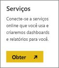
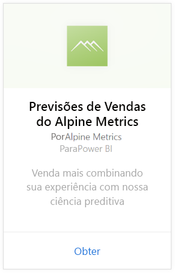
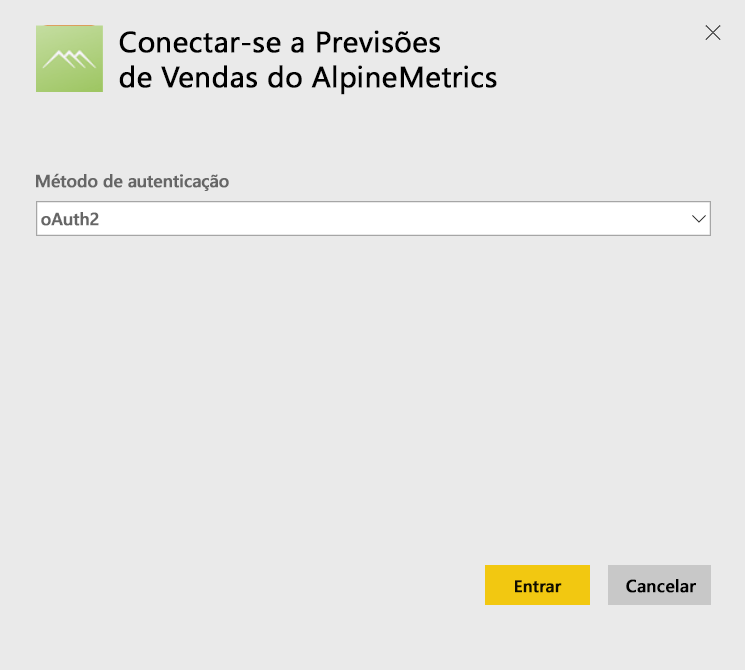
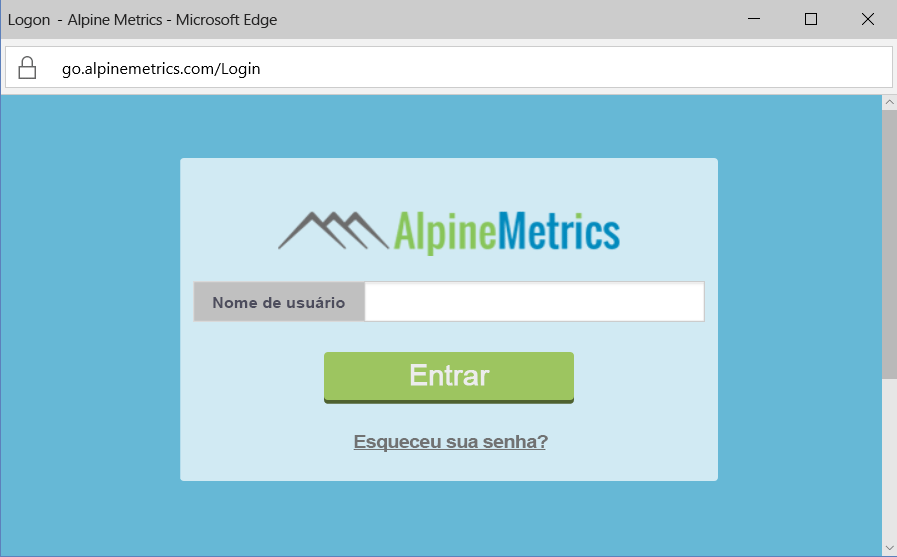

# Conectar-se a Previsões de Vendas do Alpine Metrics com o Power BI
A Alpine Metrics fornece Otimização do Processo de Vendas Preditivo avançada, na nuvem e a pedido, para pequenas e grandes organizações de vendas. O pacote de conteúdo de Previsões de Vendas do Alpine Metrics para Power BI inclui métricas, como vendas e riscos e potencial e previstos, permitindo que você tenha uma percepção mais aprofundada sobre o futuro de sua empresa. 

Conecte-se ao [pacote de conteúdo de Previsões de Vendas do Alpine Metrics](https://app.powerbi.com/getdata/services/alpine-metrics) para Power BI

## Como se conectar
1. Selecione Obter Dados na parte inferior do painel de navegação esquerdo.  
   
    
2. Na caixa **Serviços** , selecione **Obter**.  
   
    
3. Selecione **Previsões de Vendas do AlpineMetrics**, em seguida, selecione **Obter**.  
   
    
4. Selecione **OAuth 2** e **Entrar**. Quando solicitado, forneça suas credenciais do AlpineMetrics.
   
    
   
    
5. Depois que você estiver conectado, um dashboard, relatório e conjunto de dados serão carregados automaticamente. Após a conclusão, os blocos serão atualizados com dados de sua conta.
   
    

**E agora?**

* Tente [fazer uma pergunta na caixa de P e R](service-q-and-a.md) na parte superior do dashboard
* [Altere os blocos](service-dashboard-edit-tile.md) no dashboard.
* [Selecione um bloco](service-dashboard-tiles.md) para abrir o relatório subjacente.
* Enquanto seu conjunto de dados será agendado para ser atualizado diariamente, você pode alterar o agendamento de atualização ou tentar atualizá-lo sob demanda usando **Atualizar Agora**

## O que está incluído
O pacote de conteúdo inclui dados das seguintes tabelas:  

    - Account    
    - Negócios    
    - País    
    - Setor    
    - Oportunidade  
    - Pessoa  
    - Previsão    
    - Histórico de Previsão    
    - Product  
    - Região    

## Requisitos de sistema
É necessário ter uma conta do Alpine Metrics com permissões de acesso às tabelas acima para criar uma instância deste pacote de conteúdo.

## Próximas etapas
[Introdução ao Power BI](service-get-started.md)

[Power BI – conceitos básicos](service-basic-concepts.md)

