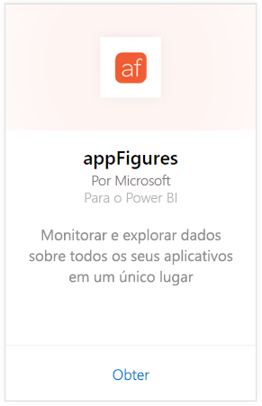
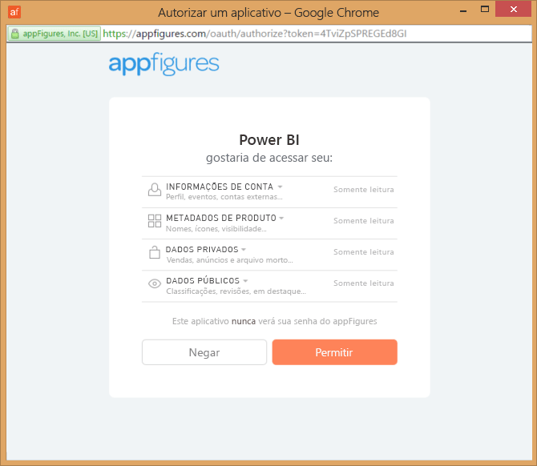
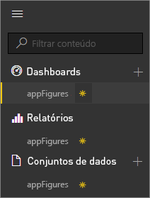
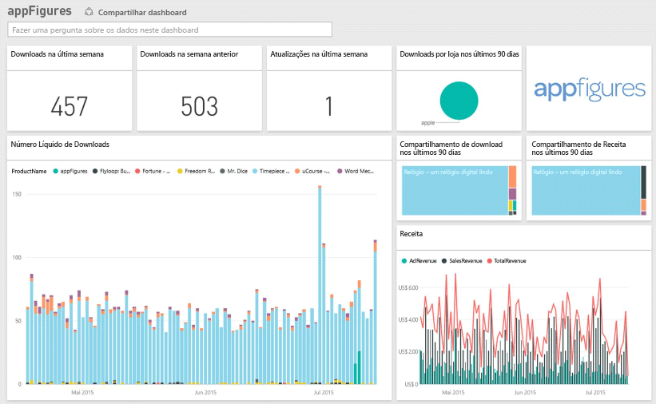
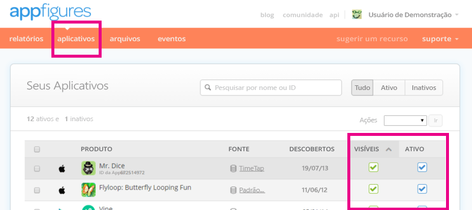

# Conectar-se ao appFigures com o Power BI
É fácil acompanhar estatísticas importantes sobre seus aplicativos com o Power BI e o pacote de conteúdo do appFigures. O Power BI recupera seus dados, incluindo vendas de aplicativo, downloads e estatísticas de anúncios, e cria um painel padrão e relatórios relacionados com base nesses dados.

Conecte-se ao [pacote de conteúdo do appFigures](https://app.powerbi.com/getdata/services/appfigures) ou leia mais sobre a [integração do appFigures](https://powerbi.microsoft.com/integrations/appfigures) com o Power BI.

## Como se conectar
1. Selecione **Obter Dados** na parte inferior do painel de navegação esquerdo.
   
   
2. Na caixa **Serviços** , selecione **Obter**.
   
   
3. Selecione **appFigures** \>  **Obter**.
   
   
4. Para o **Método de Autenticação**, selecione **oAuth2** \> **Entrar**. Quando solicitado, insira suas credenciais do appFigures e siga o processo de autenticação correspondente.
   
   Na primeira vez que você se conectar, o Power BI solicitará a você o acesso somente leitura à sua conta. Selecione **Permitir** para iniciar o processo de importação. Isso pode levar alguns minutos, dependendo do volume de dados em sua conta.
   
   
5. Após o Power BI importar os dados, você verá novos elementos (painel, relatório e conjunto de dados) no painel de navegação esquerdo. Os itens novos são marcados com um asterisco amarelo \*:
   
    
6. Selecione o painel appFigures. Esse é o painel padrão criado pelo Power BI para exibir seus dados. Você pode alterar esse painel para exibir seus dados de qualquer modo que desejar.
   
    

**E agora?**

* Tente [fazer uma pergunta na caixa de P e R](power-bi-q-and-a.md) na parte superior do dashboard
* [Altere os blocos](service-dashboard-edit-tile.md) no dashboard.
* [Selecione um bloco](service-dashboard-tiles.md) para abrir o relatório subjacente.
* Enquanto seu conjunto de dados será agendado para ser atualizado diariamente, você pode alterar o agendamento de atualização ou tentar atualizá-lo sob demanda usando **Atualizar Agora**

## O que está incluído
Os dados a seguir estão disponíveis no appFigures no Power BI.

| **Nome da tabela** | **Descrição** |
| --- | --- |
| Países |Esta tabela fornece informações de nome de país. |
| Datas |Esta tabela contém datas desde hoje até a mais antiga PublishDate (data de publicação) dos aplicativos que estão Ativos e Visíveis em sua conta do appFigures. |
| Eventos |Esta tabela contém informações de download, vendas e anúncios para cada aplicativo, por país, que são fornecidas diariamente. Observe que tanto as informações de compra no aplicativo quanto aquelas no aplicativo estão todas nessa única tabela - você pode usar a coluna <strong>Tipo</strong> para diferenciá-las. |
| Em aplicativo |Esta tabela contém dados sobre os diferentes tipos de compras em aplicativo que estão associados com os aplicativos Ativos e Visíveis em sua conta do appFigures. |
| Produtos |Esta tabela contém dados sobre os diferentes aplicativos que estão Ativos e Visíveis em sua conta do appFigures. |

## Solução de problemas
Se os dados de alguns de seus aplicativos não estão aparecendo no Power BI, certifique-se de que esses aplicativos estão Visíveis e Ativos na guia **aplicativos** do site do appFigures.

## Próximas etapas
* [Introdução ao Power BI](service-get-started.md)
* [Obter dados no Power BI](service-get-data.md)

