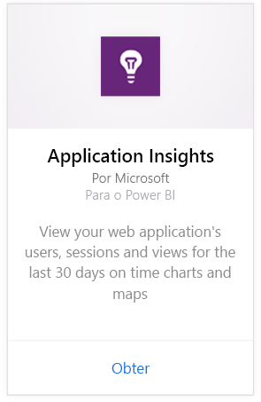
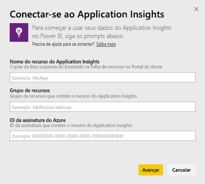
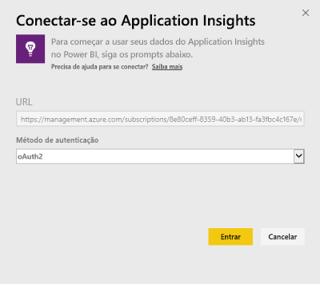
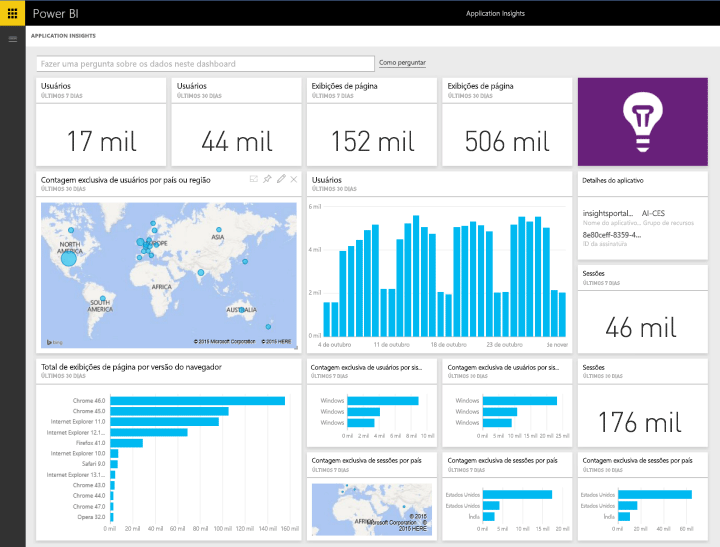
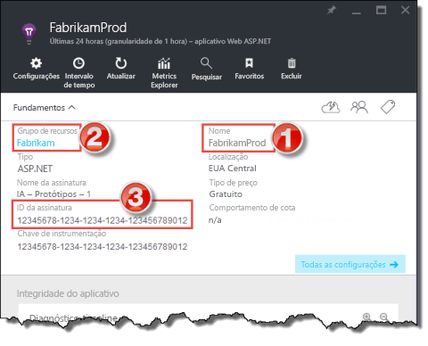
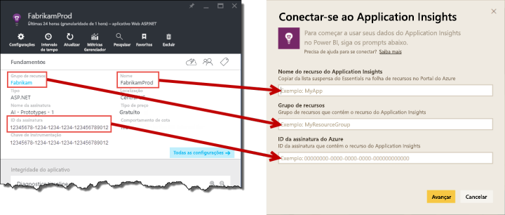

# Conectar-se ao Application Insights com o Power BI
Use o Power BI para criar painéis personalizados eficientes por meio da telemetria do [Application Insights](https://azure.microsoft.com/documentation/articles/app-insights-overview/). Preveja a telemetria do seu aplicativo de novas maneiras. Combine métricas de vários aplicativos ou serviços de componente em um único painel. Esta primeira versão do pacote de conteúdo do Power BI para o Application Insights inclui widgets de métricas comuns relacionadas ao uso como usuários ativos, exibição de página, sessões, versão do navegador e do SO e distribuição geográfica de usuários em um mapa.

Conecte-se ao [pacote de conteúdo do Application Insights para o Power BI](https://app.powerbi.com/getdata/services/application-insights).

>[!NOTE]
>Para se conectar, é necessário acesso à folha de visão geral do Application Insights para o aplicativo na Versão Prévia do Portal do Azure. Mais detalhes sobre os requisitos abaixo.

## Como se conectar
1. Selecione **Obter Dados** na parte inferior do painel de navegação esquerdo.
   
    
2. Na caixa **Serviços** , selecione **Obter**.
   
    
3. Selecione **Application Insights** > **Obter**.
   
    
4. Forneça os detalhes do aplicativo ao qual você deseja se conectar, incluindo **Nome de Recurso do Application Insights**, **Grupo de Recursos**e **ID da Assinatura**. Veja [Encontrando os parâmetros do Application Insights](#FindingAppInsightsParams) abaixo para obter mais detalhes.
   
        
5. Selecione **Entrar** e siga as telas para se conectar.
   
    
6. O processo de importação é iniciado automaticamente. Quando concluído, uma notificação é mostrada e um novo painel, relatório e conjunto de dados aparecerão no Painel de Navegação, marcados com um asterisco.  Selecione o painel para exibir os dados importados por você.
   
    

**E agora?**

* Tente [fazer uma pergunta na caixa de P e R](power-bi-q-and-a.md) na parte superior do dashboard
* [Altere os blocos](service-dashboard-edit-tile.md) no dashboard.
* [Selecione um bloco](service-dashboard-tiles.md) para abrir o relatório subjacente.
* Enquanto seu conjunto de dados será agendado para ser atualizado diariamente, você pode alterar o agendamento de atualização ou tentar atualizá-lo sob demanda usando **Atualizar Agora**

## O que está incluído
O pacote de conteúdo do Application Insights inclui as seguintes tabelas e métricas:  

    ´´´
    - ApplicationDetails  
    - UniqueUsersLast7Days   
    - UniqueUsersLast30Days   
    - UniqueUsersDailyLast30Days  
    - UniqueUsersByCountryLast7Days  
    - UniqueUsersByCountryLast30Days   
    - PageViewsDailyLast30Days   
    - SessionsLast7Days   
    - SessionsLast30Days  
    - PageViewsByBrowserVersionDailyLast30Days   
    - UniqueUsersByOperatingSystemLast7Days   
    - UniqueUsersByOperatingSystemLast30Days    
    - SessionsDailyLast30Days   
    - SessionsByCountryLast7Days   
    - SessionsByCountryLast30Days   
    - PageViewsByCountryDailyLast30Days  
    ´´´ 

## Localizando parâmetros
O Nome de Recurso, Grupo de Recursos e a ID da Assinatura podem ser encontradas no Portal do Azure. A seleção do Nome abrirá uma exibição detalhada, e você poderá usar o menu suspenso Noções Básicas para encontrar todos os valores necessários.

Copie e cole-os nos campos no Power BI:

## Próximas etapas
[Introdução ao Power BI](service-get-started.md)

[Obter dados no Power BI](service-get-data.md)

