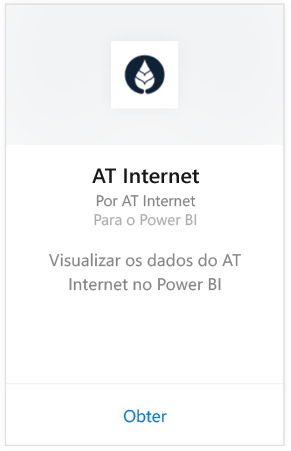
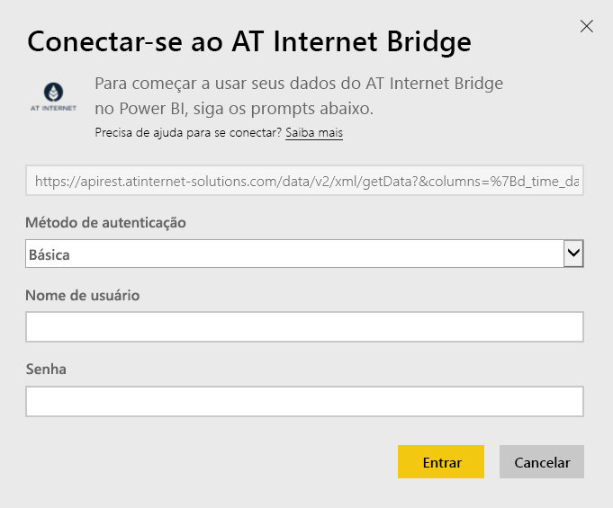

# Conectar-se ao AT Internet Bridge com o Power BI
O AT Internet ajuda você a extrair o valor imediato de seus dados usando sua plataforma analítica digital unificada, o Analytics Suite. O pacote de conteúdo do AT Internet Bridge para o Power BI inclui dados sobre visitas, fontes, localização e dispositivos para seu site.

Conecte-se ao [pacote de conteúdo do AT Internet Bridge](https://app.powerbi.com/getdata/services/at-internet-bridge) para Power BI.

## Como se conectar
1. Selecione **Obter Dados** na parte inferior do painel de navegação esquerdo.
   
    
2. Na caixa **Serviços** , selecione **Obter**.
   
    
3. Selecione **AT Internet Bridge** \> **Obter**.
   
   
4. Especifique o número do site do AT Internet ao qual você deseja se conectar.
   
   
5. Selecione **Básico** como Mecanismo de Autenticação, forneça seu nome de usuário e senha do AT Internet e clique em **entrar**.
   
   
6. Clique em **Conectar** para iniciar o processo de importação. Quando concluído, um novo painel, relatório e modelo aparecerão no Painel de Navegação. Selecione o painel para exibir os dados importados por você.
   
    

**E agora?**

* Tente [fazer uma pergunta na caixa de P e R](power-bi-q-and-a.md) na parte superior do dashboard
* [Altere os blocos](service-dashboard-edit-tile.md) no dashboard.
* [Selecione um bloco](service-dashboard-tiles.md) para abrir o relatório subjacente.
* Enquanto seu conjunto de dados será agendado para ser atualizado diariamente, você pode alterar o agendamento de atualização ou tentar atualizá-lo sob demanda usando **Atualizar Agora**

## O que está incluído
Este pacote de conteúdo contém dados dos últimos 45 dias nas tabelas a seguir:  

    - Conversão  
    - Dispositivos  
    - Localização  
    - Fontes  
    - Visitas Globais  

## Próximas etapas
[Introdução ao Power BI](service-get-started.md)

[Power BI – conceitos básicos](service-basic-concepts.md)

