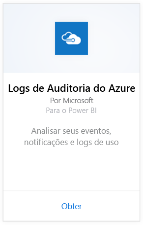
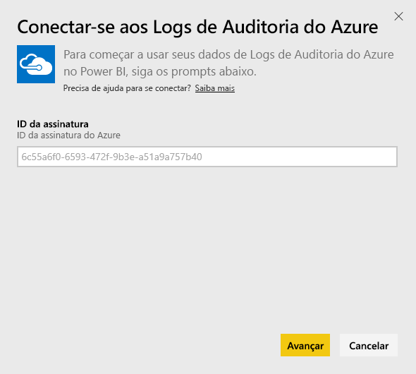
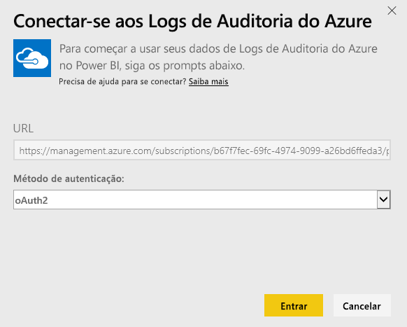
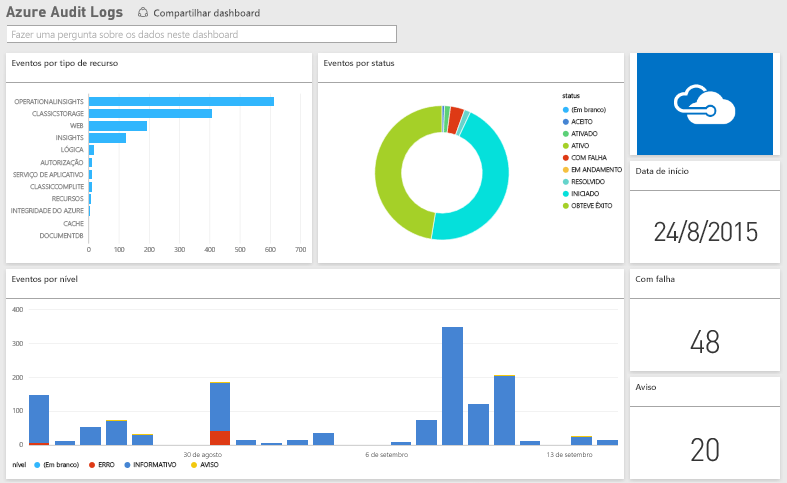

# Conectar-se aos Logs de Auditoria do Azure com o Power BI
Com o pacote de conteúdo de Logs de Auditoria do Azure, você pode analisar e visualizar as informações armazenadas nos logs de auditoria. O Power BI recupera seus dados, cria um painel inicial e cria relatórios com base nesses dados.

[Conecte-se ao pacote de conteúdo dos Logs de Auditoria do Azure](https://app.powerbi.com/getdata/services/azure-audit-logs) ou leia mais sobre a [integração dos Logs de Auditoria do Azure](https://powerbi.microsoft.com/integrations/azure-audit-logs) com o Power BI.

## Como se conectar
1. Selecione **Obter Dados** na parte inferior do painel de navegação esquerdo.  
   
    
2. Na caixa **Serviços** , selecione **Obter**.  
   
     
3. Selecione **Logs de Auditoria do Azure** > **Obter**.  
   
   
4. Quando solicitado, insira a **ID da assinatura do Azure**. Consulte detalhes sobre como localizar sua [ID da assinatura](#FindingParams) abaixo.   
   
    
5. Para o **Método de Autenticação**, selecione **oAuth2** \> **Entrar**.
   
    
6. Insira suas credenciais de conta para concluir o processo de entrada.
   
    
7. O Power BI recuperará seus dados do Log de Auditoria do Azure e criará um relatório e painel prontos para uso. 
   
    

**E agora?**

* Tente [fazer uma pergunta na caixa de P e R](service-q-and-a.md) na parte superior do dashboard
* [Altere os blocos](service-dashboard-edit-tile.md) no dashboard.
* [Selecione um bloco](service-dashboard-tiles.md) para abrir o relatório subjacente.
* Enquanto seu conjunto de dados será agendado para ser atualizado diariamente, você pode alterar o agendamento de atualização ou tentar atualizá-lo sob demanda usando **Atualizar Agora**

## Requisitos de sistema
O pacote de conteúdo de logs de Auditoria do Azure requer acesso aos Logs de Auditoria no Portal do Azure. Mais detalhes [aqui](https://azure.microsoft.com/en-us/documentation/articles/insights-debugging-with-events/).

## Localizando parâmetros
Há duas maneiras fáceis de localizar sua ID da Assinatura.

1. De https://portal.azure.com -&gt; Procurar -&gt; Assinaturas -&gt; ID da assinatura
2. De https://manage.windowsazure.com -&gt; Configurações -&gt; ID da assinatura

Sua ID da assinatura será um conjunto longo de números e caracteres, semelhantes ao exemplo da Etapa \#4 acima. 

## Solução de problemas
Se você estiver vendo um erro de credenciais ou de tentativa de atualização devido às credenciais inválidas, tente excluir todas as instâncias do pacote de conteúdo dos logs de Auditoria do Azure e reconectar.

## Próximas etapas
[Introdução ao Power BI](service-get-started.md)  
[Power BI – conceitos básicos](service-basic-concepts.md)  

