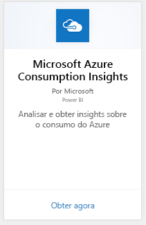
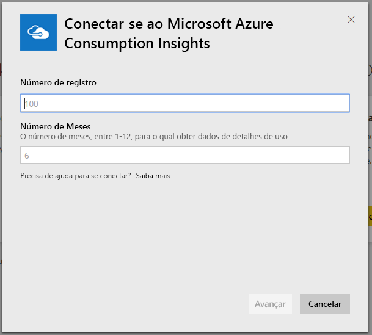
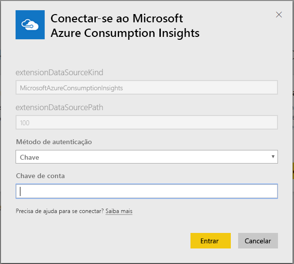
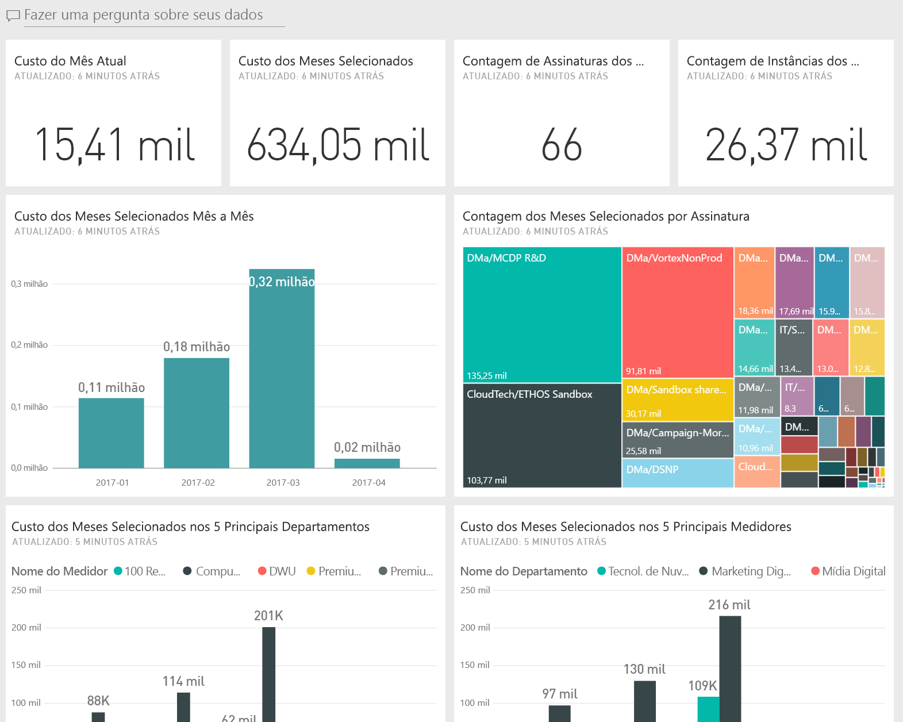
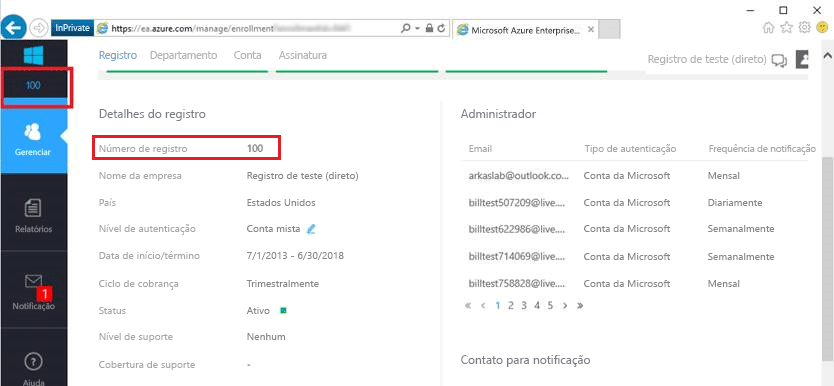
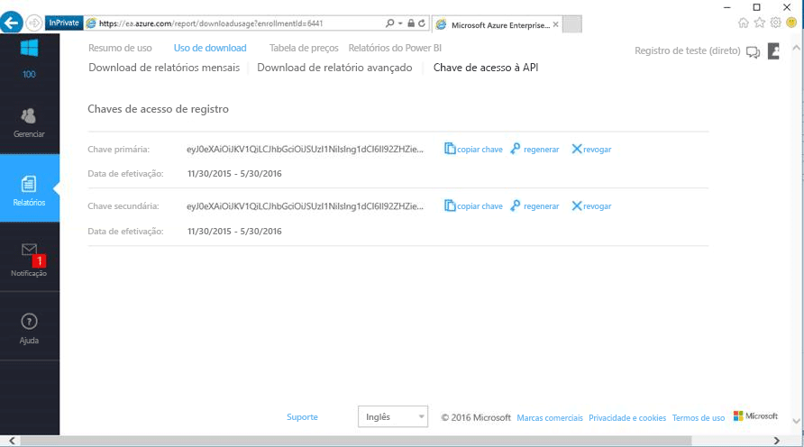

# Conectar-se ao Microsoft Azure Consumption Insights com o Power BI
Explore e monitore seus dados de consumo do Microsoft Azure no Power BI com o pacote de conteúdo do Power BI. Os dados serão atualizados automaticamente uma vez por dia.

Conecte-se ao [Pacote de conteúdo de consumo de informações do Microsoft Azure](https://app.powerbi.com/getdata/services/azureconsumption) para o Power BI.

## Como se conectar
1. Selecione **Obter Dados** na parte inferior do painel de navegação esquerdo.
   
    
2. Na caixa **Serviços** , selecione **Obter**.
   
   
3. Selecione **Consumo de informações do Microsoft Azure** \> **Obter**. 
   
   
4. Forneça o número de meses de dados que deseja importar e seu número de registro do Azure Enterprise. Veja detalhes sobre [como encontrar esses parâmetros](#FindingParams) abaixo.
   
    
5. Forneça sua Chave de acesso para se conectar. A chave para o seu registro pode ser encontrada no Portal EA do Azure. 
   
    
6. O processo de importação será iniciado automaticamente. Quando concluído, um novo painel, relatório e modelo aparecerão no Painel de Navegação. Selecione o painel para exibir os dados importados por você.
   
   

**E agora?**

* Tente [fazer uma pergunta na caixa de P e R](power-bi-q-and-a.md) na parte superior do dashboard
* [Altere os blocos](service-dashboard-edit-tile.md) no dashboard.
* [Selecione um bloco](service-dashboard-tiles.md) para abrir o relatório subjacente.
* Enquanto seu conjunto de dados será agendado para ser atualizado diariamente, você pode alterar o agendamento de atualização ou tentar atualizá-lo sob demanda usando **Atualizar Agora**

## O que está incluído
O pacote de conteúdo de consumo de informações do Microsoft Azure inclui dados de relatórios mensais para o intervalo de meses que você fornece durante o fluxo de conexão. O intervalo é uma janela móvel, portanto as datas inclusas serão atualizadas à medida que o conjunto de dados for atualizado.

## Requisitos do sistema
O pacote de conteúdo exige acesso aos recursos do Enterprise no Portal do Azure. 

## Localizando parâmetros
Os relatórios do Power BI estão disponíveis para EA Direto, Parceiros e Clientes Indiretos que podem exibir informações de cobrança. Leia abaixo para obter detalhes sobre a localização de cada um dos valores esperados pelo fluxo de conexão.

**Número de meses**

* Esse deve ser um número entre 1-36, que representa o número de meses de dados (a partir de hoje) que você deseja importar.

**Número de registro**

* Este é o número de registro do Azure Enterprise que pode ser encontrado na tela inicial do [Azure Enterprise Portal](https://ea.azure.com/) em “Detalhes do Registro”.
  
    

**Tecla de acesso**

* A chave pode ser encontrada no portal do Azure Enterprise, em “Baixar Uso” > “Chave de Acesso de API”
  
    

**Ajuda adicional**

* Para obter ajuda adicional ao configurar o pacote Power BI do Azure Enterprise, faça logon no Azure Enterprise Portal para exibir o arquivo de ajuda da API em “Ajuda” e as instruções adicionais em Relatórios -> Baixar uso -> Tecla de acesso da API. 

## Próximas etapas
[Introdução ao Power BI](service-get-started.md)

[Obter dados no Power BI](service-get-data.md)

